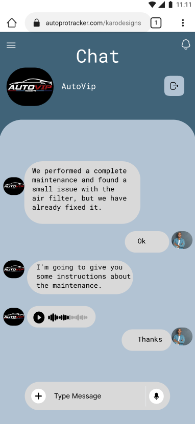
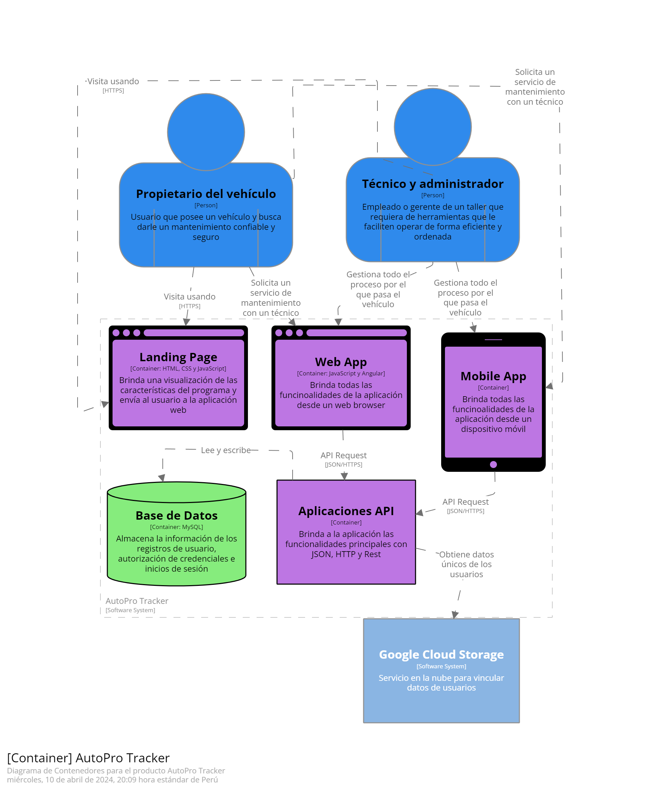

  

# **Universidad Peruana de Ciencias Aplicadas**
## Carrera de Ingeniería de Software

Ciclo: 2024 - 1

Curso: Desarrollo de Aplicaciones Open Source

Sección: SW51

Profesor: Angel Augusto Velasquez Nuñez

“Informe de Trabajo Final”

Startup: VehicleTec

Producto: AutoPro Tracker

|          Integrantes          |      Código      |
|:-----------------------------:|:-------------------:|
|   De la Piedra Quintanilla, Erwin Miquel   |    U202112179    |
|  Pinto Fuentes Rivera, Alvaro Felipe  |    U202213384    |
|   Espinoza Saenz,Christian Renato  |    U202213208    |
|  Méndez Vargas, Sebastian Orlando   |    U20201F140    |
|   Matos Ferrnandez, Christian André   |    U202214162   |

Abril 2024

<table>
  <thead>
    <tr>
        <th>Versión</th>
        <th>Fecha</th>
        <th>Autor</th>
        <th>Descripción de modificación</th>
    </tr>
  </thead>
  <tbody>
  <tr>
      <td><strong>TB1</strong></td>
      <td>Miércoles 10 de Abril</td>
      <td>
        <ul>
          <li>De la Piedra Quintanilla, Erwin Miquel</li>
          <li>Pinto Fuentes Rivera, Alvaro Felipe</li>
          <li>Espinoza Saenz,Christian Renato</li>
          <li>Méndez Vargas, Sebastian Orlando</li>
          <li>Matos Ferrnandez, Christian André</li>
        </ul>
      </td>
      <td>
        Se han incluído los siguientes capítulos:
        <ul>
          <li>Capítulo I: Introducción</li>
          <li>Capítulo II: Requirements Elicitation & Analysis</li>
          <li>Capítulo III: Requirements Specification</li>
          <li>Capítulo IV: Product Design</li>
          <li>Avance del Capítulo V: Product Implementation, Validation & Deployment hasta el punto 5.2.1.8</li>
          <li>Avance de Conclusiones, Bibliografía y Anexos</li>
        </ul>
      </td>
  </tr>
  </tbody>
</table>

# **Project Report Collaboration Insights**
URL Project Report (Github): [https://github.com/Grupo-Punteros-Open-Source](https://github.com/Grupo-Punteros-Open-Source/Project_Report)

# **Tabla de Contenido**

- [Registro de Versiones](#registro-de-versiones)
- [Student Outcome](#student-outcome)
- [Capítulo I: Introducción](#Capítulo-I-Introducción)
  - [1.1. Startup Profile](#11-startup-profile)
    - [1.1.1. Descripción de la Startup](#111-descripción-de-la-startup)
    - [1.1.2. Perfiles de integrantes del equipo](#112-perfiles-de-integrantes-del-equipo)
  - [1.2. Solution Profile](#12-solution-profile)
    - [1.2.1. Antecedentes y problemática](#121-antecedentes-y-problemática)
    - [1.2.2. Lean UX Process](#122-lean-ux-process)
      - [1.2.2.1. Lean UX Problem Statements](#1221-lean-ux-problem-statements)
      - [1.2.2.2. Lean UX Assumptions](#1222-lean-ux-assumptions)
      - [1.2.2.3. Lean UX Hypothesis Statements](#1223-lean-ux-hypothesis-statements)
      - [1.2.2.4. Lean UX Canvas](#1224-lean-ux-canvas)
  - [1.3. Segmentos objetivo](#13-segmentos-objetivo)
- [Capítulo II: Requirements Elicitation & Analysis](#Capítulo-II-Requirements-Elicitation--Analysis)
  - [2.1. Competidores](#21-competidores)
    - [2.1.1. Análisis competitivo](#211-análisis-competitivo)
    - [2.1.2. Estrategias y tácticas frente a competidores](#212-estrategias-y-tácticas-frente-a-competidores)
  - [2.2. Entrevistas](#22-entrevistas)
    - [2.2.1. Diseño de entrevistas](#221-diseño-de-entrevistas)
    - [2.2.2. Registro de entrevistas](#222-registro-de-entrevistas)
    - [2.2.3. Análisis de entrevistas](#223-análisis-de-entrevistas)
  - [2.3. Needfinding](#23-needfinding)
    - [2.3.1. User Personas](#231-user-personas)
    - [2.3.2. User Task Matrix](#232-user-task-matrix)
    - [2.3.3. User Journey Mapping](#233-user-journey-mapping)
    - [2.3.4. Empathy Mapping](#234-empathy-mapping)
    - [2.3.5. As-is Scenario Mapping](#235-as-is-scenario-mapping)
  - [2.4. Ubiquitous Language](#23-ubiquitous-language)
- [Capítulo III: Requirements Specification](#Capítulo-III-Requirements-Specification)
  - [3.1. To-Be Scenario Mapping](#31-to-be-scenario-mapping)
  - [3.2. User Stories](#32-user-stories)
  - [3.3. Impact Mapping](#33-impact-mapping)
  - [3.4. Product Backlog](#34-product-backlog)
- [Capítulo IV: Product Design](#Capítulo-IV-Product-Design)
  - [4.1. Style Guidelines](#41-style-guidelines)
    - [4.1.1. General Style Guidelines](#411-general-style-guidelines)
    - [4.1.2. Web Style Guidelines](#412-web-style-guidelines)
  - [4.2. Information Architecture](#42-information-architecture)
    - [4.2.1. Organization Systems](#421-organization-systems)
    - [4.2.2. Labeling Systems](#422-labeling-systems)
    - [4.2.3. SEO Tags and Meta Tags](#423-seo-tags-and-meta-tags)
    - [4.2.4. Searching Systems](#424-searching-systems)
    - [4.2.5. Navigation Systems](#425-navigation-systems)
  - [4.3. Landing Page UI Design](#43-landing-page-ui-design)
    - [4.3.1. Landing Page Wireframe](#431-landing-page-wireframe)
    - [4.3.2. Landing Page Mock-up](#432-landing-page-mock-up)
  - [4.4. Web Applications UX/UI Design](#44-web-applications-uxui-design)
    - [4.4.1. Web Applications Wireframes](#441-web-applications-wireframes)
    - [4.4.2. Web Applications Wireflow Diagrams](#442-web-applications-wireflow-diagrams)
    - [4.4.3. Web Applications Mock-ups](#443-web-applications-mock-ups)
    - [4.4.4. Web Applications User Flow Diagrams](#444-web-applications-user-flow-diagrams)
  - [4.5. Web Applications Prototyping](#45-web-applications-prototyping)
  - [4.6. Domain-Driven Software Architecture](#46-domain-driven-software-architecture)
    - [4.6.1. Software Architecture Context Diagram](#461-software-architecture-context-diagram)
    - [4.6.2. Software Architecture Container Diagrams](#462-software-architecture-container-diagrams)
    - [4.6.3. Software Architecture Components Diagrams](#463-software-architecture-components-diagrams)
  - [4.7. Software Object-Oriented Design](#47-software-object-oriented-design)
    - [4.7.1. Class Diagrams](#471-class-diagrams)
    - [4.7.2. Class Dictionary](#472-class-dictionary)
  - [4.8. Database Design](#48-database-design)
    - [4.8.1. Database Diagram](#481-database-diagram)
- [Capítulo V: Product Implementation, Validation & Deployment](#Capítulo-V-Product-Implementation-Validation--Deployment)
  - [5.1. Software Configuration Management](#51-software-configuration-management)
    - [5.1.1. Software Development Environment Configuration](#511-software-development-environment-configuration)
    - [5.1.2. Source Code Management](#512-source-code-management)
    - [5.1.3. Source Code Style Guide & Conventions](#513-source-code-style-guide--conventions)
    - [5.1.4. Software Deployment Configuration](#514-software-deployment-configuration)
  - [5.2. Landing Page, Services & Applications Implementation](#52-landing-page-services--applications-implementation)
    - [5.2.1. Sprint n](#521-sprint-n)
      - [5.2.1.1. Sprint Planning n](#5211-sprint-planning-n)
       -[5.2.1.2. Sprint Backlog n](#5212-sprint-backlog-n)
      - [5.2.1.3. Development Evidence for Sprint Review](#5213-development-evidence-for-sprint-review)
      - [5.2.1.4. Testing Suite Evidence for Sprint Review](#5214-testing-suite-evidence-for-sprint-review)
      - [5.2.1.5. Execution Evidence for Sprint Review](#5215-execution-evidence-for-sprint-review)
      - [5.2.1.6. Services Documentation Evidence for Sprint Review](#5216-services-documentation-evidence-for-sprint-review)
      - [5.2.1.7. Software Deployment Evidence for Sprint Review](#5217-software-deployment-evidence-for-sprint-review)
      - [5.2.1.8. Team Collaboration Insights during Sprint](#5218-team-collaboration-insights-during-sprint)
  - [5.3. Validation Interviews](#53-validation-interviews)
    - [5.3.1. Diseño de Entrevistas](#531-diseño-de-entrevistas)
    - [5.3.2. Registro de Entrevistas](#532-registro-de-entrevistas)
    - [5.3.3. Evaluaciones según heurísticas](#533-evaluaciones-según-heurísticas)
  - [5.4. Video About-the-Product](#54-video-about-the-product)
- [Conclusiones](#conclusiones)
  - [Conclusiones y recomendaciones](#conclusiones-y-recomendaciones)
- [Video About-the-Team](#video-about-the-team)
- [Bibliografía](#bibliografía)
- [Anexos](#anexos)

# Capítulo I: Introducción
# Capítulo II: Requirements Elicitation & Analysis.
# Capítulo III: Requirements Specification.
# Capítulo IV: Product Design.
## 4.1. Style Guidelines
### 4.1.1 General Style Guidelines
**Paleta de colores:**
Nuestra selección en la paleta de colores se basa en la atención a la legibilidad y buen aspecto de nuestra landing page. El color #002e43 se usa como color principal para resaltar elemento importantes, luego el color #406378 se usa para subtítulos y otros apartados de una ligera menor relevancia, en el caso del color #6a90a9 se utiliza en el cuerpo y en otras áreas para contrastar con los títulos y subtítulos, finalmente para los colores #b2c3d3 y #d7dce0 se usarán de fondo. Estos colores se usarán de forma inteligente para poder presentar una jerarquía visual clara e intuitiva.

  

**Branding:**
Para el branding de nuestra empresa se creó la marca VEHICUTECH INNOVATIONS, esta tiene por objetivo establecer una identidad presencia relevante e imponente en el mercado. Para una mejor identificación de nuestra empresa se creó el logo: 

  

**Tipografía:**
Para dar una aire diferente a nuestra marca se ha optado por el uso de la fuente “Reboto Mono” que presenta una gran variedad de estilos. Esta fuente debe ser símbolo de nuestra marca y de cumplir el objetivo de transmitir información con una identidad visual sólida y reconocible. Adicionalmente, esta tipografía es apropiada para lograr un diseño cohesivo y equilibrado que contribuye a nuestro reconocimiento en el mercado objetivo.

* Títulos:
  * H1:
  * H2:
  * H3:
  * H4:
  * H5:
  * H6:
* Cuerpo de texto:
  * B1:
  * B2:
  * B3:

  

**Spacing:**
Se hará uso de un espaciado pertinente para no abrumar al cliente con textos abarrotados que no contribuyen a la estética y contrariamente desmotivan a leer. Además, un correcto uso del espaciado en el texto también puede dar la impresión de una página más limpia y moderna, que es uno de los objetivos que hemos planteado para crear un mejor ambiente para el cliente.

**Tono de comunicación:**
El tono usado en el proyecto será del tipo formal, además de que se usará un lenguaje respetuoso, con el objetivo de mantener una comunicación estrictamente profesional con el cliente. Sin embargo, en algunas secciones se usará también un tono entusiasta o sereno para atraer al cliente a probar el producto.

### 4.1.2 Web Style Guidelines
**Colores:**
En nuestro enfoque para diseñar nuestra página web, hemos elegido cuidadosamente una paleta de colores que refleje la identidad y los valores de nuestra marca. Con el azul eléctrico como color principal, buscamos transmitir una sensación de energía, modernidad y confianza a nuestros visitantes.Adicionalmente utilizamos colores complementarios como #406378,#6a90a9 ,#b2c3d3,#d7dce0 y el color negro para dar contraste en los menus.

  

**Tipografía:**
Además, hemos optado por emplear la tipografía Reboto Mono debido a su estilo moderno y legible, que se alinea perfectamente con la estética contemporánea que deseamos transmitir en nuestra página web, adicionalmente pensamos usar los distintos tamaños de letra según sea necesario en el texto de cara a dar una mejor perspectiva de jerarquía en el texto, así podremos separar los títulos, subtítulos y el cuerpo de una mejor forma.

  

**Formas:**
Se decidió emplear figuras con bordes ligeramente redondeados en el proyecto para proporcionar una apariencia más ordenada y pulida, lo que contribuye a una experiencia visual más agradable para los usuarios.

## 4.2 Information Architecture
### 4.2.1 Organizations Systems:
Usaremos la organización visual de contenido de forma jerárquica para el inicio de forma, más específicamente el patrón F que nos otorgan una mejor distribución de textos. En términos de esquemas de categorización usaremos el estilo por tópicos ya que separaremos por secciones en pestañas diferentes.

  

 

### 4.2.2 Labeling Systems:
**Aplicación web celulares:**

  

  

  

**Aplicación web Escritorio:**

  

  

### 4.2.3 Searching Systems
Se  implementaron dos funcionalidades de búsqueda similares con el objetivo de mejorar la experiencia de usuario al facilitar la búsqueda de información deseada.

El primero de estos sistemas se encuentra en la sección de "Invoices" de la aplicación. Aquí, los usuarios tienen acceso a una lista completa de todas las facturas emitidas. Para agilizar la localización de una factura específica, se ha incorporado una barra de búsqueda que permite introducir términos clave para encontrar rápidamente la factura deseada.

Por otro lado, el segundo sistema de búsqueda se encuentra en la sección de "Vehicles". En esta sección, los usuarios pueden buscar vehículos utilizando diversos criterios. Además de la búsqueda por el nombre del propietario, se han implementado filtros adicionales que permiten refinar la búsqueda según la marca, modelo, número de reparaciones y servicios recientes del vehículo. Esta funcionalidad proporciona a los usuarios una manera eficiente de encontrar información específica sobre los vehículos registrados en la plataforma.

### 4.2.4. Navigation Systems
Para facilitar la navegación del usuario dentro de la aplicación, proporcionamos un menú desplegable intuitivo que le permite moverse entre las distintas áreas de la misma:
-Home: Página de inicio del menú.
-Vehicle: Acceso a información del vehículo y estado de reparación.
-Chat: Comunicación con el taller encargado de la reparación.
-Profile: Visualización de datos personales.
-Configuration: Configuración de la aplicación.
Para el gerente del taller, el menú es similar, pero con secciones adicionales:
-Inventory: Gestión de los materiales disponibles.
-Invoice: Administración de las facturas emitidas.
-Support: Solicitud de ayuda en caso de errores.
-Configuration: Configuración de opciones.
Adicionalmente, nos aseguramos de que la aplicación sea fácil de leer para que el usuario no se sienta perdido con lo que tiene en pantalla. Esto permite que pueda realizar acciones que lo llevan a otras ventanas de forma intuitiva.

## 4.6. Domain Driven Software Architecture
Para la construcción de los siguientes diagramas, se hizo uso de la herramienta Structurizr, la cual permite crear los mismos mediante líneas de código.

### 4.6.1. Software Architecture Context Diagram

  

**Elementos del diagrama**

  

### 4.6.2. Software Architecture Container Diagrams

  

**Elementos del diagrama**

  

### 4.6.3. Software Architecture Components Diagrams

  

**Elementos del diagrama**

  

## 4.7. Software Object-Oriented Design.
### 4.7.1. Class Diagrams.
### 4.7.2. Class Dictionary.

# Capítulo V: Product Implementation, Validation & Deployment.
