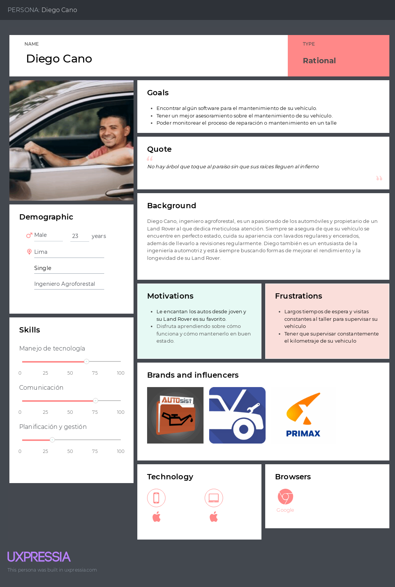
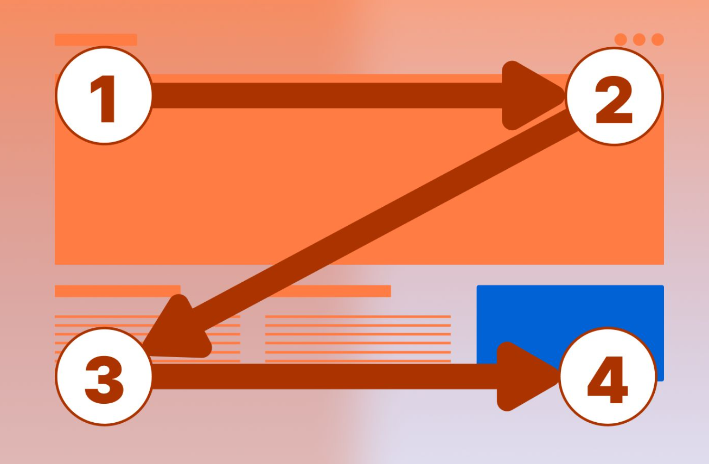
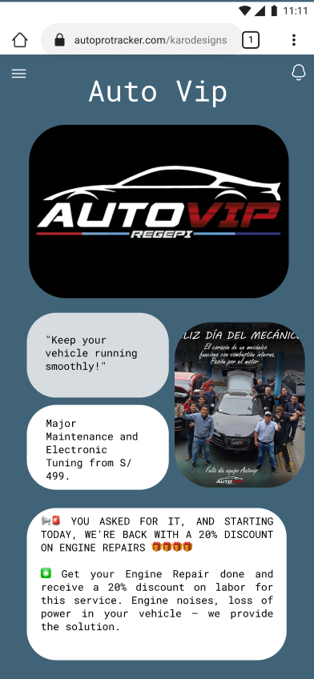
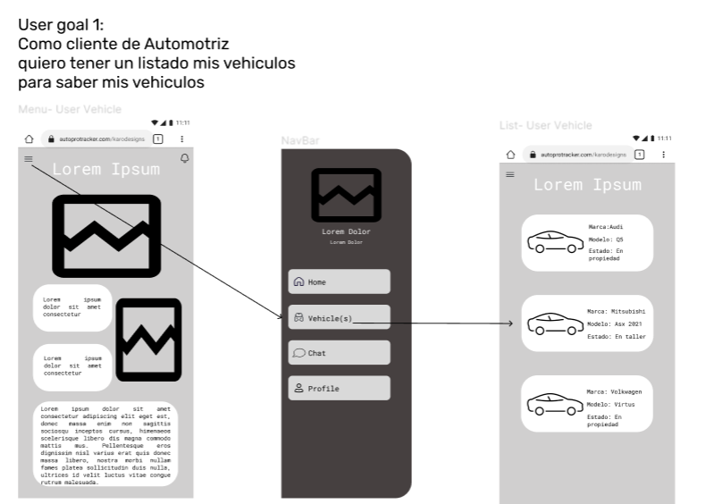
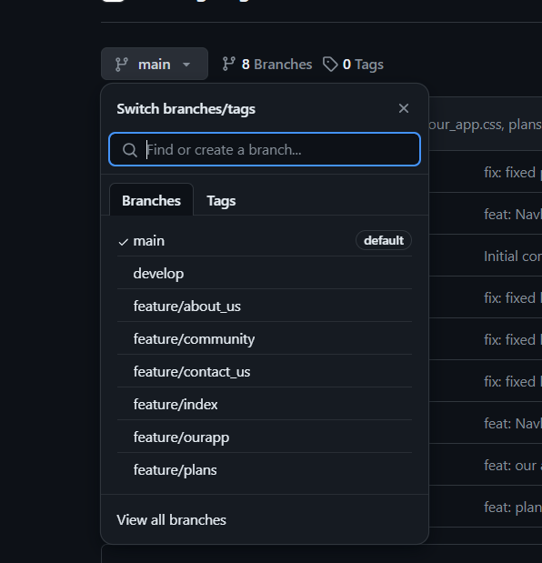

  

# **Universidad Peruana de Ciencias Aplicadas**
## Carrera de Ingeniería de Software

Ciclo: 2024 - 1

Curso: Desarrollo de Aplicaciones Open Source

Sección: SW51

Profesor: Angel Augusto Velasquez Nuñez

“Informe de Trabajo Final”

Startup: VehicleTec

Producto: AutoPro Tracker

|          Integrantes          |      Código      |
|:-----------------------------:|:-------------------:|
|   De la Piedra Quintanilla, Erwin Miquel   |    U202112179    |
|  Pinto Fuentes Rivera, Alvaro Felipe  |    U202213384    |
|   Espinoza Saenz,Christian Renato  |    U202213208    |
|  Méndez Vargas, Sebastian Orlando   |    U20201F140    |
|   Matos Ferrnandez, Christian André   |    U202214162   |

Abril 2024

<table>
  <tr>
    <th>Versión</th>
    <th>Fecha</th>
    <th>Autor</th>
    <th>Descripción de Modificación</th>
  </tr>
  <tr>
    <td>1.0</td>
    <td>25/03/24</td>
    <td>De la Piedra, Pinto, Espinoza, Mendez, Matos</td>
    <td>Creación del documento de trabajo en formato markdown</td>
  </tr>
  <tr>
    <td>1.1</td>
    <td>28/03/24</td>
    <td>De la Piedra</td>
    <td>Redacción del startup profile y solution profile.</td>
  </tr>
  <tr>
    <td>1.2</td>
    <td>29/03/24</td>
    <td>De la Piedra, Pinto, Espinoza, Mendez, Matos</td>
    <td>Delimitación de segmentos objetivo, redacción de preguntas para el diseño de entrevistas</td>
  </tr>
  <tr>
    <td>1.3</td>
    <td>03/04/24</td>
    <td>De la Piedra, Pinto, Espinoza, Mendez, Matos</td>
    <td>Elaboración y registro de entrevistas a segmentos objetivo, análisis de entrevistas</td>
  </tr>
  <tr>
    <td>1.4</td>
    <td>05/04/24</td>
    <td>Pinto</td>
    <td>Elaboración de  user personas.</td>
  </tr>
  <tr>
    <td>1.5</td>
    <td>06/04/24</td>
    <td>Espinoza</td>
    <td>Elaboración de impact mapping, to-be</td>
  </tr>
  <tr>
    <td>1.6</td>
    <td>08/04/24</td>
    <td>Mendez</td>
    <td>Elaboración de empathy mapping y as-is.</td>
  </tr>
  <tr>
    <td>1.7</td>
    <td>09/04/24</td>
    <td>De la Piedra, Pinto, Espinoza, Mendez, Matos</td>
    <td>Elaboración de user stories</td>
  </tr>
  <tr>
    <td>1.8</td>
    <td>09/04/24</td>
    <td>Matos</td>
    <td>Elaboración de product backlog</td>
  </tr>
  <tr>
    <td>1.9</td>
    <td>09/04/24</td>
    <td>De la Piedra, Pinto, Espinoza, Mendez, Matos</td>
    <td>Elaboración de prototipos de wireframes y mockups</td>
  </tr>
  <tr>
    <td>1.10</td>
    <td>10/04/24</td>
    <td>Pinto, Espinoza</td>
    <td>Redacción de style guidelines e information architecture</td>
  </tr>
  <tr>
    <td>1.11</td>
    <td>10/04/24</td>
    <td>De la Piedra</td>
    <td>Elaboración de diagrama de base de datos, diagrama de clases, diccionario de clases.</td>
  </tr>
  <tr>
    <td>1.12</td>
    <td>11/04/24</td>
    <td>Mendez</td>
    <td>Elaboración de diagramas de contenedores, diagramas de contexto, diagramas de componentes</td>
  </tr>
  <tr>
    <td>1.13</td>
    <td>11/04/24</td>
    <td>De la Piedra, Pinto, Espinoza, Mendez, Matos</td>
    <td>Registro de evidencias del Sprint 1</td>
  </tr>
  <tr>
    <td>1.14</td>
    <td>12/04/24</td>
    <td>Matos</td>
    <td>Redacción de software configuration management</td>
  </tr>

  <tr>
    <td>1.15</td>
    <td>12/04/24</td>
    <td>De la Piedra, Pinto, Espinoza, Mendez, Matos</td>
    <td>Redacción de conclusiones</td>
  </tr>

  <tr>
    <td>2.1</td>
    <td>07/06/24</td>
    <td>Matos</td>
    <td>Sprint 3 </td>
  </tr>

   <tr>
    <td>2.11</td>
    <td>07/06/24</td>
    <td>Espinoza</td>
    <td>Redacción de entrevistas</td>
  </tr>
  
   <tr>
    <td>2.2</td>
    <td>07/06/24</td>
    <td>Pinto</td>
    <td>Realización del Development Evidence for Sprint Review</td>
  </tr>
  
</table>

# **Project Report Collaboration Insights**

El informe del proyecto se encuentra alojado en el repositorio de GitHub del equipo. El URL del repositorio es: [https://github.com/Grupo-Punteros-Open-Source](https://github.com/Grupo-Punteros-Open-Source/Project_Report)

Durante el desarrollo del proyecto, el equipo ha trabajado activamente en la elaboración del informe en varias etapas. Las actividades principales incluyen:

- Investigación: Se realizó una investigación exhaustiva sobre el tema del proyecto para recopilar información relevante y datos necesarios para el informe.

- Redacción: Se redactaron los diferentes apartados del informe, incluyendo la introducción, los antecedentes, la metodología, los resultados y las conclusiones.

- Revisión y Edición: Se llevaron a cabo revisiones periódicas del informe para mejorar la claridad, coherencia y precisión del contenido.

Commits en reporte avance TB1:

  
  
  

# **Tabla de Contenido**

- ## [Registro de Versiones](#registro-de-versiones)
- ## [Student Outcome](#student-outcome-1)
- ## [Capítulo I: Introducción](#Capítulo-I-Introducción-1)
  - [1.1. Startup Profile](#11-startup-profile)
    - [1.1.1. Descripción de la Startup](#111-descripción-de-la-startup)
    - [1.1.2. Perfiles de integrantes del equipo](#112-perfiles-de-integrantes-del-equipo)
  - [1.2. Solution Profile](#12-solution-profile)
    - [1.2.1. Antecedentes y problemática](#121-antecedentes-y-problemática)
    - [1.2.2. Lean UX Process](#122-lean-ux-process)
      - [1.2.2.1. Lean UX Problem Statements](#1221-lean-ux-problem-statements)
      - [1.2.2.2. Lean UX Assumptions](#1222-lean-ux-assumptions)
      - [1.2.2.3. Lean UX Hypothesis Statements](#1223-lean-ux-hypothesis-statements)
      - [1.2.2.4. Lean UX Canvas](#1224-lean-ux-canvas)
  - [1.3. Segmentos objetivo](#13-segmentos-objetivo)
- ## [Capítulo II: Requirements Elicitation & Analysis](#Capítulo-II-Requirements-Elicitation--Analysis-1)
  - [2.1. Competidores](#21-competidores)
    - [2.1.1. Análisis competitivo](#211-análisis-competitivo)
    - [2.1.2. Estrategias y tácticas frente a competidores](#212-estrategias-y-tácticas-frente-a-competidores)
  - [2.2. Entrevistas](#22-entrevistas)
    - [2.2.1. Diseño de entrevistas](#221-diseño-de-entrevistas)
    - [2.2.2. Registro de entrevistas](#222-registro-de-entrevistas)
    - [2.2.3. Análisis de entrevistas](#223-análisis-de-entrevistas)
  - [2.3. Needfinding](#23-needfinding)
    - [2.3.1. User Personas](#231-user-personas)
    - [2.3.2. User Task Matrix](#232-user-task-matrix)
    - [2.3.3. User Journey Mapping](#233-user-journey-mapping)
    - [2.3.4. Empathy Mapping](#234-empathy-mapping)
    - [2.3.5. As-is Scenario Mapping](#235-as-is-scenario-mapping)
  - [2.4. Ubiquitous Language](#24-ubiquitous-language)
- ## [Capítulo III: Requirements Specification](#Capítulo-III-Requirements-Specification-1)
  - [3.1. To-Be Scenario Mapping](#31-to-be-scenario-mapping)
  - [3.2. User Stories](#32-user-stories)
  - [3.3. Impact Mapping](#33-impact-mapping)
  - [3.4. Product Backlog](#34-product-backlog)
- ## [Capítulo IV: Product Design](#Capítulo-IV-Product-Design-1)
  - [4.1. Style Guidelines](#41-style-guidelines)
    - [4.1.1. General Style Guidelines](#411-general-style-guidelines)
    - [4.1.2. Web Style Guidelines](#412-web-style-guidelines)
  - [4.2. Information Architecture](#42-information-architecture)
    - [4.2.1. Organization Systems](#421-organization-systems)
    - [4.2.2. Labeling Systems](#422-labeling-systems)
    - [4.2.3. SEO Tags and Meta Tags](#423-seo-tags-and-meta-tags)
    - [4.2.4. Searching Systems](#424-searching-systems)
    - [4.2.5. Navigation Systems](#425-navigation-systems)
  - [4.3. Landing Page UI Design](#43-landing-page-ui-design)
    - [4.3.1. Landing Page Wireframe](#431-landing-page-wireframe)
    - [4.3.2. Landing Page Mock-up](#432-landing-page-mock-up)
  - [4.4. Web Applications UX/UI Design](#44-web-applications-uxui-design)
    - [4.4.1. Web Applications Wireframes](#441-web-applications-wireframes)
    - [4.4.2. Web Applications Wireflow Diagrams](#442-web-applications-wireflow-diagrams)
    - [4.4.3. Web Applications Mock-ups](#443-web-applications-mock-ups)
    - [4.4.4. Web Applications User Flow Diagrams](#444-web-applications-user-flow-diagrams)
  - [4.5. Web Applications Prototyping](#45-web-applications-prototyping)
  - [4.6. Domain-Driven Software Architecture](#46-domain-driven-software-architecture)
    - [4.6.1. Software Architecture Context Diagram](#461-software-architecture-context-diagram)
    - [4.6.2. Software Architecture Container Diagrams](#462-software-architecture-container-diagrams)
    - [4.6.3. Software Architecture Components Diagrams](#463-software-architecture-components-diagrams)
  - [4.7. Software Object-Oriented Design](#47-software-object-oriented-design)
    - [4.7.1. Class Diagrams](#471-class-diagrams)
    - [4.7.2. Class Dictionary](#472-class-dictionary)
  - [4.8. Database Design](#48-database-design)
    - [4.8.1. Database Diagram](#481-database-diagram)
- ## [Capítulo V: Product Implementation, Validation & Deployment](#Capítulo-V-Product-Implementation-Validation--Deployment-1)
  - [5.1. Software Configuration Management](#51-software-configuration-management)
    - [5.1.1. Software Development Environment Configuration](#511-software-development-environment-configuration)
    - [5.1.2. Source Code Management](#512-source-code-management)
    - [5.1.3. Source Code Style Guide & Conventions](#513-source-code-style-guide--conventions)
    - [5.1.4. Software Deployment Configuration](#514-software-deployment-configuration)
  - [5.2. Landing Page, Services & Applications Implementation](#52-landing-page-services--applications-implementation)
    - [5.2.1. Sprint 1](#521-sprint-1)
      - [5.2.1.1. Sprint Planning 1](#5211-sprint-planning-1)
      - [5.2.1.2. Sprint Backlog 1](#5212-sprint-backlog-1)
      - [5.2.1.3. Development Evidence for Sprint Review](#5213-development-evidence-for-sprint-review)
      - [5.2.1.4. Testing Suite Evidence for Sprint Review](#5214-testing-suite-evidence-for-sprint-review)
      - [5.2.1.5. Execution Evidence for Sprint Review](#5215-execution-evidence-for-sprint-review)
      - [5.2.1.6. Services Documentation Evidence for Sprint Review](#5216-services-documentation-evidence-for-sprint-review)
      - [5.2.1.7. Software Deployment Evidence for Sprint Review](#5217-software-deployment-evidence-for-sprint-review)
      - [5.2.1.8. Team Collaboration Insights during Sprint](#5218-team-collaboration-insights-during-sprint)
    - [5.2.2. Sprint 2](#522-sprint-2)
      - [5.2.2.1. Sprint Planning 2](#5221-sprint-planning-2)
      - [5.2.2.2. Sprint Backlog 2](#5222-sprint-backlog-2)
      - [5.2.2.3. Development Evidence for Sprint Review](#5223-development-evidence-for-sprint-review)
      - [5.2.2.4. Testing Suite Evidence for Sprint Review](#5224-testing-suite-evidence-for-sprint-review)
      - [5.2.2.5. Execution Evidence for Sprint Review](#5225-execution-evidence-for-sprint-review)
      - [5.2.2.6. Services Documentation Evidence for Sprint Review](#5226-services-documentation-evidence-for-sprint-review)
      - [5.2.2.7. Software Deployment Evidence for Sprint Review](#5227-software-deployment-evidence-for-sprint-review)
      - [5.2.2.8. Team Collaboration Insights during Sprint](#5228-team-collaboration-insights-during-sprint)
    - [5.2.3. Sprint 3](#523-sprint-3)
      - [5.2.3.1. Sprint Planning 3](#5231-sprint-planning-3)
      - [5.2.3.2. Sprint Backlog 3](#5232-sprint-backlog-2)
      - [5.2.3.3. Development Evidence for Sprint Review](#5233-development-evidence-for-sprint-review)
      - [5.2.3.4. Testing Suite Evidence for Sprint Review](#5234-testing-suite-evidence-for-sprint-review)
      - [5.2.3.5. Execution Evidence for Sprint Review](#5235-execution-evidence-for-sprint-review)
      - [5.2.3.6. Services Documentation Evidence for Sprint Review](#5236-services-documentation-evidence-for-sprint-review)
      - [5.2.3.7. Software Deployment Evidence for Sprint Review](#5237-software-deployment-evidence-for-sprint-review)
      - [5.2.3.8. Team Collaboration Insights during Sprint](#5238-team-collaboration-insights-during-sprint)
    - [5.2.4. Sprint 4](#523-sprint-4)
      - [5.2.4.1. Sprint Planning 4](#5231-sprint-planning-4)
      - [5.2.4.2. Sprint Backlog 4](#5232-sprint-backlog-4)
      - [5.2.4.3. Development Evidence for Sprint Review](#5233-development-evidence-for-sprint-review)
      - [5.2.4.4. Testing Suite Evidence for Sprint Review](#5234-testing-suite-evidence-for-sprint-review)
      - [5.2.4.5. Execution Evidence for Sprint Review](#5235-execution-evidence-for-sprint-review)
      - [5.2.4.6. Services Documentation Evidence for Sprint Review](#5236-services-documentation-evidence-for-sprint-review)
      - [5.2.4.7. Software Deployment Evidence for Sprint Review](#5237-software-deployment-evidence-for-sprint-review)
      - [5.2.4.8. Team Collaboration Insights during Sprint](#5238-team-collaboration-insights-during-sprint)
  - [5.3. Validation Interviews](#53-validation-interviews)
    - [5.3.1. Diseño de Entrevistas](#531-diseño-de-entrevistas)
    - [5.3.2. Registro de Entrevistas](#532-registro-de-entrevistas)
    - [5.3.3. Evaluaciones según heurísticas](#533-evaluaciones-según-heurísticas)
  - [5.4. Video About-the-Product](#54-video-about-the-product)
- ## [Conclusiones](#conclusiones-1)
  - [Conclusiones y recomendaciones](#conclusiones-y-recomendaciones)
  - [Video About-the-Team](#video-about-the-team)
- ## [Bibliografía](#bibliografía-1)
- ## [Anexos](#anexos-1)

# Student Outcome

|Criterio específico|Acciones realizadas|Conclusiones|
| :- | :- | :- |
|Comunica oralmente sus ideas y/o resultados con objetividad a público de diferentes especialidades y niveles jerárquicos, en el marco del desarrollo de un proyecto en ingeniería.|
**De la Piedra Quintanilla, Erwin Miquel**

**TB1: Durante el proyecto, demostré mi capacidad para comunicar oralmente mis ideas y resultados de forma objetiva a un público diverso, incluyendo personas con diferentes especialidades y niveles jerárquicos. Durante las reuniones de equipo y las presentaciones de progreso, fui capaz de transmitir de manera clara y concisa los aspectos técnicos del proyecto, adaptando mi lenguaje según las necesidades y el conocimiento de la audiencia. Esta habilidad me permitió mantener una comunicación efectiva con los miembros del equipo y los interesados, facilitando así el avance exitoso del proyecto y fortaleciendo las relaciones interpersonales en el entorno laboral.**

**TP: Estructuré el contenido de manera clara, adapté el lenguaje para que fuera comprensible para todos, utilicé herramientas visuales efectivas y fomenté la interacción mediante preguntas y respuestas. Manteniéndome dentro del tiempo asignado, respondí a las preguntas con claridad y objetividad. La retroalimentación fue positiva y el proyecto fue aprobado para la siguiente fase, destacando mi capacidad de comunicación.**

**TB2: Durante la presentación, organicé la información de manera clara, usando un lenguaje accesible y soportes visuales como gráficos y diagramas. Fomenté la participación del público a través de preguntas y respuestas, y manejé el tiempo de manera eficiente. La retroalimentación fue positiva, resaltando mi habilidad para comunicar ideas complejas de manera comprensible, lo que llevó a la aceptación del prototipo para una fase piloto de implementación.**

**TF: Preparé la información de manera clara y usé un lenguaje accesible acompañado de diagramas y demostraciones prácticas. Promoví la interacción mediante preguntas y respuestas, y respondí a todas las consultas con precisión. La retroalimentación fue muy positiva, destacando mi capacidad para comunicar ideas técnicas de manera comprensible, lo que llevó a la aprobación del proyecto para su implementación en la línea de producción.**

**Pinto Fuentes Rivera, Alvaro Felipe**

**TB1: Durante el desarrollo del proyecto pude comunicarme mediante las entrevistas con nuestro segmento objetivo de gerente de taller, lo que luego me permitió lograr realizar un mejor trabajo y expresar mejor los features necesarios para la realización de la aplicación web**

**TP: Comuniqué claramente el objetivo de mis pages en el front-end al realizar siguiendo nuestras user stories y product backlog el desarrollo de features teniendo en cuenta su jerarquía de relevancia.** 

**TB2: En esta entrega pude comunicarme con mis compañero para lograr los objetivos planteados, además de agilizar enormemente el progreso de la entrega.**

**TF: Para la entrega final de nuestro proyecto me aseguré de realizar correcciones a diferentes segmentos del trabajo para garantizar el correcto entendimiento de tanto el funcionamiento de nuestro proyecto como las piezas que componen sus base.**

**Espinoza Saenz,Christian Renato**

**TB1: Me enfoqué en la investigación y análisis iniciales del proyecto, incluyendo entrevistas con propietarios y la identificación de desafíos potenciales. También investigué a competidores y diseñe estrategias. Mantuvimos una comunicación activa con otros equipos para compartir información y aprovechar el tiempo.**

**TP: Durante esta etapa, mantuve una comunicación constante con mis compañeros para identificar errores de entregas pasadas y también para comunicar los errores que surgieron durante el desarrollo del front-end, ayudándonos mutuamente en el proceso.**

**TB2: En esta entrega , logré mejorar significativamente mis habilidades de comunicación con mis compañeros y el equipo en general, lo que resultó en una colaboración más efectiva y una mayor cohesión grupal.**

**Matos Ferrnandez, Christian André**

**TB1: Durante la ejecución del proyecto, tuve la oportunidad de entrevistar a los gerentes de taller que conforman nuestro público objetivo. Esta interacción me permitió mejorar mi desempeño y definir con mayor precisión las características necesarias para la creación de la aplicación web.**

**TP: Expresé de manera efectiva el propósito de mis páginas en el front-end al desarrollar las características según nuestras historias de usuario y el backlog de productos, considerando la importancia jerárquica de cada una.**

**TB2: Transmití claramente el propósito de mis páginas en el front-end al desarrollar las características basadas en nuestras historias de usuario y el backlog de productos, teniendo en cuenta la prioridad de cada una.**
|
**TB1:** 

**la comunicación oral efectiva desempeñó un papel fundamental en el éxito de los proyectos, permitiendo la comprensión técnica, el alineamiento del equipo, la mejora continua y la definición precisa de requerimientos, destacando así la importancia de esta habilidad en el contexto de la ingeniería y el trabajo colaborativo.**

**TP:**

**Una comunicación oral efectiva fue fundamental para el éxito de los proyectos, permitiendo comprender aspectos técnicos, alinear al equipo, mejorar continuamente y definir con precisión los requisitos necesarios. Esto resalta la importancia crucial de esta habilidad en el contexto de la ingeniería y el trabajo colaborativo.**

**TB2:**

**La habilidad de comunicar oralmente ideas y resultados de manera objetiva a audiencias diversas es crucial en proyectos de ingeniería. Este criterio asegura que los estudiantes presenten información técnica claramente, mejorando la colaboración y entendimiento entre equipos multidisciplinarios, y fortaleciendo su liderazgo y capacidad de influencia profesional.**
|
|Comunica en forma escrita ideas y/o resultados con objetividad a público de diferentes especialidades y niveles jerárquicos, en el marco del desarrollo de un proyecto en ingeniería.|
**De la Piedra Quintanilla, Erwin Miquel**

**TB1: Emplee gráficos, tablas y otras herramientas visuales para mejorar la comprensión de la información compleja en mis documentos escritos. Aseguro que mi estilo de redacción sea claro, estructurado y adecuado para audiencias de distintos niveles jerárquicos y especialidades.**

**TP: Utilicé capturas de pantalla y diagramas de flujo para ilustrar el diseño de la interfaz y la navegación del usuario, asegurándome de explicar cada componente y su funcionalidad de manera accesible para todos los niveles jerárquicos. Incluí una sección de pruebas y resultados, detallando el rendimiento y la usabilidad de la interfaz, apoyada por gráficos y estadísticas. También añadí recomendaciones para futuras mejoras y un resumen ejecutivo al inicio del documento para una visión general rápida.**

**TB2: Incluí secciones detalladas sobre la implementación de endpoints clave, la lógica de negocio, y los mecanismos de autenticación y autorización. Además, presenté resultados de pruebas de rendimiento y escalabilidad.**

**TF: Describí los mecanismos de seguridad, el proceso de pruebas con resultados gráficos, y el manejo de errores. Documenté la API con Swagger, detallé el plan de despliegue y ofrecí recomendaciones para futuras mejoras.**

**Pinto Fuentes Rivera, Alvaro Felipe**

**TB1: Mi enfoque consiste en redactar de manera objetiva, utilizando un lenguaje claro y preciso que sea comprensible para audiencias con diferentes niveles de experiencia y especialidades. Esto garantiza que la información se transmita de manera eficiente y que todos los miembros del equipo estén al tanto del progreso y los hallazgos del proyecto.**

**TP: En el ámbito de la ingeniería, al redactar las correcciones de nuestro documento me esfuerzo por esta vez utilizar un lenguaje claro y preciso que sea comprensible para no generar complicaciones en realización de sesiones futuras.** 

**TB2: Pude contribuir a la creación de varios puntos de la api en el backend además incluí y mejore secciones de nuestro front end en base a lo que establecimos tanto en nuestras historias de usuario como product backlog.**

**TF: Desarrollé mejoras en los analisis de entrevistas, describí claramente la organizacion de nuestro diagrama de base de datos, además de ofrecer ideas y ayuda mediante consejos a miembros del equipo para la realizacion de esta entrega.**

**Espinoza Saenz,Christian Renato**

**TB1: En esta entrega, contribuí en la redacción de varias secciones del documento, centrándome especialmente en las áreas de diseño y en la elaboración de historias de usuario. Además, fui responsable de redactar la sección relacionada con nuestros competidores y sus estrategias.**

**TP: En esta entrega, me ocupé de corregir algunos errores en el documento anterior y en la landing page. Además, de brindar apoyo en el desarrollo de una parte del frontend.**

**TB2: En esta entrega, logré organizar adecuadamente las entidades para su uso en el backend, teniendo en cuenta las historias de usuario y lo establecido.** 

**Matos Ferrnandez, Christian André**

**TB1: Durante la ejecución del proyecto, tuve la oportunidad de entrevistar a los gerentes de taller que conforman nuestro público objetivo. Esta interacción me permitió mejorar mi desempeño y definir con mayor precisión las características necesarias para la creación de la aplicación web.**

**TP: Expresé de manera efectiva el propósito de mis páginas en el front-end al desarrollar las características según nuestras historias de usuario y el backlog de productos, considerando la importancia jerárquica de cada una.**

**TB2: Transmití claramente el propósito de mis páginas en el front-end al desarrollar las características basadas en nuestras historias de usuario y el backlog de productos, teniendo en cuenta la prioridad de cada una.**
|
**TB1:**

**La capacidad de comunicarse oralmente de manera efectiva fue crucial para el logro exitoso de los proyectos, facilitando la comprensión técnica, la cohesión del equipo, la evolución constante y la especificación clara de los requisitos, resaltando así la importancia de esta habilidad en el ámbito de la ingeniería y la colaboración laboral.**

**TP:**

**La habilidad de comunicación verbal fue clave para el éxito de los proyectos, facilitando la comprensión técnica, la alineación del equipo, la mejora continua y la definición precisa de requisitos. Esto subraya la importancia fundamental de esta destreza en el contexto de la ingeniería y la colaboración efectiva.**

**TB2:**

**La habilidad de comunicación verbal fue esencial para el éxito de los proyectos, ya que facilitó la comprensión técnica, la alineación del equipo, la mejora continua y la definición precisa de los requisitos. Esto resalta la importancia crucial de esta destreza en el ámbito de la ingeniería y la colaboración efectiva.**
|

# Capítulo I: Introducción
## 1.1 Startup Profile.
En esta sección se presenta la descripción del startup y los perfiles de los miembros del equipo.
### 1.1.1. Descripción del startup.
La startup, presentada con el nombre de "VehicuTech Innovation", se centra en ofrecer una solución tecnológica avanzada para mejorar la gestión y la comunicación con los clientes en el sector automotriz del Perú. Para ello, se ha desarrollado una aplicación especializada que permite llevar un registro exhaustivo de los clientes de las compañías automotrices, incluyendo tanto sus datos personales como los detalles de sus vehículos. Esta aplicación proporciona a los clientes información detallada sobre las próximas revisiones técnicas de sus vehículos, así como una comunicación fluida con la empresa para estar al tanto de los tiempos y precios de cada intervención, y para conocer los recursos necesarios de antemano.
Misión: Brindar a las compañías automotrices herramientas avanzadas de gestión y comunicación que optimicen la experiencia del cliente, permitiendo un servicio más eficiente, transparente y personalizado. 
Visión: Nos visualizamos como líderes en la transformación digital del sector automotriz peruano, siendo reconocidos por nuestra excelencia en la entrega de soluciones tecnológicas de vanguardia que impulsan la satisfacción del cliente y el crecimiento sostenible de las empresas del rubro. Aspiramos a ser el socio estratégico preferido de las compañías automotrices en su camino hacia la innovación y la excelencia operativa.

Logotipo de la Startup:

  

Logotipo del servicio:

  

### 1.1.2. Perfiles de los integrantes del equipo.

<table border="1">
  <tr>
    <td><strong>Méndez Vargas, Sebastian Orlando (U20201F140)</strong></td>
    <td>Soy Sebastian Méndez, tengo 21 años y disfruto de temas relacionados a la tecnología moderna (IA, machine learning, etc). Aprendo mucho al trabajar en equipos y soy creativo a la hora de proponer ideas y soluciones tecnológicas. Me considero como una persona sociable y que le gusta compartir ideas con sus compañeros, todo sea por dar lo mejor de nosotros en cada trabajo. Tengo experiencia en lenguajes de programación como Java, Python y JavaScript. 
</td>
    <td>

  
</td>
  </tr>
  <tr>
    <td><strong>Matos Fernandez, Christian Matos (U202217239)</strong></td>
    <td>Me llamo Christian Matos, y estoy en mi quinto ciclo de Ingeniería de Software. Poseo experiencia en programación en lenguajes como Python, C++, y JavaScript. Disfruto contribuir con mis habilidades y trabajar en equipo para alcanzar nuestros objetivos comunes.
</td>
    <td>

  
</td>
  </tr>
  <tr>
    <td><strong>Espinoza Saenz,Christian Renato(U202213208)</strong></td>
    <td>Mi nombre es Christian Espinoza, soy un estudiante de 19 años que cursa el 5to ciclo de la carrera Ingeniería de Software. Poseo ideas únicas e innovadoras para que el trabajo logre sobresalir. Tengo experiencia en la creación de distintos tipos de diagramas, editar diferentes tipos de multimedia como videos, y un conocimiento general en programación de C++, HTML, CSS y SQL, que será beneficioso para el proyecto.</td>
    <td>

  
</td>
  </tr>
  <tr>
    <td><strong>Pinto Fuentes Rivera, Alvaro Felipe(U202213384)</strong></td>
    <td>Hola, mi nombre es Alvaro, soy un estudiante del quinto ciclo de la carrera Ingeniería de Software. Me gusta mucho leer, sobretodo el género de fantasía y ciencia ficción, mi frase favorita de un libro es el credo "Vida antes que muerte, fuerza antes que debilidad y viaje antes que destino", también soy un gran fan del cine y pasó la mayor parte de mi tiempo libre escribiendo por diversión. Poseo un nivel bueno de programación en los lenguajes de C# y C++, creo que podré resultar de gran ayuda para resolver cualquier tipo de problema durante el desarrollo del proyecto, así como podré brindar ideas creativas para el equipo.</td>
    <td>

  
</td>
  </tr>
  <tr>
    <td><strong>De la Piedra Quintanilla, Erwin Miquel (U202112179)</strong></td>
    <td>Me llamo Miquel De la Piedra, tengo 20 años y me gusta mucho el cine, en especial las críticas de esta. Posee conocimientos relacionados a la programación en C++, Python, HTML y CSS, considero que estos conocimientos ayudarán a la realización de este trabajo, además de mejorar nuestros métodos de organización y trabajo en equipo.</td>
    <td>

  
</td>
  </tr>
</table>

## 1.2. Solution Profile.
### 1.2.1. Antecedentes y Problemática.

<u>What (Qué)</u>

¿Cuál es el problema?

El problema identificado radica en la deficiente gestión y organización de las empresas automotrices en Perú con respecto a la información de sus clientes, así como en la falta de canales efectivos de comunicación con los mismos. Esta situación conlleva a dificultades significativas durante la ejecución de procedimientos de reparación y mantenimiento vehicular.

<u>When (Cuando)</u>

¿Cuándo sucede el problema?

El problema surge durante el proceso de análisis de vehículos, donde se requiere acceder a datos tanto del vehículo como de su propietario, lo que puede resultar en dificultades para recopilar esta información de manera eficiente. Además, existe una carencia en la capacidad de obtener información sobre los tiempos y costos asociados con las revisiones, así como en establecer una comunicación directa con el cliente para proporcionar esta información de manera oportuna y precisa.

<u>Where (Dónde)</u>

¿A dónde se dirige?

El servicio está enfocado a brindar solución a todo tipo de empresas enfocadas en el sector automotriz en el Perú.

¿Dónde surge el problema?

El servicio proporcionado está diseñado para ofrecer una solución integral a todas las empresas dedicadas al sector automotriz en el Perú.

<u>Who (Quién)</u>

¿Quiénes están involucrados? ¿Quién lo utilizará?

Los usuarios encargados de gestionar el registro de información serán los técnicos especializados en el área automotriz. Utilizarán la aplicación para registrar y dar seguimiento a los vehículos de sus clientes. Por otro lado, los clientes serán los usuarios que interactúan con el sistema para registrar únicamente sus recorridos y obtener información sobre las necesidades y aspectos relevantes de sus vehículos cuando se encuentren en las automotrices. Estos datos permitirán a las automotrices y a sus clientes ahorrar tiempo y mejorar la gestión de los vehículos.

<u>Why (Por qué)</u>

¿Cuál es la causa del problema?

La causa principal del problema radica en la falta de experiencia de los miembros de las empresas automotrices, así como en su tendencia a conformarse con el uso de comunicaciones externas no formalizadas. Esto conduce a una comunicación ineficaz en la mayoría de los casos y a la aparición de una mayor cantidad de problemas.

¿Cuáles son las 2H?

<u>How (Cómo)</u>

¿Cómo se utilizará el producto?

El producto se emplea para gestionar el registro de vehículos y clientes, estableciendo así una base de datos para facilitar las revisiones técnicas de los automóviles. Posteriormente, esta plataforma servirá como medio para comunicar los diferentes tiempos y precios de las revisiones, adaptándose a las necesidades específicas de cada cliente.

¿Cómo lograremos desarrollar la correcta gestión de vehículos y clientes dentro de la plataforma?

Los técnicos y administradores accederán a la aplicación web mediante un navegador. Desde esta interfaz, podrán registrar datos relacionados con los clientes y luego agregar información sobre los vehículos correspondientes a esos clientes. Todos los datos se almacenarán de forma segura en una base de datos protegida.

<u>How much (Cuánto)</u>

¿Cuál es la magnitud del problema?

La magnitud del problema radica en la falta de eficiencia y comunicación en la gestión de clientes por parte de las empresas automotrices en el Perú. Esto resulta en retrasos en las reparaciones, confusiones en los precios y tiempos de intervención, así como en la necesidad de una comunicación más efectiva entre las partes involucradas. Esta deficiencia afecta tanto a las empresas automotrices como a los clientes, lo que resulta en una experiencia insatisfactoria y una menor eficiencia en el servicio.

¿Qué porcentaje del personal de la industria automotriz se verá beneficiado por el servicio?

La aplicación está diseñada para ser utilizada por múltiples técnicos y propietarios de vehículos, con un número de usuarios que puede variar considerablemente. Sin embargo, se estima que aproximadamente el 40% de los usuarios se beneficiarán directamente de su uso.

### 1.2.2. Lean UX Process.

#### 1.2.2.1. Lean UX Problem Statements.

Problem Statement:
El propósito de AutoTracker Pro es brindar a las automotrices un sistema que les permita llevar un mejor manejo y registro de información de sus clientes y vehículos, dándoles la facilidad de realizar mejor sus revisiones al tener a la mano esta información.

En el mercado automotriz peruano, las empresas enfrentan desafíos significativos en la gestión eficiente de clientes y la comunicación efectiva con ellos. La falta de sistemas centralizados y la dependencia de comunicaciones informales, como llamadas telefónicas y mensajes privados dispersos, conducen a una experiencia inadecuada tanto para los clientes como para las empresas. Esto resulta en retrasos en la programación de revisiones y reparaciones de vehículos, falta de transparencia en los costos y tiempos, y una mayor probabilidad de errores en la información del cliente y del vehículo. Además, la ausencia de un seguimiento efectivo de las necesidades de los clientes y de los servicios realizados puede conducir a una percepción deficiente de la calidad del servicio.

Como resultado, las automotrices se enfrentan a una pérdida de eficiencia operativa, mayores costos debido a retrabajos y reclamaciones, y a una disminución en la satisfacción del cliente. Esto último puede afectar negativamente la reputación de la empresa y su capacidad para retener y atraer nuevos clientes en un mercado altamente competitivo.

En este contexto, se necesita con urgencia una solución tecnológica que centralice la gestión de clientes y mejore la comunicación entre las automotrices y sus clientes. Esta solución debe proporcionar una plataforma intuitiva y segura que permita a las empresas registrar y actualizar fácilmente la información de los clientes y de sus vehículos, así como programar y rastrear las revisiones y reparaciones realizadas. Además, debe facilitar una comunicación transparente y oportuna con los clientes, brindando información precisa sobre los tiempos y costos de los servicios, así como recordatorios automáticos de mantenimiento.

¿Cómo podríamos gestionar de forma automatizada la información proveniente de los clientes y vehículos sin generar pérdidas de datos relevantes?

#### 1.2.2.2. Lean UX Assumptions.

<u>Business Assumptions:</u>

**Demanda del mercado:** Se asume que hay una demanda significativa en el mercado peruano para soluciones tecnológicas que mejoren la gestión y comunicación con los clientes en el sector automotriz.

**Disponibilidad de clientes potenciales:** Se asume que existen suficientes empresas automotrices en Perú que estarían interesadas en adoptar una solución tecnológica para mejorar su gestión de clientes y operaciones.

**Interés en la adopción tecnológica:** Se asume que las empresas automotrices en Perú están dispuestas a adoptar nuevas tecnologías para mejorar su eficiencia operativa y la satisfacción del cliente.

**Acceso a la tecnología:** Se asume que las empresas automotrices en Perú tienen acceso adecuado a la infraestructura tecnológica necesaria para implementar y utilizar la solución propuesta.

**Necesidades de comunicación con los clientes:** Se asume que las empresas automotrices en Perú enfrentan desafíos significativos en la comunicación efectiva con sus clientes, lo que genera una demanda para una solución que facilite esta comunicación.

**Regulaciones y normativas:** Se asume que la startup cumplirá con todas las regulaciones y normativas relevantes del sector automotriz en Perú, incluidas aquellas relacionadas con la protección de datos y la privacidad del cliente.

**Competencia en el mercado:** Se asume que existen competidores potenciales en el mercado, tanto locales como internacionales, que ofrecen soluciones similares o alternativas para la gestión de clientes en el sector automotriz en Perú.

<u>Bussines Outcomes:</u>

Incremento en la eficiencia operativa y en la satisfacción del cliente para las empresas automotrices en Perú, como resultado de la implementación de la plataforma tecnológica. Esto se reflejará en una reducción en los tiempos de espera para los clientes, una mejor gestión de la comunicación y los registros, así como una mayor fidelización de los clientes.

<u>User Assumptions:</u>

¿Quién es el usuario?

Los usuarios son, los técnicos y administradores encargados del registro de de la empresa, además de sus mismo clientes al momento de hacer uso para mantener un seguimiento de sus vehículos.

¿Qué problemas tiene nuestro producto? ¿Resolver?

Un problema de la aplicación, es la falta de automatización de la aplicación para reconocer las necesidades del vehículo, en especial determinar las distancias recorridas, ya que el cliente debe ingresar de manera manual el kilometraje de sus propios automóviles,

¿Qué características son importantes?

Las características más relevantes del sistema incluyen un sistema de registro y seguimiento implementado por técnicos y administradores, mediante el cual se capturan y gestionan los datos de los clientes de manera eficiente. Se proporcionan herramientas y funcionalidades para la adición, gestión, actualización y eliminación ágil de perfiles de clientes en el sistema.
Además, se destacan las funcionalidades diseñadas para mantener a los clientes informados y actualizados respecto a sus vehículos. Esto se logra a través de medios de comunicación integrados como el chat y notificaciones automatizadas, que permiten una interacción fluida entre el usuario y el sistema. Estas características aseguran una comunicación efectiva y oportuna entre el cliente y el servicio, mejorando la experiencia general del usuario y la eficacia operativa del sistema.

¿Dónde encaja nuestro producto en su trabajo o vida?

El producto encaja en la mejora de gestión de las automotrices en sus clientes, a su vez en la vida de dichos clientes.

¿Cuándo y cómo es nuestro producto? ¿Usado?

El servicio será utilizado por los técnicos de la compañía, al momento de registrar los datos de sus clientes y al momento de necesitarlos para su uso, siendo también usados por sus clientes para determinar el tiempo y precio de sus reparaciones.

¿Cómo debe verse nuestro producto y cómo debe comportarse?

El producto debe mostrar una interfaz eficiente y sencilla para los trabajadores, que les brinde todas las facilidades para llevar un registro adecuado, mientras que para los clientes debe verse adicionalmente llamativo, para lograr captar la atención de estos. Finalmente, el comportamiento se dirige a los términos de privacidad y seguridad de datos personales de los usuarios así como de la automotriz.

<u>User Outcomes:</u>

Los técnicos y administradores de automotrices experimentarán una mayor facilidad y eficiencia en la gestión de clientes y registros, gracias a una interfaz intuitiva y funcionalidades avanzadas proporcionadas por la plataforma. Los clientes de las automotrices disfrutarán de una experiencia más conveniente y transparente, con acceso a información detallada sobre el estado de sus vehículos y una comunicación más clara y oportuna con la empresa automotriz.

<u>Feature Assumptions:</u>

**Creemos que** los usuarios desean recibir notificaciones automáticas sobre el estado de sus vehículos, incluyendo recordatorios de mantenimiento y alertas de posibles problemas mecánicos.

**Creemos que** que existe una necesidad clara de una comunicación más efectiva entre las empresas automotrices y sus clientes para facilitar la coordinación de servicios de mantenimiento y reparación de vehículos.

**Creemos que**  los usuarios requerirán una interfaz de usuario intuitiva que garantice una experiencia de uso fluida y eficiente durante su interacción recurrente con la aplicación.

#### 1.2.2.3. Lean UX Hypothesis Statements.

<u>Hypothesis Statement 01:</u>

**Creemos que** los técnicos supervisores y clientes de las automotrices estarán dispuestos a adoptar la aplicación para llevar un registro más eficiente y mantener una mejor comunicación con la compañía.

**Sabremos que** hemos tenido éxito.

**Cuando** aproximadamente el 80% de los usuarios objetivo haya adoptado la aplicación dentro del primer semestre desde su lanzamiento.

<u>Hypothesis Statement 02:</u>

**Creemos que** al facilitar una comunicación transparente y oportuna con los clientes sobre los tiempos y costos de los servicios de mantenimiento a través de nuestra plataforma, podemos aumentar la confianza del cliente en las automotrices y mejorar la percepción de la calidad del servicio ofrecido.

**Sabremos que** hemos tenido éxito.

**Cuando** se observe un incremento del 20% en la frecuencia de interacciones entre los trabajadores y clientes de automotriz mediante el uso de la plataforma.

<u>Hypothesis Statement 03:</u>

**Creemos que** al proporcionar a los técnicos y administradores de automotrices una plataforma intuitiva y segura para registrar y actualizar información de clientes y vehículos, podemos reducir la incidencia de errores en los datos y mejorar la precisión y confiabilidad de la información almacenada.

**Sabremos** que hemos tenido éxito.

**Cuando** al menos el 60% de las decisiones estratégicas tomadas por los administradores se fundamentan en los análisis proporcionados por la aplicación.

<u>Hypothesis Statement 04:</u>

**Creemos que** al simplificar y automatizar los procesos de programación de revisiones y reparaciones de vehículos a través de nuestra solución tecnológica, podemos reducir significativamente los tiempos de espera y los errores en la programación, lo que resultará en una mejora perceptible en la experiencia del cliente.

**Sabremos que** hemos tenido éxito.

**Cuando** se perciba una disminución del 70% de las quejas de los clientes al momento de utilizar el servicio.

#### 1.2.2.4. Lean UX Canvas.

  

## 1.3. Segmento objetivo.

Se han identificado dos segmentos objetivos:

**Administradores de Taller:** Este segmento está compuesto por profesionales encargados de la gestión de clientes y registros dentro de una automotriz. Actúan como representantes de la empresa automotriz en la aplicación y tienen acceso privilegiado a funciones avanzadas para la manipulación y gestión de registros.

**Propietarios de Vehiculos:** Este segmento incluye a los propietarios de vehículos que visitan las automotrices. Son los usuarios finales de la aplicación y se encargan de proporcionar información relevante para los registros. Además, reciben mensajes y notificaciones dentro de la aplicación relacionados con el estado de sus vehículos y otros servicios ofrecidos por la automotriz.

# Capítulo II: Requirements Elicitation & Analysis.
## 2.1 Competidores

Para realizar el análisis competitivo hemos tomado en consideración competidores directos e indirectos:

- **Mitchell1**: Mitchell1 es una empresa líder en la industria automotriz que ofrece software y soluciones tecnológicas para talleres mecánicos y concesionarios de automóviles. Su producto principal, ProDemand, es un sistema de información de reparación que proporciona a los técnicos automotrices acceso a datos detallados sobre reparación y mantenimiento de vehículos, incluyendo diagramas de cableado, procedimientos de diagnóstico y otra información técnica esencial.  

  

- **ALLDATA**: AllData es otra empresa líder en la industria automotriz que proporciona software y soluciones tecnológicas para talleres mecánicos y profesionales del automóvil. Al igual que Mitchell1, AllData ofrece acceso a una amplia base de datos de información técnica sobre reparación y mantenimiento de vehículos. Sus productos incluyen diagramas de cableado, especificaciones de componentes, procedimientos de reparación, boletines técnicos y otra documentación útil para ayudar a los técnicos a diagnosticar y reparar vehículos de manera efectiva. 

  

- **Shop-Ware**: Shop-Ware es una empresa de software que ofrece una plataforma de gestión de talleres para la industria automotriz. Su plataforma integra una variedad de herramientas y funciones diseñadas para ayudar a los talleres mecánicos a administrar eficientemente sus operaciones diarias. Esto incluye funciones como programación de citas, gestión de órdenes de trabajo, seguimiento de inventario, facturación, gestión de clientes y más.  

  

### 2.1.1 Análisis competitivo

<table>
  <tr>
    <th colspan="6" valign="top">Competitive Analysis Landscape</th>
  </tr>
  <tr>
    <td colspan="2" valign="top">¿Por qué llevar a cabo este análisis?</td>
    <td colspan="4" valign="top">El objetivo de este análisis es identificar las características de los competidores y encontrar maneras de diferenciarnos.</td>
  </tr>
  <tr>
    <td colspan="2" rowspan="2" valign="top">Startup y Competidores</td>
    <td valign="top">AutoPro Tracker</td>
    <td valign="top">Mitchell1</td>
    <td valign="top">ALLDATA</td>
    <td valign="top">Shop-Ware</td>
  </tr>
  <tr>
    <td valign="top"></td>
    <td valign="top"></td>
    <td valign="top"></td>
    <td valign="top"></td>
  </tr>
  <tr>
    <td rowspan="2" valign="top">Perfil</td>
    <td valign="top">Overview</td>
    <td valign="top">Plataforma de gestión de procesos para talleres de reparación de vehículos, centrada en simplificar operaciones y mejorar la experiencia del cliente.</td>
    <td valign="top">Ofrece soluciones de gestión de talleres para la industria automotriz.</td>
    <td valign="top">Software de gestión de talleres y bases de datos de información técnica para la industria automotriz.</td>
    <td valign="top">Plataforma de gestión de talleres basada en la nube diseñada específicamente para la industria automotriz.
</td>
  </tr>
  <tr>
    <td valign="top">Ventaja competitiva ¿Qué valor ofrece a los clientes?</td>
    <td valign="top">Integración de seguimiento de kilometraje y notificaciones automáticas, interfaz fácil de usar y enfoque centrado en el cliente</td>
    <td valign="top">Su experiencia en la industria y sus sólidas bases de datos técnicas son su principal ventaja competitiva.</td>
    <td valign="top">Su amplia base de datos de información técnica y su experiencia en la industria automotriz son su principal ventaja competitiva.</td>
    <td valign="top">Su principal ventaja competitiva radica en su enfoque en la tecnología de la nube y su capacidad para proporcionar herramientas intuitivas y eficientes para la gestión de talleres.</td>
  </tr>
  <tr>
    <td rowspan="2" valign="top">Perfil de Marketing</td>
    <td valign="top">Mercado objetivo</td>
    <td valign="top">Talleres de reparación de vehículos de todos los tamaños, enfocándose en mejorar la eficiencia y calidad del servicio.</td>
    <td valign="top">Talleres de reparación de vehículos de todos los tamaños.</td>
    <td valign="top">Talleres de reparación de vehículos de todos los tamaños y fabricantes de automóviles</td>
    <td valign="top">Talleres de reparación de vehículos de todos los tamaños, desde pequeños talleres independientes hasta grandes cadenas de servicios automotrices.</td>
  </tr>
  <tr>
    <td valign="top">Estrategias de marketing</td>
    <td valign="top">Marketing en línea, demostraciones de producto, participación en eventos de la industria y asociaciones estratégicas.</td>
    <td valign="top">Utilizan marketing directo, publicidad en línea y participación en ferias de la industria automotriz.</td>
    <td valign="top">Utilizan publicidad en línea, asociaciones con fabricantes de automóviles y distribuidores para promocionar sus productos</td>
    <td valign="top">Shop-Ware utiliza una combinación de marketing en línea, demostraciones de producto, participación en eventos de la industria y asociaciones estratégicas para promover sus soluciones.</td>
  </tr>
  <tr>
    <td rowspan="3" valign="top">Perfil de Producto</td>
    <td valign="top">Productos & Servicios</td>
    <td valign="top">Plataforma de gestión de procesos con seguimiento de kilometraje, notificaciones automáticas y estimaciones de reparación.</td>
    <td valign="top">Ofrecen ProDemand y Manager SE, bases de datos técnicas y software de gestión de talleres.</td>
    <td valign="top">Ofrecen bases de datos de información técnica y software de gestión de talleres.</td>
    <td valign="top">Ofrece una plataforma de gestión de talleres basada en la nube que incluye funciones como programación, estimación, facturación, seguimiento de inventario y comunicación con los clientes.</td>
  </tr>
  <tr>
    <td valign="top">Precios & Costos</td>
    <td valign="top">Varían según características y tamaño del taller, con opciones de suscripción mensual o anual.</td>
    <td valign="top">Varían según el producto y pueden incluir tarifas de suscripción o costos de licencia.</td>
    <td valign="top">Los precios varían según el producto y pueden incluir tarifas de suscripción mensuales o costos de licencia.</td>
    <td valign="top">Los precios varían según el tamaño del taller y las características específicas de la solución, con opciones de suscripción mensual o anual</td>
  </tr>
  <tr>
    <td valign="top">Canales de distribución (Web y/o Móvil)</td>
    <td valign="top">Principalmente a través de su sitio web oficial y asociaciones con distribuidores de la industria automotriz.
    </td>
    <td valign="top">Principalmente a través de su sitio web y distribuidores autorizados, con posibilidad de acceso móvil. </td>
    <td valign="top">Principalmente a través de su sitio web oficial y asociaciones con fabricantes de automóviles y distribuidores.</td>
    <td valign="top">Principalmente a través de su sitio web oficial y mediante asociaciones con distribuidores de la industria automotriz.</td>
  </tr>
  <tr>
    <td rowspan="4" valign="top">Análisis SWOT</td>
    <td valign="top">Fortalezas</td>
    <td valign="top">
        <ul>
          <li>Enfoque centrado en el cliente.</li>
          <li>Integración de tecnología para mejorar la eficiencia operativa.</li>
          <li>Facilidad de uso y accesibilidad de la plataforma.</li>
      </ul>
    </td>
    <td valign="top">
        <ul>
          <li>Experiencia en la industria</li>
          <li>Bases de datos técnicas sólidas.</li>
          <li>Buen soporte al cliente.</li>
      </ul>
    </td>
    <td valign="top">
        <ul>
          <li>Experiencia en la industria automotriz.</li>
          <li>Asociaciones estratégicas.</li>
        </ul>
    </td>
    <td valign="top">
        <ul>
        <li>Tecnología basada en la nube.</li>
        <li>Herramientas intuitivas y eficientes.</li>
        <li>Enfoque en mejorar la comunicación con los clientes.</li>
      </ul>
    </td>
  </tr>
  <tr>
    <td valign="top">Debilidades</td>
    <td valign="top">
        <ul>
          <li>Posible necesidad de educación sobre el uso del sistema para nuevos usuarios.</li>
          <li>Dependencia de la conectividad a Internet para acceder al sistema.</li>
        </ul>
    </td>
    <td valign="top">
        <ul>
        <li>Curva de aprendizaje para nuevos usuarios.</li>
        <li>Expansión geográfica.</li>
      </ul>
    </td>
    <td valign="top">
        <ul>
        <li>Curva de aprendizaje para nuevos usuarios.</li>
        <li>Posible dependencia de asociaciones con fabricantes de automóviles.</li>
      </ul>
    </td>
    <td valign="top">
        <ul>
        <li> Posible resistencia al cambio por parte de algunos talleres.</li>
        <li>Dependencia de la conectividad a Internet para acceder al sistema.</li>
      </ul>
    </td>
  </tr>
  <tr>
    <td valign="top">Oportunidades</td>
    <td valign="top">
        <ul>
          <li>Expansión a nuevos mercados geográficos.</li>
          <li>Desarrollo de nuevas características para satisfacer las necesidades emergentes de la industria automotriz.</li>
      </ul>
    </td>
    <td valign="top">
        <ul>
          <li>Expansión geográfica.</li>
          <li> Desarrollo de nuevas características.</li>
      </ul>
    </td>
    <td valign="top">
        <ul>
          <li>Expansión a nuevos mercados geográficos.</li>
          <li>Desarrollo de nuevas características y funcionalidades</li>
      </ul>
    </td>
    <td valign="top">
        <ul>
          <li>Expansión a nuevos mercados geográficos.</li>
          <li>Desarrollo de nuevas características para satisfacer las necesidades emergentes de la industria automotriz.</li>
      </ul>
    </td>
  </tr>
  <tr>
    <td valign="top">Amenazas</td>
    <td valign="top">
        <ul>
          <li>Competencia creciente en el mercado de soluciones de gestión de talleres.</li>
          <li>Cambios en las tendencias tecnológicas que podrían afectar la demanda de productos y servicios</li>
      </ul>
    </td>
    <td valign="top">
        <ul>
          <li>Competencia creciente.</li>
          <li>Cambios tecnológicos.</li>
      </ul>
    </td>
    <td valign="top">
        <ul>
          <li>Competencia creciente en el mercado de soluciones de gestión de talleres.</li>
          <li>Cambios en las preferencias del cliente y en la tecnología.</li>
      </ul>
    </td>
    <td valign="top">
        <ul>
          <li>Competencia creciente en el mercado de soluciones de gestión de talleres.</li>
          <li>Cambios en las tendencias tecnológicas que podrían afectar la demanda de productos y servicios de Shop-Ware.</li>
      </ul>
    </td>
  </tr>
</table>

### 2.1.2. Estrategias y tácticas frente a competidores.

**Estrategia 1: Desarrollo de Capacitación Personalizada**

  - Táctica: Ofrecer capacitación personalizada a los talleres sobre cómo utilizar eficazmente nuestra plataforma de gestión de procesos.

  - Explicación: Al proporcionar capacitación personalizada, podemos asegurarnos de que los talleres comprendan completamente todas las características y funcionalidades de nuestra plataforma. Esto les permitirá aprovechar al máximo la solución y optimizar su eficiencia operativa.

**Estrategia 2: Participación en Eventos de la Industria**

  - Táctica: Asistir y participar activamente en ferias comerciales, conferencias y eventos de la industria automotriz.

  - Explicación: Participar en eventos de la industria nos brinda la oportunidad de establecer contactos con propietarios de talleres, gerentes y profesionales de la industria. Además, podemos demostrar nuestra plataforma en vivo, responder preguntas y recopilar comentarios directos de clientes potenciales. Esta estrategia nos ayuda a aumentar la visibilidad de nuestra marca y a establecer relaciones sólidas en el mercado automotriz.

**Estrategia 3: Marketing de Contenidos**

  - Táctica: Crear y distribuir contenido relevante y útil, como blogs, videos tutoriales y guías de mejores prácticas, que aborden los desafíos comunes enfrentados por los talleres de reparación de vehículos.

  - Explicación: El marketing de contenidos nos permite establecernos como autoridad en la industria y construir confianza con nuestra audiencia al proporcionarles información valiosa y soluciones a sus problemas. Esto puede ayudar a atraer nuevos clientes y fomentar la retención de clientes existentes.

**Estrategia 4: Programa de Fidelización de Clientes**

  - Táctica: Implementar un programa de fidelización de clientes donde los talleres acumulen puntos o descuentos por el uso continuo de nuestra plataforma y por referir nuevos clientes.

  - Explicación: Este programa incentiva a los talleres a mantenerse comprometidos con nuestra plataforma a largo plazo, al tiempo que los recompensa por su lealtad y contribución al crecimiento de nuestra base de usuarios. Además, fomenta la retención de clientes existentes y estimula el boca a boca positivo, lo que puede generar un aumento en la adquisición de nuevos clientes.

## 2.2 Entrevistas
### 2.2.1 Diseño de entrevistas

Preguntas para: Propietarios de vehículos

1. ¿Con qué frecuencia realiza mantenimiento preventivo a su vehículo?
2. ¿Cuál es su método actual para llevar un registro del mantenimiento de su vehículo?
3. ¿Qué aspectos considera más importantes al elegir un servicio de mantenimiento para su vehículo?
4. ¿Ha enfrentado alguna dificultad al seguir un programa de mantenimiento regular para su vehículo?
5. ¿Cuál es su opinión sobre la importancia de mantener registros precisos del mantenimiento del vehículo?
6. ¿Qué tipo de notificaciones o recordatorios le serían útiles para el mantenimiento de su vehículo?
7. ¿Está dispuesto a pagar por servicios adicionales en una aplicación web que faciliten la gestión del mantenimiento de su vehículo?
8. ¿Qué funcionalidades le gustaría ver en una aplicación móvil para gestionar el mantenimiento de su vehículo?
9. ¿Cómo cree que una aplicación móvil puede ayudarle a mantener su vehículo en buen estado y prolongar su vida útil?
10. ¿Qué características de seguridad considera importantes al utilizar una aplicación web para el mantenimiento de su vehículo?

Preguntas para: Administradores del taller

1. ¿Qué métodos utiliza actualmente para gestionar las operaciones del taller?
2. ¿Qué desafíos enfrenta al coordinar las citas de los clientes y el trabajo en el taller?
3. ¿Qué herramientas o software utiliza para programar citas y llevar un registro de las reparaciones?
4. ¿Cómo maneja actualmente la comunicación con los clientes sobre el progreso de las reparaciones?
5. ¿Qué información le gustaría recibir automáticamente de una aplicación móvil sobre el estado de las reparaciones en curso?
6. ¿Cuál es su opinión sobre la importancia de mantener un registro digital de los vehículos y sus historiales de mantenimiento en el taller?
7. ¿Cómo cree que una aplicación móvil puede mejorar la eficiencia y productividad del taller?
8. ¿Qué características considera esenciales en una aplicación para ayudarle a gestionar eficientemente las operaciones del taller?
9. ¿Qué funcionalidades adicionales le gustaría ver en una aplicación móvil para facilitar la gestión del taller?
10. ¿Está dispuesto a invertir en una aplicación móvil personalizada para su taller si mejora significativamente la eficiencia y la experiencia del cliente?

### 2.2.2 Registro de entrevistas

<u>**Entrevista: 1 - Segmento Objetivo: Administrador de taller**</u>

Fecha Entrevista: 02/04/2024

Entrevistador: Alvaro Pinto Fuentes Rivera

Entrevistado: Felipe Pinto Velaochaga

Datos del Entrevistado:

- Edad: 41
- Distrito: Ate

Link del Video de la Entrevista: [https://upcedupe-my.sharepoint.com/:v:/r/personal/u202213208_upc_edu_pe/Documents/upc-pre-202401-si729--SW51-VehicelTec-needfinding-sprint1.mp4?csf=1&web=1&nav=eyJyZWZlcnJhbEluZm8iOnsicmVmZXJyYWxBcHAiOiJTdHJlYW1XZWJBcHAiLCJyZWZlcnJhbFZpZXciOiJTaGFyZURpYWxvZy1MaW5rIiwicmVmZXJyYWxBcHBQbGF0Zm9ybSI6IldlYiIsInJlZmVycmFsTW9kZSI6InZpZXcifX0%3D&e=wHve8T](https://upcedupe-my.sharepoint.com/:v:/r/personal/u202213208_upc_edu_pe/Documents/upc-pre-202401-si729--SW51-VehicelTec-needfinding-sprint1.mp4?csf=1&web=1&nav=eyJyZWZlcnJhbEluZm8iOnsicmVmZXJyYWxBcHAiOiJTdHJlYW1XZWJBcHAiLCJyZWZlcnJhbFZpZXciOiJTaGFyZURpYWxvZy1MaW5rIiwicmVmZXJyYWxBcHBQbGF0Zm9ybSI6IldlYiIsInJlZmVycmFsTW9kZSI6InZpZXcifX0%3D&e=wHve8T)

- Minuto de Inicio: 00:03
- Duración: 6:23 minutos

Resumen de la Entrevista:

Felipe Pinto, es un gerente en un taller de 41 años, trabaja principalmente con el sistema operativo de windows en laptop y pc, utiliza un celular android, hace uso del browser de google mediante el cuál realiza búsquedas y se mantiene al pendiente de las ultimas noticias del mundo de la mecatrónica. Felipe es una persona extrovertida que tiene mucha facilidad para comunicarse con sus clientes, por la naturaleza de su trabajo posee una buena habilidad con el manejo de tecnología. Para la administración de su taller se apoya en hojas de cálculo de Excel, sin embargo, estas prácticas tradicionales están demostrando ser cada vez más ineficientes y lentas. Felipe reconoce que la implementación de una aplicación especializada puede proporcionar una solución eficaz y ágil para gestionar todas las operaciones del taller. Durante la entrevista se le presentó la idea de nuestro proyecto que implicaría el desarrollo de una aplicación diseñada específicamente para satisfacer las necesidades de gestión de su taller. Felipe se mostró interesado en invertir en una suscripción que le brinde acceso a esta herramienta tecnológica innovadora puesto que la función que consideró necesaria para una aplicación ya está implementada en nuestra idea de proyecto que sería el registro o historial de cada vehículo del cliente además de su información completa.

<u>**Entrevista: 2 - Segmento Objetivo: Administrador de taller**</u>

Fecha Entrevista: 04/04/2024

Entrevistador: Miquel De la Piedra Quintanilla

Entrevistado: Sasha Chavez

Datos del entrevistado:

- Edad: 39 años
- Distrito: Miraflores

Link del Video de la Entrevista: [https://upcedupe-my.sharepoint.com/:v:/r/personal/u202213208_upc_edu_pe/Documents/upc-pre-202401-si729--SW51-VehicelTec-needfinding-sprint1.mp4?csf=1&web=1&nav=eyJyZWZlcnJhbEluZm8iOnsicmVmZXJyYWxBcHAiOiJTdHJlYW1XZWJBcHAiLCJyZWZlcnJhbFZpZXciOiJTaGFyZURpYWxvZy1MaW5rIiwicmVmZXJyYWxBcHBQbGF0Zm9ybSI6IldlYiIsInJlZmVycmFsTW9kZSI6InZpZXcifX0%3D&e=wHve8T](https://upcedupe-my.sharepoint.com/:v:/r/personal/u202213208_upc_edu_pe/Documents/upc-pre-202401-si729--SW51-VehicelTec-needfinding-sprint1.mp4?csf=1&web=1&nav=eyJyZWZlcnJhbEluZm8iOnsicmVmZXJyYWxBcHAiOiJTdHJlYW1XZWJBcHAiLCJyZWZlcnJhbFZpZXciOiJTaGFyZURpYWxvZy1MaW5rIiwicmVmZXJyYWxBcHBQbGF0Zm9ybSI6IldlYiIsInJlZmVycmFsTW9kZSI6InZpZXcifX0%3D&e=wHve8T)

- Minuto de Inicio: 05:24
- Duración: 8:10 minutos

Resumen: 

 Sasha Chávez, es una administradora de automotriz de 39 años, utiliza el buscador de google, además de una computadora windows y un celular android, nos comenta que mediante el uso de un software pagado, pueden llevar un registro de datos de sus clientes, sin embargo nos comenta que el tema relacionado a la comunicación con sus clientes, es informal, ya que se utiliza distintos medios como mensajes de texto y llamadas telefónicas. Durante la entrevista, se le mostró la idea de nuestro proyecto, que ayudaría a mejorar la interacción con el cliente, además de mejorar el registro de sus clientes. Sasha mostró interés por probar un software más actualizado para una interacción y manejo de registros más moderno, además que ayude a formalizar la interacción con sus clientes.

<u>**Entrevista: 3 - Segmento Objetivo: Administrador de taller**</u>

Fecha Entrevista: 05/04/2024

Entrevistador: Miquel De la Piedra Quintanilla

Entrevistado: Alfredo Baca Lara

Datos del Entrevistado:

- Edad: 64 años
- Distrito: Surco 

Link del Video de la Entrevista: [https://upcedupe-my.sharepoint.com/:v:/r/personal/u202213208_upc_edu_pe/Documents/upc-pre-202401-si729--SW51-VehicelTec-needfinding-sprint1.mp4?csf=1&web=1&nav=eyJyZWZlcnJhbEluZm8iOnsicmVmZXJyYWxBcHAiOiJTdHJlYW1XZWJBcHAiLCJyZWZlcnJhbFZpZXciOiJTaGFyZURpYWxvZy1MaW5rIiwicmVmZXJyYWxBcHBQbGF0Zm9ybSI6IldlYiIsInJlZmVycmFsTW9kZSI6InZpZXcifX0%3D&e=wHve8T](https://upcedupe-my.sharepoint.com/:v:/r/personal/u202213208_upc_edu_pe/Documents/upc-pre-202401-si729--SW51-VehicelTec-needfinding-sprint1.mp4?csf=1&web=1&nav=eyJyZWZlcnJhbEluZm8iOnsicmVmZXJyYWxBcHAiOiJTdHJlYW1XZWJBcHAiLCJyZWZlcnJhbFZpZXciOiJTaGFyZURpYWxvZy1MaW5rIiwicmVmZXJyYWxBcHBQbGF0Zm9ybSI6IldlYiIsInJlZmVycmFsTW9kZSI6InZpZXcifX0%3D&e=wHve8T)

- Minuto de Inicio: 12:48
- Duración: 9:13 minutos

Resumen: 

  Alfredo Baca Lara, es una administradora de automotriz de 64 años, utiliza principalmente google como buscador, hace uso de una computadora de apple MacOs y usa un celular android, mediante las preguntas, hemos logrado determinar que no se encuentran tan acostumbrados al uso de software tan avanzados para el manejo de sus registros, además que utilizan medios informales como mensajes directos, correos y llamadas para comunicarse con sus clientes. Durante la entrevista se comentó acerca de la aplicación del proyecto. Alfredo mostró un pensamiento de aceptación, ya que nos dice que hoy en día todo funciona con la ayuda de la tecnología y esto seria de gran ayuda para mejorar el método de registro que poseen.

<u>**Entrevista: 4 - Segmento Objetivo: Propietarios de Vehiculo**</u>

Fecha Entrevista: 05/04/2024

Entrevistador: Christian Renato Espinoza Saenz

Entrevistado: Sebastian Palacios

Datos del Entrevistado:

- Edad: 22 años
- Distrito: San Juan de Miraflores

Link del Video de la Entrevista: [https://upcedupe-my.sharepoint.com/:v:/r/personal/u202213208_upc_edu_pe/Documents/upc-pre-202401-si729--SW51-VehicelTec-needfinding-sprint1.mp4?csf=1&web=1&nav=eyJyZWZlcnJhbEluZm8iOnsicmVmZXJyYWxBcHAiOiJTdHJlYW1XZWJBcHAiLCJyZWZlcnJhbFZpZXciOiJTaGFyZURpYWxvZy1MaW5rIiwicmVmZXJyYWxBcHBQbGF0Zm9ybSI6IldlYiIsInJlZmVycmFsTW9kZSI6InZpZXcifX0%3D&e=wHve8T](https://upcedupe-my.sharepoint.com/:v:/r/personal/u202213208_upc_edu_pe/Documents/upc-pre-202401-si729--SW51-VehicelTec-needfinding-sprint1.mp4?csf=1&web=1&nav=eyJyZWZlcnJhbEluZm8iOnsicmVmZXJyYWxBcHAiOiJTdHJlYW1XZWJBcHAiLCJyZWZlcnJhbFZpZXciOiJTaGFyZURpYWxvZy1MaW5rIiwicmVmZXJyYWxBcHBQbGF0Zm9ybSI6IldlYiIsInJlZmVycmFsTW9kZSI6InZpZXcifX0%3D&e=wHve8T)

- Minuto de Inicio: 28:40
- Duración: 6:10 minutos

Resumen:

Sebastián Palacios, un estudiante universitario de 22 años, que ha estado manejando durante dos años con su automóvil Kia, suele frecuentar su vehículo diariamente para desplazarse. En la entrevista, se evidenció que tenía una personalidad tranquila mientras compartía sus prácticas de mantenimiento preventivo y su método para registrar el mantenimiento de su vehículo. Además, discutió sobre las dificultades encontradas en el mantenimiento regular, la importancia de mantener registros precisos, sus preferencias respecto a las notificaciones para el mantenimiento, y su disposición a pagar por servicios adicionales en una aplicación móvil.

Cuando se trató el tema de la aplicación móvil para el mantenimiento del vehículo, Sebastián mencionó que espera que esta aplicación funcione de manera óptima en su celular Galaxy. Además, compartió que utiliza una computadora mac de marca apple y un celular apple, suele frecuentar Firefox para navegar en su celular y que tiene una preferencia por la marca de gasolina Primax. Respecto a las características deseadas en la aplicación, destacó la necesidad de funcionalidades intuitivas que le permitan registrar y programar mantenimientos de manera eficiente, así como características de seguridad que protejan su información personal y la de su vehículo.

<u>**Entrevista: 5 - Segmento Objetivo: Propietarios de Vehiculo**</u>

Fecha Entrevista: 06/04/2024

Entrevistador: Christian Matos

Entrevistado: Jorge Quiñones

- Edad: 19 años
- Distrito: San Juan de Lurigancho

Link del Video de la Entrevista: [https://upcedupe-my.sharepoint.com/:v:/r/personal/u202213208_upc_edu_pe/Documents/upc-pre-202401-si729--SW51-VehicelTec-needfinding-sprint1.mp4?csf=1&web=1&nav=eyJyZWZlcnJhbEluZm8iOnsicmVmZXJyYWxBcHAiOiJTdHJlYW1XZWJBcHAiLCJyZWZlcnJhbFZpZXciOiJTaGFyZURpYWxvZy1MaW5rIiwicmVmZXJyYWxBcHBQbGF0Zm9ybSI6IldlYiIsInJlZmVycmFsTW9kZSI6InZpZXcifX0%3D&e=wHve8T](https://upcedupe-my.sharepoint.com/:v:/r/personal/u202213208_upc_edu_pe/Documents/upc-pre-202401-si729--SW51-VehicelTec-needfinding-sprint1.mp4?csf=1&web=1&nav=eyJyZWZlcnJhbEluZm8iOnsicmVmZXJyYWxBcHAiOiJTdHJlYW1XZWJBcHAiLCJyZWZlcnJhbFZpZXciOiJTaGFyZURpYWxvZy1MaW5rIiwicmVmZXJyYWxBcHBQbGF0Zm9ybSI6IldlYiIsInJlZmVycmFsTW9kZSI6InZpZXcifX0%3D&e=wHve8T)

- Minuto de Inicio: 34:03
- Duración: 3:53 minutos

Resumen:

Jorge Quiñones, un estudiante universitario de 22 años en Lima, Perú, hace uso del navegador de google, tiene una computadora MacOs y un celular apple, se destaca por su interés en la ingeniería mecánica y su habilidad para entender conceptos técnicos relacionados con automóviles. Él prefiere marcas reconocidas en el sector automotriz y se deja influenciar por recomendaciones de amigos y expertos en mecánica. Jorge utiliza predominantemente aplicaciones móviles debido a su conveniencia y accesibilidad, confiando en su teléfono celular para la gestión diaria de tareas, incluyendo el mantenimiento de su vehículo. Sus objetivos principales incluyen mantener su automóvil en óptimas condiciones con el menor esfuerzo posible, pero se frustra con la falta de herramientas digitales que simplifiquen la organización de su mantenimiento automotriz y la gestión de recordatorios de servicios programados.

<u>**Entrevista: 6 - Segmento Objetivo: Propietarios de Vehiculo**</u>

Fecha Entrevista: 06/04/2024

Entrevistador: Sebastian Méndez

Entrevistado: Leonardo Vargas

- Edad: 26 años
- Distrito: Ate

Link del Video de la Entrevista: [https://upcedupe-my.sharepoint.com/:v:/r/personal/u202213208_upc_edu_pe/Documents/upc-pre-202401-si729--SW51-VehicelTec-needfinding-sprint1.mp4?csf=1&web=1&nav=eyJyZWZlcnJhbEluZm8iOnsicmVmZXJyYWxBcHAiOiJTdHJlYW1XZWJBcHAiLCJyZWZlcnJhbFZpZXciOiJTaGFyZURpYWxvZy1MaW5rIiwicmVmZXJyYWxBcHBQbGF0Zm9ybSI6IldlYiIsInJlZmVycmFsTW9kZSI6InZpZXcifX0%3D&e=wHve8T](https://upcedupe-my.sharepoint.com/:v:/r/personal/u202213208_upc_edu_pe/Documents/upc-pre-202401-si729--SW51-VehicelTec-needfinding-sprint1.mp4?csf=1&web=1&nav=eyJyZWZlcnJhbEluZm8iOnsicmVmZXJyYWxBcHAiOiJTdHJlYW1XZWJBcHAiLCJyZWZlcnJhbFZpZXciOiJTaGFyZURpYWxvZy1MaW5rIiwicmVmZXJyYWxBcHBQbGF0Zm9ybSI6IldlYiIsInJlZmVycmFsTW9kZSI6InZpZXcifX0%3D&e=wHve8T)

- Minuto de Inicio: 22:12
- Duración: 6:29 minutos

Resumen:

Leonardo Vargas, un ingeniero civil de 26 años, hace uso del buscador de google, tiene una computadora windows y un celular android, nos comentó un poco acerca de la importancia que tiene para él llevar un registro al día del mantenimiento de su vehículo. Tras finalizar la entrevista, Leonardo indicó que él requiere de anotar y tener varias consideraciones para con su vehículo y así evitar cualquier inconveniente mientras esté viajando. Asimismo, considera que le gustaría poder contar con un servicio de mantenimiento confiable debido a una mala experiencia que tuvo con un taller que cambió partes de un vehículo de uno de sus familiares. Luego, agregó que el uso de una aplicación móvil le facilitaría mucho más el registro de eventos relacionados al mantenimiento de su vehículo, ya que él siempre está al pendiente de su teléfono. Por último, nos comentó que le gustaría conseguir esta aplicación por un bajo costo y que cuente, más que nada, con notificaciones cada que se genere cualquier actividad en su vehículo.

### 2.2.3 Análisis de entrevistas.

<u>**Segmento Objetivo: Administrador de taller**</u>

Gráfico de navegadores usados

Grafico de sistema operativo en computadoras

Grafico de sistema operativo en celulares

**Coincidencias:**

1. **Reconocimiento de la necesidad de actualización tecnológica:** Tanto Felipe como Sasha reconocen que las herramientas tecnológicas actuales en sus talleres son anticuadas y limitadas en eficiencia.

2. **Necesidades específicas del proyecto:** Tanto Felipe como Sasha identificaron aspectos específicos que les parecen importantes en la propuesta del proyecto, como el registro o historial de vehículos para Felipe y la mejora de la comunicación con los clientes para Sasha.

**Diferencias:**

1. **Uso actual de herramientas tecnológicas:** Felipe mencionó que utiliza hojas de cálculo de Excel, mientras que Sasha utiliza un software pagado para llevar un registro de datos de clientes.

2. **Comunicación con los clientes:** Mientras que Felipe no mencionó problemas específicos en la comunicación con los clientes, Sasha expresó que la comunicación es informal y busca una solución para mejorarla.

<u>**Segmento Objetivo: Propietario de Vehiculos**</u>

Gráfico de navegadores usados

Grafico de sistema operativo en computadoras

Grafico de sistema operativo en celulares

**Coincidencias:**

1. **Importancia del registro de mantenimiento:** Tanto Sebastián Palacios como Leonardo Vargas reconocen la importancia de llevar un registro detallado del mantenimiento de sus vehículos para evitar problemas futuros y asegurar un funcionamiento óptimo.

2. **Interés en una aplicación móvil para el mantenimiento del vehículo:** Ambos expresan interés en utilizar una aplicación móvil para facilitar el registro y seguimiento del mantenimiento de sus vehículos.

3. **Deseo de notificaciones para recordatorios de mantenimiento:** Tanto Sebastián como Leonardo mencionan la importancia de recibir notificaciones para recordarles cuándo es necesario realizar mantenimiento en sus vehículos.

**Diferencias:**

1. **Frecuencia y prácticas de mantenimiento:** Sebastián Palacios habla sobre sus prácticas de mantenimiento preventivo y su disposición a realizar mantenimiento regularmente, mientras que Jorge Quñones menciona que a veces olvida llevar su vehículo a mantenimiento debido a la falta de recordatorios.

2. **Experiencias pasadas y confiabilidad del servicio:** Leonardo Vargas menciona una mala experiencia previa con un taller de reparación, lo que lo hace buscar un servicio de mantenimiento confiable. Por otro lado, Jorge Quñones prioriza talleres con buena reputación y atención, pero no menciona una experiencia negativa específica.

3. **Costo y preferencias en una aplicación móvil:** Leonardo Vargas enfatiza en la importancia de un costo bajo para la aplicación móvil y la necesidad de notificaciones frecuentes, mientras que Sebastián Palacios menciona su disposición a pagar por servicios adicionales en una aplicación móvil sin mencionar preferencias específicas sobre el costo.

En resumen, aunque Sebastián Palacios y Leonardo Vargas comparten la importancia del registro de mantenimiento, el interés en una aplicación móvil y la necesidad de notificaciones para recordatorios, difieren en sus prácticas y frecuencia de mantenimiento, experiencias pasadas con talleres de reparación, y preferencias sobre el costo y las características de la aplicación móvil.

## 2.3 Needfinding.
### 2.3.1. User Personas.

**Segmento Objetivo: Propietario de un vehiculo**

  

**Segmento Objetivo: Administrador de Taller**

  

### 2.3.2. User Task Matrix

<table>
        <tr>
          <th colspan="5" valign="top">Actividades</th>
        </tr>
        <tr>
          <th valign="top"></th>
          <th colspan="2" valign="top">DIEGO</th>
          <th colspan="2" valign="top">WILLIAM</th>
        </tr>
        <tr>
          <th valign="top"></th>
          <th>Frecuencia</th>
          <th>Importancia</th>
          <th>Frecuencia</th>
          <th>Importancia</th>
        </tr>
        <tr>
          <td valign="top">Revisa el estado de su vehiculo</td>
          <td>Con frecuencia</td>
          <td>Alta</td>
          <td>Rara Vez</td>
          <td>Alta</td>
        </tr>
        <tr>
          <td valign="top">Piensa en tener controlado el estado actual del vehículo</td>
          <td>Rara vez</td>
          <td>Media</td>
          <td>Rara vez</td>
          <td>Media</td>
        </tr>
        <tr>
          <td valign="top">Desea estar en constante comunicación con el cliente/gerente</td>
          <td>Con frecuencia</td>
          <td>Alta</td>
          <td>Con frecuencia</td>
          <td>Alta</td>
        </tr>
        <tr>
          <td valign="top">Minimizar el tiempo que toma el mantenimiento</td>
          <td>Con frecuencia</td>
          <td>Alta</td>
          <td>Con frecuencia</td>
          <td>Alta</td>
        </tr>
        <tr>
          <td valign="top">Hace uso de software relacionado al mantenimiento de vehiculos</td>
          <td>Rara vez</td>
          <td>Media</td>
          <td>Con frecuencia</td>
          <td>Alta</td>
        </tr>
</table>

### 2.3.3. User Journey Mapping

**Segmento Objetivo: Propietario de un vehiculo**

  

**Segmento Objetivo: Administrador del Taller**

  

### 2.3.4. Empathy Mapping

**Segmento Objetivo: Propietario de un vehiculo**

  

**Segmento Objetivo: Administrador del Taller de Taller**

  

### 2.3.5. As-is Scenario Mapping

<table>
        <tr>
          <th colspan="4" valign="top">Diego Cano</th>
        </tr>
        <tr>
          <th valign="top">PHASES</th>
          <th>DOING</th>
          <th>THINKING</th>
          <th>FEELING</th>
        </tr>
        <tr>
          <td valign="top">Registro del usuario</td>
          <td>El cliente llega por primera vez a un taller y realiza un registro del vehículo</td>
          <td>Piensa que el servicio no tendrá en cuenta las especificaciones de su vehículo</td>
          <td>Siente que el servicio no destaca por sí solo.</td>
        </tr>
        <tr>
          <td valign="top">Actualización del kilometraje</td>
          <td>El cliente requiere de recordar el kilometraje usado hasta el momento en el que entra al taller para informar a un mecánico</td>
          <td>Cree que podría haber una forma más eficiente de calcular el kilometraje usado</td>
          <td>Desconfiado por no recordar exactamente el kilometraje de su vehículo</td>
        </tr>
        <tr>
          <td valign="top">Servicio de mantenimiento</td>
          <td>El cliente registra un turno de atención con un mecánico para el mantenimiento del vehículo</td>
          <td>Considera que no se puede confiar plenamente en el trabajo de los mecánicos del taller</td>
          <td>Se siente un poco aliviado por dejar su vehículo con un profesional</td>
        </tr>
        <tr>
          <td valign="top">Seguimiento de la reparación</td>
          <td>El cliente no recibe ninguna actualización del estado de su vehículo en tiempo real</td>
          <td>Piensa que podrían hacerle modificaciones maliciosas a su vehículo</td>
          <td>Ansioso por que su vehículo salga lo más pronto posible</td>
        </tr>
        <tr>
          <td valign="top">Pago y recogida del vehículo</td>
          <td>El cliente paga y recoge su vehículo una vez reparado</td>
          <td>Piensa que, dependiendo del estado actual de su vehículo, quizás considere volver</td>
          <td>Aliviado por tener de vuelta su vehículo en el estado que haya salido</td>
        </tr>
</table>

## 2.4. Ubiquitous Language

Elegimos este conjunto de términos para nuestro glosario, ya que refleja el lenguaje estándar en nuestro negocio de la mecánica automotriz:

-Maintenance(Mantenimiento):Conjunto de acciones preventivas y correctivas realizadas de manera periódica en un vehículo con el fin de garantizar su funcionamiento seguro y eficiente a lo largo del tiempo.
-Repair(Reparación): Proceso mediante el cual se restaura o corrige un problema o defecto en un vehículo o componente mecánico con el objetivo de devolverlo a un estado funcional óptimo.
-Diagnostic(Diagnóstico ): Proceso de identificación y análisis de problemas o fallos en un vehículo mediante la evaluación de sus sistemas y componentes.
-Spare Part(Pieza de Repuesto):Componente o parte mecánica que se utiliza para reemplazar una pieza dañada o defectuosa en un vehículo durante el proceso de reparación.
-Work Order(Orden de Trabajo):Documento que detalla las tareas específicas a realizar durante el proceso de reparación o mantenimiento de un vehículo, incluyendo la mano de obra, piezas necesarias, y tiempo estimado.
-Maintenance Schedule(Programación de Mantenimiento):Planificación y calendarización de actividades de mantenimiento periódico en un vehículo, como cambios de aceite, inspecciones, y ajustes, con el fin de prevenir averías y prolongar su vida útil.
-Exhaust System(Sistema de Escape):Conjunto de componentes que guían los gases de escape desde el motor hasta el exterior del vehículo, incluyendo el tubo de escape, catalizador, y silenciador.
-Suspension(Suspensión):Conjunto de componentes que absorben impactos y proporcionan confort de marcha al vehículo, incluyendo amortiguadores, muelles y brazos de suspensión.

# Capítulo III: Requirements Specification.
## 3.1 To-Be Scenario Mapping.

**Segmento Administradores de Taller:**

  
  
**Segmento Propietarios de Vehiculos:**
  

## 3.2 User Stories
Se presentan los siguientes user stories: 

|Epic/User Story ID|Título|Descripción|Criterios de Aceptación |Relacionado con (Epic ID)|
| :-: | :-: | :-: | :-: | :-: |
|EP01|Implementación de Notificaciones de Mantenimiento Preventivo|Como propietario de un vehículo quiero un sistema que me notifique para realizar mantenimiento preventivo en mi vehículo|No corresponde|No corresponde
|EP02|Gestión Integral de Vehículos|Como propietario de un vehículo, quiero poder gestionar todos los aspectos relacionados con mi(s) vehículo(s) dentro de la plataforma. Para obtener para tener un control completo sobre el mantenimiento|No corresponde|No corresponde
|EP03|Gestión y administraciones de cuentas en la aplicación|Como administrador del taller quiero poder crear una cuenta, modificar y eliminar los datos de los clientes para poder actualizar la información de nuestros clientes y agregar nuevos|No corresponde|No corresponde
|EP04|Aumento de eficiencia y rentabilidad del taller mediante soluciones digitales|Como gerente de taller quiero que el uso de la aplicación lleve consigo un aumento en la eficiencia y rentabilidad de nuestro taller mediante las soluciones digitales o funciones que ofrezca para lograr una mayor productividad|No corresponde|No corresponde
|EP05|Gestión y actualización del proceso de mantenimiento|Como técnico del taller, quiero poder contar con herramientas en la plataforma que mantengan al día a mi cliente con cada cambio realizado en su vehículo para que se pueda evidenciar el cumplimiento de la totalidad del servicio y mejorar la confiabilidad respecto al trabajo realizado en el taller|No corresponde|No corresponde
|EP06|Creación de Landing Page Informativa para Clientes|Como cliente, quiero acceder a una Landing Page que brinde información detallada sobre la aplicación y sus características|No corresponde|No corresponde
|EP07|Gestión de Sesiones de Usuario para Acceso Seguro y Funcionalidades Personalizadas|Como usuario quiero poder iniciar sesión para acceder a mi cuenta y cerrar sesión para salir de ella para garantizar la seguridad de mis datos personales y acceder a las funciones exclusivas de mi cuenta cuando lo necesite|No corresponde|No corresponde
|US01|Integración con Kilometraje del Vehículo|Como usuario, quiero notificaciones de mantenimiento preventivo se basen en el kilometraje actual de mi vehículo.|
**Escenario 1: Actualización del Kilometraje**

- Dado que el usuario necesita mantener actualizado el kilometraje de su vehículo.

- Cuando el usuario ingresa al sistema y actualiza el kilometraje.

- Entonces el sistema calcula automáticamente los intervalos de mantenimiento basados en el nuevo kilometraje registrado.

**Escenario 2: Registro de Kilometraje Menor**

- Dado que el usuario ingresa un kilometraje con valores por debajo del anterior.

- Cuando el usuario intenta actualizar el kilometraje del vehículo.

- Entonces el sistema le alerta sobre el error y le permite reingresar un nuevo kilometraje correcto.

**Escenario 3: Registro de Kilometraje Excedido**

- Dado que el usuario ingresa un kilometraje que excede el esperado para el mantenimiento.

- Cuando el usuario actualiza el kilometraje del vehículo.

- Entonces el sistema le alerta sobre la necesidad de un mantenimiento inmediato.

|01|
|US02|Visualización de Historial de Mantenimiento|Como usuario, quiero poder ver un historial de mantenimiento preventivo de mi vehículo en la plataforma.|
**Escenario 1: Acceso al Historial de Mantenimiento**

- Dado que el usuario necesita ver el historial de mantenimiento de su vehículo.

- Cuando el usuario ingresa al sistema y selecciona la opción de historial de mantenimiento.

- Entonces la plataforma le permite ver una lista detallada de todos los servicios de mantenimiento previos realizados en su vehículo.

**Escenario 2: Filtrado por Tipo de Servicio**

- Dado que el usuario quiere revisar un tipo específico de servicio realizado en su vehículo.

- Cuando el usuario accede al historial de mantenimiento.

- Entonces la plataforma le permite filtrar los registros por el tipo de servicio, como cambios de aceite, inspecciones, reparaciones, etc.
|01|
|US03|Listado de Vehículos|
Como propietario de un vehículo quiero poder visualizar mi vehículo en la plataforma para gestionar todos los aspectos relacionados con el mantenimiento y cuidado de mi vehículo de manera organizada.

|
Escenario 1: Ver Listado de Vehículos 

Dado que soy propietario de un vehículo y deseo registrar mi vehículo en la plataforma

.

Cuando el usuario ingresa a la sección de "Vehicles" 

Entonces la plataforma le muestra la lista de sus vehículos

 
|02|
|US04|Ver Tiempo Estimado de Reparación|
Como propietario de un vehículo que está siendo reparado en un taller, quiero poder ver el tiempo estimado que tomará la reparación de mi vehículo para tener una idea clara de cuándo mi vehículo va a estar listo.

|
Escenario 1: Consulta del Tiempo Estimado de Reparación

Dado que el propietario necesita conocer el tiempo estimado de reparación de su vehículo.

Cuando el propietario selecciona la opción "ver el estado de su vehículo".

Entonces la plataforma muestra el tiempo estimado restante para la finalización de la reparación del vehículo en forma de una barra qeu se va llenando.

Escenario 2: Visualización de Reparación Completada

Dado que el propietario desea verificar si ya se acabó con la reparación de su vehiculo

.

Cuando el propietario selecciona la opción para ver el estado de su vehículo.

Entonces la plataforma muestra que la reparación ha sido completada y la barra de progreso se llena por completo.

|02|
|US05|Detalle de Tareas de Mantenimiento|Como propietario de un vehículo, deseo poder ver una lista detallada de las tareas de mantenimiento y reparación programadas para mi vehículo, para comprender el trabajo.|
Escenario 1: Acceso a la Lista Detallada de Tareas

Dado que el propietario del vehículo desea revisar las tareas de mantenimiento.

Cuando el usuario selecciona su vehículo desde la sección de vehículos.

Entonces la aplicación muestra una lista detallada de todas las tareas de mantenimiento.

Escenario 2: Actualización en Tiempo Real de las Tareas

Dado que el propietario del vehículo quiere mantenerse al tanto de cualquier cambio en su vehículo

Cuando el usuario accede a la lista de tareas desde la sección de vehículos en la aplicación.

Entonces la aplicación actualiza automáticamente la lista de tareas para reflejar los cambios.

|02|
|US06|Visualización del Costo de Reparaciones|
Como propietario de un vehículo, quiero poder ver el costo estimado de las reparaciones pendientes de mi vehículo para tener una idea clara de los gastos asociados.

|
Escenario 1: Visualización del Costo Estimado de Reparaciones

Dado que el propietario necesita información sobre el costo estimado de las reparaciones de su vehículo.

Cuando el propietario selecciona su vehículo desde la sección de vehículos en la aplicación.

Entonces la aplicación muestra una sección donde se detalla el costo estimado de las reparaciones pendientes o en curso.

Escenario 2: Consulta de Precios de Repuestos

Dado que el propietario está en la sección de vehículos

Cuando el propietario hace click en la opción para ver detalles.

Entonces la aplicación muestra una sección donde se detallan los precios de los repuestos.

|02|
|US07|Registrar administrador del taller|Como administrador del taller quiero registrarme en la aplicación para gestionar la información de los clientes y utilizarla en futuras revisiones.|
**Escenario 1: Usuario se registra correctamente.** 

- Dado que el administrador del taller necesita crear una cuenta en AutoPro Tracker.

- Cuando seleccione la opción de registro para una automotriz y haya ingresado la información de una empresa no registrada y una contraseña correcta.

- Entonces se notificará la correcta creación de la cuenta.

**Escenario 2: Usuario se registra erróneamente.**

- Dado que el administrador del taller necesita crear una cuenta en AutoPro Tracker.

- Cuando seleccione la opción de registro para automotriz y haya ingresado las credenciales de la empresa de manera incorrecta o una empresa ya registrada o contraseña incorrecta.

- Entonces la plataforma notificará el error en la creación de la cuenta y le pedirá ingresar otros datos.
|03|
|US08|Registrar nuevo cliente|Como administrador del taller quiero añadir los nuevos clientes que llegan a la automotriz para mantenerlos actualizados e informados en todo momento.|
**Escenario 1: Usuario registra un nuevo cliente.**

- Dado que administrador del taller quiere anadir a un nuevo cliente.

- Cuando seleccione la opción agregar cliente y se encuentre la cuenta de dicho cliente y le de confirmar a la opción de añadir.

- Entonces el cliente será registrado en la base de datos de la automotriz y se conectará con esta misma.

**Escenario 2: Usuario no encuentra perfil del cliente.**

- Dado que administrador del taller quiere anadir a un nuevo cliente.

- Cuando seleccione la opción agregar cliente y busque la cuenta de dicho cliente y no logre encontrarla.

- Entonces el usuario no podrá registrar al cliente y este deberá revisar que haya enviado correctamente su información.
|03|
|US09|
Actualización de clientes

|Como administrador del taller quiero gestionar los datos de los clientes para mantenerlos actualizados y ordenados|
**Escenario 1: Usuario actualiza de manera correcta una nueva revisión técnica.**

- Dado que administrador del taller desea agregar una revisión técnica en el historial del cliente.

- Cuando seleccione el usuario que desea actualizar y seleccione la opción añadir e ingrese todos los datos requeridos de manera correcta.

- Entonces se actualizará la base de datos con la nueva información añadida.

**Escenario 2: Usuario actualiza de manera errónea una nueva revisión técnica.**

- Dado que administrador del taller desea agregar una revisión técnica en el historial del cliente.

- Cuando seleccione el usuario que desea actualizar y seleccione la opción añadir e ingrese todos los datos requeridos omitiendo algunos de ellos o brindando datos erróneos.

- Entonces se avisará los espacios que falta completar y los que falten corregir para añadir la información.
|03|
|US10|Eliminar cliente|Como administrador del taller quiero poder eliminar algún cliente para no mantener seguimiento de algún cliente que haya abandonado la automotriz.|
**Escenario 1: Usuario elimina correctamente a cliente.**

- Dado que administrador del taller necesita eliminar un cliente que abandonó.

- Cuando seleccione la opción eliminar cliente y se encuentre la cuenta de dicho cliente y le de confirmar a la opción de eliminar.

- Entonces el cliente será borrado de la base de datos de la automotriz y se desvinculara todo tipo de notificaciones e historiales de esta misma.

**Escenario 2: Usuario no encuentra cuenta del cliente.**

- Dado que administrador del taller necesita eliminar un cliente que abandonó.

- Cuando seleccione la opción eliminar cliente y no encuentre la cuenta de dicho cliente.

- Entonces el usuario será notificado que no se encuentra un cliente con esa información, que verifique dicha información.
|03|
|US11|Búsqueda de clientes|Como administrador del taller quiero poder buscar y visualizar fácilmente la información de las cuentas de los clientes en la aplicación para poder acceder rápidamente a los detalles relevantes cuando sea necesario.|
**Escenario 1: Búsqueda exitosa por nombre de cliente**

- Dado que el administrador del taller está en la página de búsqueda de cuentas de clientes en la aplicación.

- Cuando ingresa el nombre del cliente en el campo de búsqueda y presiono el botón de búsqueda.

- Entonces la aplicación muestra una lista de cuentas de clientes que coinciden con el nombre de dicho cliente.

- Y puede hacer clic en una cuenta específica para ver más detalles de esa cuenta.

**Escenario 2: Visualización de información de cuenta clara y organizada**

- Dado que el administrador del taller está viendo los detalles de una cuenta de cliente en la aplicación.

- Cuando la información se muestra en la pantalla.

- Y la información está organizada en secciones fácilmente legibles, con etiquetas claras para cada campo.

- Y no hay información confusa o desordenada en la pantalla de detalles de la cuenta del cliente.

- Entonces puede ver claramente el nombre, la dirección, el número de teléfono y el correo electrónico del cliente.
|03|
|US12|Creación y administración de informes|Como administrador del taller quiero poder generar informes personalizados sobre las cuentas de los clientes en la aplicación para obtener una visión general de la información relevante y tomar decisiones informadas.|
**Escenario 1: Generación rápida y eficiente de informes**

- Dado que el administrador del taller necesita generar un informe sobre las cuentas de los clientes.

- Cuando selecciona los criterios específicos que deseo incluir en el informe, como el nombre del cliente, la fecha de creación de la cuenta y el estado de la cuenta.

- Entonces la aplicación procesa rápidamente mi solicitud y genera el informe en cuestión de segundos.

- Y el informe muestra todos los detalles requeridos de manera clara y organizada.

**Escenario 2: Exportación exitosa del informe**

- Dado que se ha generado un informe sobre las cuentas de los clientes en la aplicación.

- Cuando el informe está listo para ser exportado.

- Entonces selecciono la opción de exportación y elijo el formato deseado, como PDF.

- Y la aplicación descarga el informe exportado en mi dispositivo con éxito.

- Y al abrir el archivo, se puede verificar que todos los datos están correctamente formateados y presentados según lo esperado.

**Escenario 3: Personalización de los criterios del informe**

- Dado que se necesita un informe específico sobre las cuentas de los clientes en la aplicación,

- Cuando se accede a la funcionalidad de generación de informes y se selecciona los criterios que deseo incluir, como el nombre del cliente y el estado de la cuenta,

- Entonces la aplicación genera un informe que solo contiene la información relevante según mis criterios de selección.

- Y se puede ver que el informe se adapta exactamente a mis necesidades, mostrando solo los datos que necesito revisar.

- Y se tiene la opción de guardar esta configuración para futuras generaciones de informes.

|03|
|US13|Facturar y cobrar al cliente|Como administrador de taller quiero tener acceso a un método simple de facturación para agilizar la cobranza a clientes, además de poder adjuntar una proforma detallada.|
**Escenario 1: Se ingresa en la aplicación los elementos necesarios de la revisión o reparación.** 

- Dado que el administrador del taller ya ha introducido todos los elementos en la aplicación AutoPro Tracker.

- Cuando seleccione la opción generar factura y enviar al cliente se dirigirá a una pantalla de vista previa.

- Entonces al presionar la opción enviar se notificará al cliente que tiene una factura pendiente en la cuenta y se le adjuntará el documento.

**Escenario 2: Se ingresa incorrectamente los elementos necesarios de la revisión o reparación.**

- Dado que el administrador del taller sólo ha introducido algunos de los elementos o elementos incorrectos en la aplicación AutoPro Tracker.

- Cuando seleccione la opción generar factura y enviar al cliente se dirigirá a una pantalla de vista previa.

- Entonces al notar el error dentro de la vista previa seleccionará la opción regresar y realizará los cambios necesarios.
|04|
|US14|Marketing Digital|Como administrador de taller quiero poder compartir con mis clientes mis ofertas y otros anuncios de la empresa para atraerlos.|
**Escenario 1: Se sube a la aplicación las imágenes publicitarias.**

- Dado que el administrador quiere añadir a un nuevo espacio publicitario.

- Cuando seleccione la opción agregar espacio publicitario y seleccione la opción subir imágenes y aceptar.

- Entonces el cliente podrá ver anuncios del taller afiliado en el menú de inicio.

**Escenario 2: Se sube a la aplicación un texto publicitario.**

- Dado que el administrador quiere añadir a un nuevo espacio publicitario.

- Cuando seleccione la opción agregar espacio publicitario podrá escribir en un recuadro el texto que desee hasta un máximo de 360 carácteres además de enlaces.

- Entonces el cliente podrá ver el anuncio del taller afiliado en el menú de inicio.
|04|
|US15|
Acceso simple y rápido al chat con los clientes

|Como administrador de taller quiero poder tener una comunicación activa para informarle de cualquier tipo de suceso o nuevo problema que pueda surgir durante la reparación o revisión de su vehículo. Además de la posibilidad de incluir archivos como imágenes o multimedia.|
**Escenario 1: Enviar videos del proceso en el que se encuentra el vehículo.**

- Dado que el administrador desea enviar al cliente un video del estado actual del vehículo o qué procesos está por recibir.

- Cuando seleccione el símbolo de “más” y la opción archivo multimedia.

- Entonces podrá seleccionar desde su equipo el archivo que desee y será cargado en el chat para la visualización del cliente.

**Escenario 2: Enviar documento sobre el vehículo al cliente.**

- Dado que el administrador desea enviar al cliente un archivo que contiene información sobre piezas necesarias o sobre el estado de alguna pieza que requiere .

- Cuando seleccione el símbolo de “más” y la opción documento.

- Entonces podrá seleccionar desde su equipo el archivo que desee y será cargado en el chat para que el cliente pueda descargarlo y verlo.

|04|
|US16|Recompensas por fidelidad al taller|Como administrador de taller quiero retener a una buena clientela y que acudan únicamente a nuestros servicios.|
**Escenario 1: Cliente recibe descuentos.**

- Dado que el cliente ya ha usado más de una vez los servicios del taller.

- Cuando el cliente ingrese a su aplicación luego de haber anotado su kilometraje una cierta cantidad de veces.

- Entonces la aplicación le ofrecerá al administrador de taller la opción de brindarle al cliente un cupón para una revisión a su vehículo con un descuento del 20% que se aplica automaticamente.

**Escenario 2: Cliente recibe un trato especial .**

- Dado que el cliente visita el taller constantemente y usa con regularidad la aplicación.

- Cuando el cliente lleve su vehículo al taller nuevamente después de una racha constante.

- Entonces en algunas ocasiones el usuario recibirá en su aplicación un cupón de descuento de un 15% que se aplicará automaticamente.
|04|
|US17|Búsqueda y visualización de diagramas|Como administrador de taller quiero tener acceso a diagramas de distintas piezas y modelos de autos para facilitar mi trabajo.|
**Escenario 1: Búsqueda de diagramas**

- Dado que el administrador requiere de un diagrama específico.

- Cuando ingrese a la aplicación encontrará la opción de buscar diagramas además de un gran listado de filtros como marca, modelo, año o directamente con su código.

- Entonces luego de ingresar los datos necesarios el sistema le mostrará el diagrama.

**Escenario 2: Visualización ordenada de los resultados**

- Dado que el administrador ya ha introducido datos de búsqueda que no sean directamente el código.

- Cuando se carguen los diagramas dependiendo del tipo de búsqueda aparecerán distintos resultados.

- Entonces el administrador podrá ver de forma ordenada por fecha y alfabéticamente los diagramas.

- Y dependiendo de sus necesidades puede aplicar filtros para buscar de forma más eficiente.
|04|
|US18|Optimizar la gestión de inventario y compras|Como administrador quiero que la aplicación pueda ayudarme a gestionar el stock y notificarme cuando necesite reabasteceserme.|
**Escenario 1: Registro de inventario**

- Dado que el administrador desea tener control sobre su inventario.

- Cuando abra la aplicación encontrará una opción llamada “registrar inventario”.

- Entonces cuando seleccione esta opción se abrirá otra pestaña y podrá ingresar en espacios similares a casillas de excel sus productos en stock además de otros datos como imágenes del producto.

**Escenario 2: Seguimiento del uso de stock**

- Dado que ya se ha introducido el stock disponible de cada producto de la empresa.

- Cuando un producto esté cerca a acabarse o lleve mucho tiempo sin venderse.

- Entonces la aplicación mandará una alerta avisando del hecho.
|04|
|US19|Agregar un vehículo de Cliente|Como administrador del taller quiero poder agregar un vehículo de un cliente para mantener un registro actualizado de los vehículos que se encuentran en el taller |
**Escenario 1: Agregar vehículo**  

`  `- Dado que el administrador del taller deseo agregar un vehículo de un cliente.  

`  `- Cuando acceda a la opción de agregar vehículo y complete los datos requeridos como marca, modelo, año y código del vehículo.  

`  `- Entonces el sistema registrará el vehículo en la base de datos de manera exitosa y mostrará un mensaje de confirmación.
|E05|
|US20|Eliminar vehículo de Cliente|
Como administrador del taller  

quiero poder eliminar un vehículo de un cliente 

para mantener un registro preciso y actualizado de los vehículos que se encuentran en el taller.
|
**Escenario 1: Eliminar vehículo**  

`  `- Dado que el administrador del taller necesito eliminar un vehículo de un cliente.  

`  `- Cuando seleccione la opción de eliminar vehículo y proporcione el identificador único del vehículo a eliminar.  

`  `- Entonces el sistema confirmará la eliminación y actualizará la base de datos, eliminando el vehículo de manera permanente.
|E05|
|US21|Editar vehículo de Cliente|
Como administrador del taller  

quiero poder editar la información de un vehículo de un cliente 

para corregir errores o actualizar la información según sea necesario.
|
**Escenario 1: Editar vehículo**  

`  `- Dado que eladministrador del taller necesito modificar la información de un vehículo de un cliente.  

`  `- Cuando acceda a la opción de editar vehículo y modifique los datos necesarios como marca, modelo, año o código del vehículo.  

`  `- Entonces el sistema guardará los cambios realizados.
|E05|
|US22|Listado de Vehículos de Cliente|
Como administrador del taller  

quiero poder ver un listado de los vehículos de los clientes que se encuentran registrados en la aplicación  

para tener una visión general de los vehículos presentes en el taller y gestionar eficientemente los servicios.
|
**Escenario 1: Visualizar listado de vehículos**  

`  `- Dado que el administrador del taller deseo ver un listado de los vehículos de los clientes.  

`  `- Cuando acceda a la opción de listar vehículos de clientes.  

`  `- Entonces el sistema mostrará una lista ordenada por marca, modelo, año y kilometraje.
|E05|
|US23|NavBar|Como usuario quiero usar visualizar una barra de navegación para navegar fácilmente a través de la página.|
**Escenario 1: Visualización de Navbar** 

Dado que el usuario desea conocer sobre la aplicación

Cuando ingresa al Landing Page

Entonces se mostrará el Navbar que permita al usuario navegar de forma sencilla
|E06|
|US24|Página de Inicio|Como usuario, quiero poder visualizar una página de inicio para comprender la idea principal de la aplicación.|
**Escenario 1: Visualización de página de inicio**

Dado que el usuario desea conocer sobre la aplicación

Cuando ingresa al Landing Page

Entonces la plataforma mostrará la página de inicio sencilla que comprende la idea principal.
|E06|
|US25|Sección “About us”|Como usuario, quiero poder acceder a una página "About Us" para comprender la problemática principal y el propósito de la aplicación.|
**Escenario 1: Visualización de página About Us**

Dado que el usuario 

desea conocer sobre el problema que resuelve la aplicación

Cuando ingresa al Landing Page

Y ingresa a la sección “About us”

Entonces la plataforma mostrará la página About us, donde se muestra la problemática que resolverá la aplicación.
|E06|
|US26|Sección “Community”|Como usuario, quiero poder acceder a una página "Community" para ver reseñas de la aplicación.|
**Escenario 1: Visualización de página Community**

Dado que el usuario 

desea conocer reseñas de la aplicación

Cuando ingresa al Landing Page

Y ingresa a la sección “Community”

Entonces la plataforma mostrará la página Community, 
|E06|
|US27|Sección “Contact Us”|Como usuario, deseo acceder a una página "Contact Us" para poder conocer los medios de comunicación con la empresa y así realizar preguntas sobre dudas, problemas o sugerencias.|
**Escenario 1: Visualización de página Contact Us**

Dado que el usuario desea contactar con el área de soporte del startup

Cuando ingresa al Landing Page

Y ingresa a la sección “Contact Us”

Entonces se mostrará la página Contact Us, donde se muestra los medios de contacto que puede usar el usuario para realizar consultas.
|E06|
|US28|Sección “Our App”|Como usuario, deseo acceder a una página "Our App" para poder ir a probar la plataforma.|
**Escenario 1: Visualización de página Our App**

Dado que el usuario desea probar la plataforma

Cuando ingresa al Landing Page

Y ingresa a la sección “Our App”

Entonces se mostrará la página Our App.
|E06|
|US29|Sección “Plans”|
Como administrador del taller, quiero tener una página de “Plans” Seleccionar el plan de suscripción más

para acceder a las funcionalidades y características que se adapten mejor a mi negocio.
|
**Escenario 1: Visualización de página Our App**

Dado que el usuario desea probar la plataforma

Cuando ingresa al Landing Page

Y ingresa a la sección “Plans”

Entonces se mostrará la página Plans.
|E06|
|US30|Inicio de Sesión|Como usuario de la quiero poder iniciar sesión con mis credenciales de usuario para acceder a las funciones y datos exclusivos de mi cuenta y realizar acciones personalizadas.|
**Escenario 1: Iniciar sesión con éxito**

`  `- Dado que el usuario se ha registrado y desea iniciar sesión en la aplicación.

`  `- Cuando acceda a la pantalla de inicio de sesión y proporcione mi nombre de usuario y contraseña.

`  `- Entonces el sistema verificará las credenciales ingresadas y redirigirá a la cuenta personalizada.

**Escenario 2: Sesión activa**

`  `- Dado que el usuario ha iniciado sesión en la aplicación.

`  `- Cuando cierre la aplicación y la vuelva a abrir más tarde.

`  `- Entonces el sistema mantendrá la sesión activa.

**Escenario 3: Sesión no activa**

`  `- Dado que el usuario ha cerrado sesión en la aplicación.

`  `- Cuando vuelva a abrir la aplicación después de un período de inactividad.

`  `- Entonces el sistema mostrara la pantalla de inicio de sesión.
|E07|
|US31|Cerrar Sesión|
Como usuario de la quiero poder cerrar sesión en mi cuenta 

para asegurarme de que nadie más pueda acceder a mi información personal y proteger mi privacidad.
|
**- Escenario 1: Cerrar sesión**

`  `- Dado que el usuario desea cerrar sesión

`  `- Cuando selecciona la opción de cerrar sesión 

`  `- Entonces el sistema cerrará la sesión actual 

|E07|
|US32|Elegir plan de suscripción|Como cliente, quiero elegir un plan de suscripción que se adapte a mis necesidades, para acceder a las funcionalidades necesarias para mí.|
**Escenario 1: Elección de plan de suscripción exitosa**

- Dado que el cliente está en la página de planes

- Cuando seleccione un plan de suscripción e ingrese los datos de pago y sea valida

-Entonces la plataforma asignará el tipo de suscripción a la cuenta

**Escenario 2: Elección de plan de suscripción fallida**

- Dado que el cliente está en la página de planes

- Cuando seleccione un plan de suscripción e ingrese los datos de pago y sea invalida

-Entonces la plataforma no asignará el plan de suscripción elegido y se mostrará el mensaje de error.

|E07|

## 3.3 Impact Mapping
**Segmento Administradores de Automotrices:**

  
  
**Segmento Clientes de Automotrices:**

  

## 3.4 Product Backlog

La gestión del Product Backlog se lleva a cabo mediante la plataforma Pivotal Tracker, accesible a través del enlace proporcionado: https://www.pivotaltracker.com/n/projects/2700909

|**# Orden**|**User Story Id**|**Título**|**Descripción**|**Story Points (1/2/3/5/8)**|
| :- | :- | :- | :- | :- |
|1|US23|NavBar|Como usuario quiero usar visualizar una barra de navegación para navegar fácilmente a través de la página.|1|
|2|US24|Página de Inicio|Como usuario, quiero poder visualizar una página de inicio para comprender la idea principal de la aplicación.|2|
|3|US25|Sección “About us”|Como usuario, quiero poder acceder a una página "About Us" para comprender la problemática principal y el propósito de la aplicación.|1|
|4|US26|Sección “Community”|Como usuario, quiero poder acceder a una página "Community" para ver reseñas de la aplicación.|1|
|5|US27|Sección “Contact Us”|Como usuario, deseo acceder a una página "Contact Us" para poder conocer los medios de comunicación con la empresa y así realizar preguntas sobre dudas, problemas o sugerencias.|2|
|6|US28|Sección “Our App”|Como usuario, deseo acceder a una página "Our App" para poder ir a probar la plataforma.|1|
|7|US29|Sección “Plans”|Como administrador del taller, quiero tener una página de “Plans” Seleccionar el plan de suscripción más para acceder a las funcionalidades y características que se adapten mejor a mi negocio.|2|
|8|US03|Listado de Vehículos|
Como propietario de un vehículo quiero poder visualizar mi vehículo en la plataforma para gestionar todos los aspectos relacionados con el mantenimiento y cuidado de mi vehículo de manera organizada.

|5|
|9|US04|Ver Tiempo Estimado de Reparación|
Como propietario de un vehículo que está siendo reparado en un taller quiero poder ver el tiempo estimado que tomará la reparación de mi vehículo para tener una idea clara de cuándo mi vehículo va a estar listo.

|5|
|10|US05|Detalle de Tareas de Mantenimiento|Como propietario de un vehículo, deseo poder ver una lista detallada de las tareas de mantenimiento y reparación programadas para mi vehículo, para comprender el trabajo.|3|
|11|US06|Visualización del Costo de Reparaciones|
Como propietario de un vehículo, quiero poder ver el costo estimado de las reparaciones pendientes de mi vehículo para tener una idea clara de los gastos asociados.

|1|
|12|US22|Listado de Vehículos de Cliente|
Como administrador del taller  

quiero poder ver un listado de los vehículos de los clientes que se encuentran registrados en la aplicación para tener una visión general de los vehículos presentes en el taller y gestionar eficientemente los servicios.
|5|
|13|US19|Agregar un vehículo de Cliente|Como administrador del taller quiero poder agregar un vehículo de un cliente para mantener un registro actualizado de los vehículos que se encuentran en el taller|5|
|14|US21|Editar vehículo de Cliente|
Como administrador del taller  

quiero poder editar la información de un vehículo de un cliente para corregir errores o actualizar la información según sea necesario.
|3|
|15|US20|Eliminar vehículo de Cliente|
Como administrador del taller  

quiero poder eliminar un vehículo de un cliente para mantener un registro preciso y actualizado de los vehículos que se encuentran en el taller.
|3|
|16|US07|Registrar técnico o administrador|Como administrador del taller quiero registrarme en la aplicación para gestionar la información de los clientes y utilizarla en futuras revisiones.|5|
|17|US08|Registrar nuevo cliente|Como administrador del taller quiero añadir los nuevos clientes que llegan a la automotriz paramantenerlos actualizados e informados en todo momento.|5|
|18|US11|Búsqueda de clientes|Como administrador del taller quiero poder buscar y visualizar fácilmente la información de las cuentas de los clientes en la aplicación para poder acceder rápidamente a los detalles relevantes cuando sea necesario.|3|
|19|US12|Creación y administración de informes|Como administrador del taller quiero poder generar informes personalizados sobre las cuentas de los clientes en la aplicación para obtener una visión general de la información relevante y tomar decisiones informadas.|3|
|20|US09|Actualización de clientes|Como administrador del taller quiero gestionar los datos de los clientes para mantenerlos actualizados y ordenados.|2|
|21|US10|Eliminar cliente|Como administrador del taller quiero poder eliminar algún cliente para no mantener seguimiento de algún cliente que haya abandonado la automotriz.|2|
|22|US01|Integración con Kilometraje del Vehículo|Como usuario, quiero notificaciones de mantenimiento preventivo se basen en el kilometraje actual de mi vehículo.|5|
|23|US02|Visualización de Historial de Mantenimiento|Como usuario, quiero poder ver un historial de mantenimiento preventivo de mi vehículo en la plataforma.|3|
|24|US32|Elegir plan de suscripción|Como cliente, quiero elegir un plan de suscripción que se adapte a mis necesidades, para acceder a las funcionalidades necesarias para mí.|5|
|25|US30|Inicio de Sesión|Como usuario de la quiero poder iniciar sesión con mis credenciales de usuario para acceder a las funciones y datos exclusivos de mi cuenta y realizar acciones personalizadas.|3|
|26|US31|Cerrar Sesión|
Como usuario de la quiero poder cerrar sesión en mi cuenta 

para asegurarme de que nadie más pueda acceder a mi información personal y proteger mi privacidad.
|3|
|27|US18|Optimizar la gestión de inventario y compras|Como administrador quiero que la aplicación pueda ayudarme a gestionar el stock y cuando reabastecerse.|5|
|28|US17|Búsqueda y visualización de diagramas|Como administrador de taller quiero tener acceso a diagramas de distintas piezas y modelos de autos para facilitar mi trabajo.|5|
|29|US13|Facturar y cobrar al cliente|Como administrador de taller quiero tener acceso a un método simple de facturación para agilizar la cobranza a clientes, además de poder adjuntar una proforma detallada.|5|
|30|US15|Acceso simple y rápido al chat con los clientes|Como administrador de taller quiero poder tener una comunicación activa para informarle de cualquier tipo de suceso o nuevo problema que pueda surgir durante la reparación o revisión de su vehículo. Además de la posibilidad de incluir archivos como imágenes o multimedia.|3|
|31|US16|Recompensas por fidelidad al taller|Como administrador de taller quiero retener a una buena clientela y que acudan únicamente a nuestros servicios.|3|
|32|US14|Marketing Digital|Como administrador de taller quiero poder compartir con mis clientes mis ofertas y otros anuncios de la empresa para atraerlos.|2|
  
# Capítulo IV: Product Design.
## 4.1 Style Guidelines
### 4.1.1 General Style Guidelines
**Paleta de colores**
Nuestra selección en la paleta de colores se basa en la atención a la legibilidad y buen aspecto de nuestra landing page. El color #002e43 se usa como color principal para resaltar elemento importantes, luego el color #406378 se usa para subtítulos y otros apartados de una ligera menor relevancia, en el caso del color #6a90a9 se utiliza en el cuerpo y en otras áreas para contrastar con los títulos y subtítulos, finalmente para los colores #b2c3d3 y #d7dce0 se usarán de fondo. Estos colores se usarán de forma inteligente para poder presentar una jerarquía visual clara e intuitiva.

  

**Branding**
Para el branding de neustra empresa se creó la marca VEHICUTECH INNOVATIONS, esta tiene por objetivo establecer una identidad presencia relevante e imponente en el mercado. Para una mejor identificación de nuestra empresa se creó el logo: 

  

**Tipografía:**
Para dar una aire diferente a nuestra marca se ha optado por el uso de la fuente “Reboto Mono” que presenta una gran variedad de estilos. Esta fuente debe ser símbolo de nuestra marca y de cumplir el objetivo de transmitir información con una identidad visual sólida y reconocible. Adicionalmente, esta tipografía es apropiada para lograr un diseño cohesivo y equilibrado que contribuye a nuestro reconocimiento en el mercado objetivo.

  

**Spacing:**
Se hará uso de un espaciado pertinente para no abrumar al cliente con textos abarrotados que no contribuyen a la estética y contrariamente desmotivan a leer. Además, un correcto uso del espaciado en el texto también puede dar la impresión de una página más limpia y moderna, que es uno de los objetivos que hemos planteado para crear un mejor ambiente para el cliente.

**Tono de comunicación:**
El tono usado en el proyecto será del tipo formal, además de que se usará un lenguaje respetuoso, con el objetivo de mantener una comunicación estrictamente profesional con el cliente. Sin embargo, en algunas secciones se usará también un tono entusiasta o sereno para atraer al cliente a probar el producto.

### 4.1.2 Web Style Guidelines

*Colores:*
En nuestro enfoque para diseñar nuestra página web, hemos elegido cuidadosamente una paleta de colores que refleje la identidad y los valores de nuestra marca. Con el azul eléctrico como color principal, buscamos transmitir una sensación de energía, modernidad y confianza a nuestros visitantes.Adicionalmente utilizamos colores complementarios como #406378,#6a90a9 ,#b2c3d3,#d7dce0 y el color negro para dar contraste en los menus.

  

*Tipografía:*
Además, hemos optado por emplear la tipografía Reboto Mono debido a su estilo moderno y legible, que se alinea perfectamente con la estética contemporánea que deseamos transmitir en nuestra página web, adicionalmente pensamos usar los distintos tamaños de letra según sea necesario en el texto de cara a dar una mejor perspectiva de jerarquía en el texto, así podremos separar los títulos, subtítulos y el cuerpo de una mejor forma.

  

*Formas:*
Se decidió emplear figuras con bordes ligeramente redondeados en el proyecto para proporcionar una apariencia más ordenada y pulida, lo que contribuye a una experiencia visual más agradable para los usuarios.

Además, en el desarrollo de nuestros mock-ups y wireframes, se emplearon dos tipos de pantallas comunes: escritorio y móvil. La versión de escritorio estuvo más dirigida a nuestro segmento de administradores del taller, mientras que la versión móvil estuvo destinada al segmento de propietarios de vehículos.

## 4.2 Information Architecture
### 4.2.1 Organization Systems:
Usaremos la organización visual de contenido de forma jerárquica para el inicio de forma, más específicamente el patrón H o también llamado Hierarchical que nos otorga una estructura organizativa clara y jerárquica para los componentes de nuestor sistema, además este contribuye a la reutilización de componentes y escalabilidad lo que acelera el proceso de desarrollo. En términos de esquemas de categorización usaremos el estilo por tópicos ya que cada sección toca un tema o funcionalidad diferente, también dentro de cada pestaña podemos encontrar todas las funcionalidades relacionadas a dicha pestaña.

  

 

### 4.2.2 Labeling Systems:
**Aplicación web celulares:**

  

  

  

**Aplicación web Escritorio:**

  

  

### 4.2.3. SEO Tags and Meta Tag
A continuación, mostraremos las etiquetas que representarán el contenido presentado tanto en nuestra aplicación web como en nuestra página de inicio. Estas etiquetas facilitarán la identificación y localización de AutoPro Tracker.

Landing Page:

**Title:**  AutoPro Tracker

**Description:**  AutoPro Tracker- VehicleTec Oficial Landing Page

**Keywords:** Inventory,workshops,service,mechanics,tracking.

**Authors:** AutoPro Tracker team

Web application:

**Title:**  AutoPro Tracker

**Description:**  AutoPro Tracker- VehicleTec Oficial Web Site

**Keywords:** Workshops, mechanics, products, inventory, tracking, service, technicians,warehousing,vehicles,repairs.

**Authors:** AutoPro Tracker team

 
### 4.2.4. Searching Systems
Se  implementaron dos funcionalidades de búsqueda similares con el objetivo de mejorar la experiencia de usuario al facilitar la búsqueda de información deseada.

El primero de estos sistemas se encuentra en la sección de "Invoices" de la aplicación. Aquí, los usuarios tienen acceso a una lista completa de todas las facturas emitidas. Para agilizar la localización de una factura específica, se ha incorporado una barra de búsqueda que permite introducir términos clave para encontrar rápidamente la factura deseada.

Por otro lado, el segundo sistema de búsqueda se encuentra en la sección de "Vehicles". En esta sección, los usuarios pueden buscar vehículos utilizando diversos criterios. Además de la búsqueda por el nombre del propietario, se han implementado filtros adicionales que permiten refinar la búsqueda según la marca, modelo, número de reparaciones y servicios recientes del vehículo. Esta funcionalidad proporciona a los usuarios una manera eficiente de encontrar información específica sobre los vehículos registrados en la plataforma.

### 4.2.5. Navigation Systems
Para facilitar la navegación del usuario dentro de la aplicación, proporcionamos un menú desplegable intuitivo que le permite moverse entre las distintas áreas de la misma:

-Home: Página de inicio del menú.

-Vehicle: Acceso a información del vehículo y estado de reparación.

-Chat: Comunicación con el taller encargado de la reparación.

-Profile: Visualización de datos personales.

-Configuration: Configuración de la aplicación.

Para el gerente del taller, el menú es similar, pero con secciones adicionales:

-Inventory: Gestión de los materiales disponibles.

-Invoice: Administración de las facturas emitidas.

-Support: Solicitud de ayuda en caso de errores.

-Configuration: Configuración de opciones.

Adicionalmente, nos aseguramos de que la aplicación sea fácil de leer para que el usuario no se sienta perdido con lo que tiene en pantalla. Esto permite que pueda realizar acciones que lo llevan a otras ventanas de forma intuitiva.

## 4.3 Landing Page UI Design.
### 4.3.1. Landing Page Wireframe.

El Landing Page está compuesto por seis secciones: Inicio, Sobre Nosotros, Comunidad, Planes, Contáctanos y Nuestra Aplicación. En términos de diseño inclusivo, las imágenes están acompañadas de descripciones alternativas y los colores se han seleccionado cuidadosamente para garantizar un contraste adecuado que resalte tanto los textos como las imágenes. Se ha prestado atención al tamaño de los títulos y se ha limitado la cantidad de texto para mantener la atención del usuario y evitar la monotonía. Además, se ha incorporado una barra de navegación para facilitar la navegación del usuario por la página web, junto con un pie de página al final de la misma. 

La sección de Inicio presenta una frase que encapsula el propósito de nuestra startup y la aplicación.

  

Página Sobre nosotros: Contiene información nuestra startup

  

Página Sobre Community: Contiene reseñas de supuestos usuarios de la aplicación

  

Página Sobre Plans: Contiene los planes de suscripción de la aplicación

  

Página Sobre Plans: Contiene medios de contacto y formulario para comunicarte con nuestro soporte

  

Página Sobre Our App: En donde invitamos al usuario a visitar nuestra aplicacion

  

### 4.3.2. Landing Page Mock-up.

Basándonos en los Wireframes, hemos adoptado una estructura uniforme para todas las páginas, integrando la paleta de colores definida, la tipografía seleccionada y otros recursos como las imágenes de fondo.

Home:

  

About Us:

  

Community:

  

Plans:

  

Contact Us:

  

Our App:

  

## 4.4. Web Applications UX/UI Design.
### 4.4.1. Web Applications Wireframes.

Según los resultados de las encuestas, hemos identificado que el segmento objetivo, compuesto por propietarios de vehículos, muestra una preferencia por las plataformas móviles que ofrecen funcionalidades como inicio de sesión, menú desplegable, chat con el taller, lista de vehículos, notificaciones, estado del vehículo y tareas pendientes de mantenimiento, así como una lista de las piezas necesarias para su vehículo.

  

  

  

Por otro lado, para el segmento de administradores de talleres, se prefiere un entorno de escritorio en el que hemos integrado funcionalidades como la gestión de facturas, gestión de clientes, chats con clientes, gestión de vehículos de los clientes, inventario y, por último, planes de suscripción.

  

  

  

  

  

  

  

  

  

  

  

  

Figma: [https://www.figma.com/file/JeBZe5xfEIFAsovY2qrNH9/Web-Application?type=design&node-id=207%3A8737&mode=design&t=4pVz3Fpl7HF59K9W-1](https://www.figma.com/file/JeBZe5xfEIFAsovY2qrNH9/Web-Application?type=design&node-id=207%3A8737&mode=design&t=4pVz3Fpl7HF59K9W-1)

### 4.4.2. Web Applications Wireflow Diagrams.

Figma: [https://www.figma.com/file/DdBGsVPqioCdDEJ7Ol7ZO8/Untitled?type=design&node-id=0%3A1&mode=design&t=I0ZOgrRyiWo4NXwf-1](https://www.figma.com/file/DdBGsVPqioCdDEJ7Ol7ZO8/Untitled?type=design&node-id=0%3A1&mode=design&t=I0ZOgrRyiWo4NXwf-1)

Propietarios de Vehiculo:

  

  

  

  

  

  

Administradores del Taller:

  

  

  

  

  

  

  

  

  

  

  

### 4.4.2. Web Applications Mock-ups.

Se empleó la estructura definida en los wireframes como base para cada una de las vistas, pero se adaptó al estilo establecido en el styles guidelines.

Propietarios de Vehiculos:

  

  

  

Administradores de Taller:

  

  

  

  

  

  

  

  

  

  

  

  

  

  

  

  

  

  

  

  

  

  

Figma: [https://www.figma.com/file/JeBZe5xfEIFAsovY2qrNH9/Web-Application?type=design&node-id=207%3A8737&mode=design&t=4pVz3Fpl7HF59K9W-1](https://www.figma.com/file/JeBZe5xfEIFAsovY2qrNH9/Web-Application?type=design&node-id=207%3A8737&mode=design&t=4pVz3Fpl7HF59K9W-1)

### 4.4.3. Web Applications User Flow Diagrams.

Figma: [https://www.figma.com/file/DdBGsVPqioCdDEJ7Ol7ZO8/Untitled?type=design&node-id=0%3A1&mode=design&t=I0ZOgrRyiWo4NXwf-1](https://www.figma.com/file/DdBGsVPqioCdDEJ7Ol7ZO8/Untitled?type=design&node-id=0%3A1&mode=design&t=I0ZOgrRyiWo4NXwf-1)

Propietarios de Vehiculos:

  

  

  

  

  

  

Administradores de Taller:

  

  

  

  

  

  

  

  

  

  

## 4.5. Web Applications Prototyping.

Basándonos en los flujos de usuario definidos previamente, desarrollamos el prototipo funcional utilizando Figma. Se detalla el funcionamiento en el video adjunto.

**Link del video:** [https://upcedupe-my.sharepoint.com/:v:/g/personal/u202213384_upc_edu_pe/ETtTe3PSDbtCiRyqYnvD1lUBntkByOXEN2mqUH6uA-IO_Q?e=eDpSte](https://upcedupe-my.sharepoint.com/:v:/g/personal/u202213384_upc_edu_pe/ETtTe3PSDbtCiRyqYnvD1lUBntkByOXEN2mqUH6uA-IO_Q?e=eDpSte)

  

## 4.6. Domain-Driven Software Architecture
Para la construcción de los siguientes diagramas, se hizo uso de la herramienta Structurizr, la cual permite crear los mismos mediante líneas de código.

### 4.6.1. Software Architecture Context Diagram

  

**Elementos del diagrama:**

  

### 4.6.2. Software Architecture Container Diagrams

  

**Elementos del diagrama:**

  

### 4.6.3. Software Architecture Components Diagrams

  

**Elementos del diagrama:**

  

## 4.7. Software Object-Oriented Design.
### 4.7.1. Class Diagrams.

  

### 4.7.2. Class Dictionary.

Class Administrator

<table border="1">
  <tr>
    <th>Attribute</th>
    <th>Type</th>
    <th>Description</th>
  </tr>
  <tr>
    <td>id</td>
    <td>int</td>
    <td>Unique code for administrator</td>
  </tr>
  <tr>
    <td>firstname</td>
    <td>string</td>
    <td>Name of the administrator</td>
  </tr>
  <tr>
    <td>lastname</td>
    <td>string</td>
    <td>Last name of the administrator</td>
  </tr>
  <tr>
    <td>password</td>
    <td>string</td>
    <td>Password of the administrator account</td>
  </tr>
  <tr>
    <td>ruc</td>
    <td>int</td>
    <td>Ruc of the company of the administrator</td>
  </tr>
</table>

Class Client

<table border="1">
  <tr>
    <th>Attribute</th>
    <th>Type</th>
    <th>Description</th>
  </tr>
  <tr>
    <td>id</td>
    <td>int</td>
    <td>Unique code for client</td>
  </tr>
  <tr>
    <td>firstname</td>
    <td>string</td>
    <td>Name of the client</td>
  </tr>
  <tr>
    <td>lastname</td>
    <td>string</td>
    <td>Last name of the client</td>
  </tr>
  <tr>
    <td>password</td>
    <td>string</td>
    <td>Password of the client account</td>
  </tr>
  <tr>
    <td>email</td>
    <td>string</td>
    <td>Email associated to client account</td>
  </tr>
</table>

Class Vehicle

<table border="1">
  <tr>
    <th>Attribute</th>
    <th>Type</th>
    <th>Description</th>
  </tr>
  <tr>
    <td>id</td>
    <td>int</td>
    <td>Unique code for vehicle</td>
  </tr>
  <tr>
    <td>brand</td>
    <td>string</td>
    <td>Brand of the vehicle</td>
  </tr>
  <tr>
    <td>model</td>
    <td>string</td>
    <td>Model of the vehicle</td>
  </tr>
  <tr>
    <td>date</td>
    <td>int</td>
    <td>Date of the vehicle</td>
  </tr>
  <tr>
    <td>plate</td>
    <td>string</td>
    <td>Plate of the vehicle</td>
  </tr>
</table>

Class Notification

<table border="1">
  <tr>
    <th>Attribute</th>
    <th>Type</th>
    <th>Description</th>
  </tr>
  <tr>
    <td>id</td>
    <td>int</td>
    <td>Unique code for Notification</td>
  </tr>
  <tr>
    <td>message</td>
    <td>string</td>
    <td>Notification message content</td>
  </tr>
  <tr>
    <td>date</td>
    <td>date</td>
    <td>Date of the notification</td>
  </tr>
</table>

Class adminNotification

<table border="1">
  <tr>
    <th>Attribute</th>
    <th>Type</th>
    <th>Description</th>
  </tr>
  <tr>
    <td>notification</td>
    <td>Notification</td>
    <td>Notification sent to the client</td>
  </tr>
  <tr>
    <td>client</td>
    <td>Client</td>
    <td>Client who receives the notification</td>
  </tr>
</table>

Class VehicleRegistration

<table border="1">
  <tr>
    <th>Attribute</th>
    <th>Type</th>
    <th>Description</th>
  </tr>
  <tr>
    <td>listOfClients</td>
    <td>list&lt;Client&gt;</td>
    <td>List of the clients registered</td>
  </tr>
  <tr>
    <td>administrator</td>
    <td>Administrator</td>
    <td>Administrator who controls the list of clients</td>
  </tr>
</table>

## 4.8. Database Design.

### 4.8.1. Database Diagram.

  

# Capítulo V: Product Implementation, Validation & Deployment.
## 5.1 Software Configuration Management
### 5.1.1. Software Development Environment Configuration

**Project Management:**

En la administración de nuestro proyecto, empleamos WhatsApp como el principal medio de comunicación, donde un grupo dedicado facilita el intercambio de ideas y opiniones sobre todos los aspectos del trabajo. También, utilizamos Discord para llevar a cabo reuniones asincrónicas relacionadas con el proyecto. Para la documentación esencial, confiamos en Google Drive, permitiéndonos crear y compartir documentos de manera colaborativa, lo que optimiza nuestro flujo de trabajo y proporciona un seguimiento claro de las contribuciones individuales. En cuanto al manejo de repositorios, nos inclinamos hacia GitHub, que brinda acceso a todos los miembros del equipo para colaborar en el desarrollo y mantenimiento de nuestros proyectos.

**Requirements Management:**

Para registrar los requisitos optamos por emplear Pivotal Tracker para registrar los requisitos del proyecto, también conocidos como historias de usuario. En esta plataforma, organizamos las historias según su prioridad en el Product Backlog. Este proceso fue colaborativo, con la contribución de todos los miembros del equipo, quienes aportaron a la definición de las historias de usuario y participaron en discusiones sobre las funcionalidades que se consideraron necesarias para la aplicación web.

**Product UX/UI Design:**

Para la creación de productos de UX, utilizamos UXPressia, una herramienta que nos permite elaborar artefactos como User Personas, Empathy Mapping, Impact Mapping, entre otros. Esta elección nos ha permitido modelar los diseños de la experiencia de usuario, lo que resulta beneficioso para obtener una comprensión más profunda de nuestros segmentos objetivo. Además, hemos empleado Figma para desarrollar los prototipos de la aplicación web, creando wireframes y mock-ups.

**Software Development:**

EL IDE que hemos estado utilizando Visual Studio Code como nuestro principal entorno de desarrollo. Es una herramienta que todos conocemos bien y que nos encanta por su flexibilidad y facilidad de uso. Además, ofrece un gran apoyo para una amplia gama de lenguajes de programación, lo que nos ha facilitado mucho las cosas. También nos permite conectar nuestros repositorios en línea de GitHub. En cuanto al desarrollo en sí, hemos estado trabajando con lenguajes como HTML, CSS y JavaScript, que ya conocíamos de antemano y nos han sido muy útiles para llevar a cabo nuestras ideas.

**Software Testing:**

Para llevar a cabo estas pruebas, hemos empleado el lenguaje Gherkin, que se basa en el formato de escenario Given-When-Then y nos permite analizar las variables de entrada y salida. Este lenguaje se destaca por su simplicidad y claridad al utilizar una estructura que se asemeja al lenguaje natural, lo que facilita su comprensión para todos los involucrados en el proceso.

### 5.1.2. Source Code Management

Usuarios de GitHub:

|          Integrante          |      Usuario de Github      |
|:-----------------------------:|:-------------------:|
|   De la Piedra Quintanilla, Erwin Miquel   |    Miquel    |
|  Pinto Fuentes Rivera, Alvaro Felipe  |    Alvaro    |
|   Espinoza Saenz,Christian Renato  |    Christian    |
|  Méndez Vargas, Sebastian Orlando   |    Chivicita   |
|   Matos Ferrnandez, Christian André   |    FerKlox34   |

*URL de repositorio Landing Page*: [https://github.com/Grupo-Punteros-Open-Source/Landing_Page](https://github.com/Grupo-Punteros-Open-Source/Landing_Page)

*URL de repositorio Web Services*: [hhttps://github.com/Grupo-Punteros-Open-Source/Web_Services](https://github.com/Grupo-Punteros-Open-Source/Web_Services)

*URL de repositorio de Frontend Web Applications*: [https://github.com/Grupo-Punteros-Open-Source/Frontend_Web_Applications](https://github.com/Grupo-Punteros-Open-Source/Frontend_Web_Applications)

Para llevar a cabo el desarrollo del proyecto, seguiremos el modelo de flujo de trabajo GitFlow. Este enfoque se basa en el control de versiones Git y se compone de varias ramas, cada una con un propósito específico: Main, Feature y Develop. La rama Main se utiliza para trabajar con las versiones finales del sprint y realizar despliegues de la aplicación web. Por lo tanto, todas las versiones almacenadas en esta rama deben ser funcionales y estables para el usuario. Las ramas Feature se emplean para desarrollar características específicas, como por ejemplo, un registro de usuario. Cada una de estas ramas se gestiona de forma independiente para mantener un orden basado en el Product Backlog, lo que significa que cualquier problema que surja al trabajar en una característica no afectará al programa en su totalidad. Por último, está la rama Develop, donde se fusionan todas las características ya trabajadas. Esta práctica asegura que todo funcione según lo previsto antes de realizar un despliegue oficial hacia la rama Main.

### 5.1.3. Source Code Style Guide & Conventions

Durante el desarrollo proyecto, se emplearán diversos lenguajes para la creación del Landing Page, Web Services y Frontend Web Application. Para mantener la coherencia y uniformidad en el desarrollo, nos regiremos por las pautas y convenciones que se detallan a continuación.

**HTML**

Es el idioma que se usa para organizar el contenido de una página web, proporcionando una diversidad de elementos potenciales como texto, imágenes, formularios, y más. 

Mas Información en: [HTML Style Guide](https://www.w3schools.com/html/html5_syntax.asp)

- Incluir la declaración del tipo de documento en la primera línea con `<!DOCTYPE html>`, manteniendo la estructura básica del HTML con `<html>`, `<head>`, `<body>`.

- Indicar el título de la página para informar al usuario sobre el contenido de la página utilizando el elemento `<title>` dentro de `<head>`.

- Adoptar una indentación coherente para mejorar la legibilidad del código, asegurándose de tabular correctamente cada nivel de anidamiento.

- Asegurarse de cerrar siempre los elementos que lo requieran, como divisiones, párrafos, títulos, utilizando la etiqueta de cierre correspondiente (por ejemplo, `
` para cerrar una `
`).

- Incluir el atributo `"alt"` para las imágenes, proporcionando una descripción alternativa que se muestra cuando la imagen no se puede cargar.

**CS**

Es el idioma empleado para establecer el diseño de una página web, incluyendo los estilos, tipos de letra, colores, contenedores y otros aspectos visuales.

Mas Información en: [Google HTML/CSS Style Guide](https://google.github.io/styleguide/htmlcssguide.html)

- Utilizar la indentación de manera adecuada.
- Utilizar nombres cortos y en minúsculas para los elementos.
- Especificar los colores en código hexadecimal (por ejemplo, #024A86).
- Incluir comentarios para describir el propósito y uso de los estilos.
- Asegurarse de que el diseño sea responsive para que los usuarios puedan visualizarlo cómodamente en cualquier dispositivo.

**JavaScript**

Es el idioma de programación más popular en el ámbito del desarrollo web, ya que posibilita la creación de páginas interactivas con animaciones atractivas para los usuarios.

Mas Información en: [JavaScript Style Guide](https://www.w3schools.com/js/js_conventions.asp)

- Utilizar nombres breves y apropiados para las variables y funciones.
- Agregar comentarios para explicar la función de cada parte del código en la página web.
- Asegurarse de poner un punto y coma al final de cada línea de código.
- Definir constantes en lugar de variables cuando su valor no cambiará.
- Emplear operadores de comparación estrictos en lugar de comparaciones regulares siempre que sea factible (por ejemplo, usar === en lugar de ==).

**TypeScript**

TypeScript es un lenguaje de programación desarrollado por Microsoft que extiende y agrega funcionalidades a JavaScript. Proporciona características adicionales como tipado estático, lo que significa que puedes definir tipos para variables, parámetros de funciones y estructuras de datos.

Mas Información en: [Google TypeScript Style Guide](https://google.github.io/styleguide/tsguide.html)

- Uso de comillas dobles para cadenas de texto: Las cadenas de texto en TypeScript generalmente se delimitan con comillas dobles (""). Por ejemplo: let mensaje: string = "Hola Mundo";

- Indentación correcta: Mantener una correcta indentación es importante para mantener el código organizado y legible. Se recomienda indentar usando dos o cuatro espacios.

- Comentarios explicativos: Es una buena práctica incluir comentarios en el código para explicar la funcionalidad de diferentes partes del programa. Esto ayuda a otros programadores (y a ti mismo en el futuro) a entender más fácilmente qué hace cada parte del código.

- Uso de constantes: En TypeScript, puedes definir constantes utilizando la palabra clave const para valores que no cambiarán a lo largo del código. Por ejemplo: const PI: number = 3.14159;

**Gherkin**

Es el lenguaje utilizado para elaborar casos de prueba en función de los requerimientos establecidos por la empresa. Su aplicación se lleva a cabo durante el proceso de pruebas o testing.

Mas Información en: [Make your Gherkin Specifications More Readable](https://specflow.org/gherkin/gherkin-conventions-for-readable-specifications/)

- Dividir el bloque de Given When Then en partes separadas para mejorar su legibilidad y subdivisiones apropiadas.
- Cuando se presentan las variables de entrada y salida junto con sus ejemplos, se utilizan tablas para su representación. Sin embargo, no es necesario utilizar varias tablas para cada parte del código; es suficiente con una tabla general al final del escenario.
- Si hay más de un escenario en un archivo, se debe realizar una separación adecuada entre ellos para distinguirlos claramente. Esto se puede lograr dejando dos líneas en blanco para indicar el final de un escenario y el inicio del siguiente.
- Añadir líneas en blanco dentro de cada paso (Step) para mejorar la legibilidad y la organización de la información.

### 5.1.4. Software Deployment Configuration

Para la gestión del despliegue de la aplicación, optaremos por Git, un sistema de control de versiones distribuido ampliamente utilizado en proyectos de desarrollo de software. Esta herramienta esencial facilita el trabajo colaborativo y el seguimiento de los cambios realizados por los miembros del equipo. Una de sus ventajas destacadas es su capacidad para registrar los cambios en los archivos de un proyecto a lo largo del tiempo. Con Git, podemos crear ramas, efectuar cambios en ellas y fusionarlos eficientemente, lo que permite que varios desarrolladores trabajen en diferentes aspectos del proyecto simultáneamente sin conflictos.

Por otro lado, contamos con GitHub, una plataforma que sirve para alojar repositorios de Git. Es uno de los servicios más populares entre los desarrolladores a nivel global, ya que posibilita la gestión de repositorios tanto públicos como privados para almacenar el código en la nube. Además de almacenar el código, GitHub mantiene el historial de los repositorios, lo que permite a los usuarios acceder a todas las versiones trabajadas y revertir a una versión anterior si es necesario. Ofrece otras herramientas útiles como los pull requests, que son solicitudes de revisión de una rama y su posterior fusión con otra rama.

Gracias a esta combinación, cada miembro del equipo podrá trabajar de forma remota desde su entorno de desarrollo integrado (IDE), manteniendo una copia del repositorio Git a través del repositorio en línea almacenado en GitHub. De esta manera, pueden realizar commits para enviar los cambios que hayan realizado.

## 5.2. Landing Page, Services & Applications Implementation.
### 5.2.1. Sprint 1
#### 5.2.1.1. Sprint Planning 1.

Se planeó el primer sprint a través de una reunión en Discord. Para ello, se hizo la siguiente tabla para registrar la información que se discutió.

|**Sprint #**|Sprint 1|
| :- | :- |
|**Sprint Planning Background**||
|Date|2024-04-01|
|Time|07:00 PM|
|Location|Virtual|
|Prepared by|Matos Fernandez, Christian Andre|
|Attendees (to planning meeting)|
De la Piedra Quintanilla, Erwin Miquel

Pinto Fuentes Rivera, Alvaro Felipe

Espinoza Saenz,Christian Renato

Méndez Vargas, Sebastian Orlando

Matos Ferrnandez, Christian André

|
|Sprint n - 1 Review Summary|No hubo sprint anterior|
|Sprint n - 1 Retrospective Summary|No hubo sprint anterior|
|**Sprint Goal & User Stories**||
|Sprint 1 Goal|Realizar el Landing Page|
|Sprint 1 Velocity|20|
|Sum of Story Points|20|

#### 5.2.1.2. Sprint Backlog 1.

El propósito inicial de este sprint es completar el diseño del Landing Page estático. Además, estamos gestionando una tabla en Trello simultáneamente: [https://trello.com/b/ZEPqnriK/sprints](https://trello.com/b/ZEPqnriK/sprints)

|Sprint #|Sprint 1|||||||
| :- | :- | :- | :- | :- | :- | :- | :- |
|User Story|Work-Item / Task|||||||
|Id|Title|Id|Title|Description|Estimation (Hours)|Assigned To|Status (To-Do / In-Process / Review / Done)|
|US23|NavBar |TS01|Implementación de Navbar|Se implementa el navbar de forma responsive.|2|Christian Matos|Done|
|US24|Página de inicio|TS02|Implementación de página de inicio|Se implementa la página de inicio de forma responsive y con su archivo css correspondiente.|1|Christian Matos|Done|
|US25|Sección “About us”|TS03|Implementación de sección Acerca De|Se implementa la página Acerca De, de forma responsive y con su archivo css correspondiente.|1|Miquel de la Piedra |Done|
|US26|Sección “Community”|TS04|Implementación de sección Community|Se implementa la página Community, de forma responsive y con su archivo css correspondiente.|1|
Alvaro

Pinto
|Done|
|US27|Sección “Contact\_Us”|TS05|Implementación de sección Contacto|Se implementa la página Contacto, de forma responsive y con su archivo css correspondiente.|2|Christan Espinoza|Done|
|US28|Sección “Our App”|TS06|Implementación de sección Our App|Se implementa la página Our App, de forma responsive y con su archivo css correspondiente.|2|Sebastian Méndez|Done|
|US29|Sección “Plans”|TS07|Implementación de sección Planes|Se implementa la página Planes, de forma responsive y con su archivo css correspondiente.|2|Christian Matos|Done|

#### 5.2.1.3. Development Evidence for Sprint Review.

Se realizaron los avances con los commits correspondientes en el repositorio de la siguiente forma.

| Repository                                | Branch           | Commit Id | Commit Message                                       | Commit Message Body                                        | Commited on (Date) |
|-------------------------------------------|------------------|-----------|------------------------------------------------------|-----------------------------------------------------------|---------------------|
| Grupo-Punteros-Open-Source/Landing-Page  | feature/index    | 2a03b8f   | feat: Navbar, index section added                   | Navbar, index section added                               | 11/04/2024         |
| Grupo-Punteros-Open-Source/Landing-Page  | develop          | 483499e   | Merge pull request from Grupo-Punteros-Open-Source/feature/index | Navbar, index section added into develop                  | 11/04/2024         |
| Grupo-Punteros-Open-Source/Landing-Page  | feature/about_us| 8f1652e   | feat: about us section added                        | about us section added                                    | 11/04/2024         |
| Grupo-Punteros-Open-Source/Landing-Page  | develop          | e8b20e9   | Merge pull request from Grupo-Punteros-Open-Source/feature/about_us | about us section added into develop                       | 11/04/2024         |
| Grupo-Punteros-Open-Source/Landing-Page  | feature/community| d246646   | feat: community section added                       | community section added                                   | 11/04/2024         |
| Grupo-Punteros-Open-Source/Landing-Page  | develop          | ab007e5   | Merge pull request from Grupo-Punteros-Open-Source/feature/community | community section added into develop                      | 11/04/2024         |
| Grupo-Punteros-Open-Source/Landing-Page  | feature/contact_us | 35d3635 | feat: contact_us section added                      | contact_us section added                                  | 11/04/2024         |
| Grupo-Punteros-Open-Source/Landing-Page  | develop          | 8b3817d   | Merge pull request from Grupo-Punteros-Open-Source/feature/contact_us | contact_us section added into develop                     | 11/04/2024         |
| Grupo-Punteros-Open-Source/Landing-Page  | feature/ourapp   | 35fd758   | feat: our app section added                         | our app section added                                     | 11/04/2024         |
| Grupo-Punteros-Open-Source/Landing-Page  | develop          | 2a8ae52   | Merge pull request from Grupo-Punteros-Open-Source/feature/ourapp | our app section added into develop                        | 11/04/2024         |
| Grupo-Punteros-Open-Source/Landing-Page  | feature/plans   | cc8aac1   | feat: plans section added                           | plans section added                                       | 11/04/2024         |
| Grupo-Punteros-Open-Source/Landing-Page  | develop          | 61dd05f   | Merge pull request from Grupo-Punteros-Open-Source/feature/plans | plans section added into develop                         | 11/04/2024         |
| Grupo-Punteros-Open-Source/Landing-Page  | main             | 16fa397   | Merge pull request from Grupo-Punteros-Open-Source/develop | upload Landing Page into main                             | 11/04/2024         |
| Grupo-Punteros-Open-Source/Landing-Page  | main             | 000b74c   | fix: fixed languaje contact_us                      | fixed languaje contact_us                                 | 11/04/2024         |
| Grupo-Punteros-Open-Source/Landing-Page  | main             | df835cc   | fix: fixed langueje contact_us on button            | fixed langueje contact_us on button                        | 11/04/2024         |
| Grupo-Punteros-Open-Source/Landing-Page  | main             | 7588f93   | fix: fixed postions on about_us.css, our_app.css, plans.css | fixed postions on about_us.css, our_app.css, plans.css | 11/04/2024         |

#### 5.2.1.4. Testing Suite Evidence for Sprint Review.

Se realizaron los acceptance tests para las historias de usuario trabajadas y se registraron en el repositorio de la siguiente forma.

URL de repositorio: [https://github.com/Grupo-Punteros-Open-Source/Acceptance_Tests](https://github.com/Grupo-Punteros-Open-Source/Acceptance_Tests)

|**Repository**|**Branch**|**Commit Id**|**Commit Message**|**Commit Message Body**|**Commited on (Date)**|
| :- | :- | :- | :- | :- | :- |
|Grupo-2-Open Source/Acceptance-Tets|main|d30491d|
feat: feature us23 added

|feature us23 added|11/04/2024|
|Grupo-2-Open Source/Acceptance-Tets|main|53a7cf7|feat: added feature file for US25|added feature file for US25|11/04/2024|
|Grupo-2-Open Source/Acceptance-Tets|main|3075f2e|feat: added feature file for US28|added feature file for US28|11/04/2024|
|Grupo-2-Open Source/Acceptance-Tets|main|771bbb5|feat: feature us26 added|feature us26 added|11/04/2024|
|Grupo-2-Open Source/Acceptance-Tets|main|2ee9c63|feat: added feature file for US27|added feature file for US27|11/04/2024|
|Grupo-2-Open Source/Acceptance-Tets|main|0444b75|feat: added feature file for US24|added feature file for US24|11/04/2024|
|Grupo-2-Open Source/Acceptance-Tets|main|056c110|feat: added feature file for US29|added feature file for US29|11/04/2024|

#### 5.2.1.5. Execution Evidence for Sprint Review.

En esta sección se mostrará el progreso alcanzado durante el primer sprint, centrado en la creación del Landing Page estático. Como parte de esto, se ha creado un video que incluye la explicación y las capturas que ilustran la página web.

URL del video: [upc-pre-202401-si729-sw51-vehicletec-aboutthe-team-sprint-1.mp4](upc-pre-202401-si729-sw51-vehicletec-aboutthe-team-sprint-1.mp4)

La barra de navegación y la página de inicio se desarrollaron inicialmente debido a su importancia crucial para la navegación del sitio. Además, son responsivos y pueden ajustarse a diferentes tamaños de pantalla.

Sección About Us:

Sección Community:

Sección Planes:

Sección Contact Us:

Sección Our App:

#### 5.2.1.6. Services Documentation Evidence for Sprint Review.

En este primer sprint, no hemos trabajado con servicios web, ya que nos hemos concentrado exclusivamente en la creación del Landing Page estático. Es por ello que en esta ocasión, no se trabajó la documentación relacionada con el uso de servicios web.

#### 5.2.1.7. Software Deployment Evidence for Sprint Review.

Después de completar los commits y lanzar la versión de este sprint, procedemos con el despliegue. En la primera iteración, implementamos el despliegue del Landing Page estático a través de GitHub Pages. Esto implicó acceder a la configuración del repositorio y dirigirnos a la sección de Páginas.

En la sección "Branch", seleccionamos la rama principal, que es donde hemos realizado el lanzamiento del sprint, y luego guardamos los cambios.

Ahora solo nos toca aguardar a que GitHub genere la página web y nos proporcione el enlace para acceder y visualizar el Landing Page estático.

URL deployment Landing Page: [https://grupo-punteros-open-source.github.io/Landing_Page/index.html](https://grupo-punteros-open-source.github.io/Landing_Page/index.html)

#### 5.2.1.8. Team Collaboration Insights during Sprint.

Durante la implementación del Landing Page, todos los miembros del equipo realizaron commits relacionados con la rama de características en la que estaban trabajando.

Nos dividimos de la siguiente forma para trabajar en el Landing Page:

- Christian Matos: Navbar , Home y Plans
- Miquel de la Piedra: About Us
- Alvaro Pinto: Community
- Christian Espinoza: Contact_Us
- Sebastian Mendez: Our App

En línea con el flujo de trabajo de Gitflow, empleamos las ramas main, develop y feature, en ese orden.

## 5.2. Landing Page, Services & Applications Implementation.
### 5.2.2. Sprint 2
#### 5.2.2.1. Sprint Planning 2.

|**Sprint #**|Sprint 1|
| :- | :- |
|**Sprint Planning Background**||
|Date|2024-04-01|
|Time|07:00 PM|
|Location|Virtual|
|Prepared by|Matos Fernandez, Christian Andre|
|Attendees (to planning meeting)|
De la Piedra Quintanilla, Erwin Miquel

Pinto Fuentes Rivera, Alvaro Felipe

Espinoza Saenz,Christian Renato

Méndez Vargas, Sebastian Orlando

Matos Ferrnandez, Christian André

|
|Sprint n - 1 Review Summary||
|Sprint n - 1 Retrospective Summary||
|**Sprint Goal & User Stories**||
|Sprint 1 Goal|Realizar el FrontEnd Web Applications|
|Sprint 1 Velocity|30|
|Sum of Story Points|30|

#### 5.2.2.2. Sprint Backlog 2.

<table><tr><th valign="top">Sprint #</th><th colspan="7" valign="top">Sprint 2</th></tr>
<tr><td colspan="2" valign="top">User Story</td><td colspan="6" valign="top">Work-Item / Task</td></tr>
<tr><td valign="top">Id</td><td valign="top">Title</td><td valign="top">Id</td><td valign="top">Title</td><td valign="top">Description</td><td valign="top">Estimation (Hours)</td><td valign="top">Assigned To</td><td valign="top">Status (To-Do / In-Process / Review / Done)</td></tr>
<tr><td rowspan="3" valign="top">US13</td><td rowspan="3" valign="top">Facturar y cobrar al cliente</td><td valign="top">TS01</td><td valign="top">Lista de Facturas</td><td valign="top">Crear una listas de facturas</td><td valign="top">2</td><td valign="top">Christian Matos</td><td valign="top">DONE</td></tr>
<tr><td valign="top">TS02</td><td valign="top">Agregar Factura</td><td valign="top">Agregar la factura de un cliente</td><td valign="top">2</td><td valign="top">Christian Matos</td><td valign="top">DONE</td></tr>
<tr><td valign="top">TS03</td><td valign="top">Ver factura del cliente</td><td valign="top">Ver factura de un cliente específico</td><td valign="top">2</td><td valign="top">Christian Matos</td><td valign="top">DONE</td></tr>
<tr><td valign="top">US02</td><td valign="top">Visualización del Historial de Mantenimiento</td><td valign="top">TS04</td><td valign="top">Ver historial </td><td valign="top">Ver historial del mantenimiento del vehiculo</td><td valign="top">2</td><td valign="top">Sebastian Méndez</td><td valign="top">DONE</td></tr>
<tr><td valign="top">US03</td><td valign="top">Listado de Vehículos</td><td valign="top">TS05</td><td valign="top">Listado de vehículos</td><td valign="top">Ver listados de vehículos de un cliente específico</td><td valign="top">2</td><td valign="top">Sebastian Méndez</td><td valign="top">DONE</td></tr>
<tr><td valign="top">US04</td><td valign="top">Ver tiempo Estimado de Reparación</td><td valign="top">TS06</td><td valign="top">Ver tiempo estimado</td><td valign="top">Ver tiempo estimado en reparación</td><td valign="top">2</td><td valign="top">Miquel de la Piedra</td><td valign="top">DONE</td></tr>
<tr><td valign="top">US05</td><td valign="top">Detalle de tareas de mantenimiento</td><td valign="top">TS07</td><td valign="top">Tareas de mantenimiento</td><td valign="top">Tareas de detalle de mantenimiento</td><td valign="top">1</td><td valign="top">Miquel de la Piedra</td><td valign="top">DONE</td></tr>
<tr><td valign="top">US06</td><td valign="top">Visualización del costo de reparaciones</td><td valign="top">TS08</td><td valign="top">Costo de Reparaciones</td><td valign="top">Ver las reparaciones del cliente</td><td valign="top">2</td><td valign="top">Sebastian Méndez</td><td valign="top">DONE</td></tr>
<tr><td valign="top">US07</td><td valign="top">Registrar nuevo cliente</td><td valign="top">TS09</td><td valign="top">Registrar cliente</td><td valign="top">Registrar nuevo cliente</td><td valign="top">3</td><td valign="top">Miquel de la Piedra</td><td valign="top">DONE</td></tr>
<tr><td valign="top">US10</td><td valign="top">Eliminar Cliente</td><td valign="top">TS10</td><td valign="top">Eliminar cliente</td><td valign="top">Eliminar cliente</td><td valign="top">3</td><td valign="top">Miquel de la Piedra</td><td valign="top">DONE</td></tr>
<tr><td valign="top">US19</td><td valign="top">Agregar un vehiculo cliente</td><td valign="top">TS11</td><td valign="top">Agregar vehículo</td><td valign="top">Agregar vehiculo del cliente</td><td valign="top">2</td><td valign="top">Sebastian Méndez</td><td valign="top">DONE</td></tr>
<tr><td valign="top">US20</td><td valign="top">Eliminar vehiculo del cliente</td><td valign="top">TS12</td><td valign="top">Eliminar vehículo</td><td valign="top">Eliminar vehiculo del cliente</td><td valign="top">3</td><td valign="top">Sebastian Méndez</td><td valign="top">DONE</td></tr>
<tr><td valign="top">US21</td><td valign="top">Editar vehiculo cliente</td><td valign="top">TS13</td><td valign="top">Editar vehículo</td><td valign="top">Editar vehiculo del cliente</td><td valign="top">2</td><td valign="top">Sebastian Méndez</td><td valign="top">DONE</td></tr>
<tr><td valign="top">US22</td><td valign="top">Listado de vehiculos del cliente</td><td valign="top">TS14</td><td valign="top">Ver listado de vehículos</td><td valign="top">Ver listado de vehiculos del cliente</td><td valign="top">2</td><td valign="top">Miquel de la Piedra</td><td valign="top">DONE</td></tr>
<tr><td valign="top">US32</td><td valign="top">Elegir plan de suscripción</td><td valign="top">TS15</td><td valign="top">Elegir plan</td><td valign="top">Ver listado de planes de suscripción</td><td valign="top">2</td><td valign="top">Alvaro Pinto</td><td valign="top">DONE</td></tr>
<tr><td valign="top">US18</td><td valign="top">Optimizar gestión de inventario y compras</td><td valign="top">TS16</td><td valign="top">Gestión de Inventarios</td><td valign="top">Ver lista de inventario de la compañia</td><td valign="top">2</td><td valign="top">Christian Espinoza</td><td valign="top">DONE</td></tr>
</table>

#### 5.2.2.3. Development Evidence for Sprint Review.

|**Repository**|**Branch**|**Commit Id**|**Commit Message**|**Commit Message Body**|**Commited on (Date)**|
| :- | :- | :- | :- | :- | :- |
|
**Grupo-Punteros-Open-Source**

**/**

**Frontend\_Web\_Applications**
|**development**|**71fcdbc**|
[**feat: added template**](https://github.com/Grupo-Punteros-Open-Source/Frontend_Web_Applications/commit/71fcdbce41ca7a69fac0e5971186e95d6dc8500b)

|
[**added template**](https://github.com/Grupo-Punteros-Open-Source/Frontend_Web_Applications/commit/71fcdbce41ca7a69fac0e5971186e95d6dc8500b)

|**01/05/2024**|
|
**Grupo-Punteros-Open-Source**

**/**

**Frontend\_Web\_Applications**
|**development**|**49ea5f4**|[**chore: added environments configurations files**](https://github.com/Grupo-Punteros-Open-Source/Frontend_Web_Applications/commit/49ea5f4bbaa816f9c8d9c59773e42de9d9fb3b17)|
[**added environments configurations files**](https://github.com/Grupo-Punteros-Open-Source/Frontend_Web_Applications/commit/49ea5f4bbaa816f9c8d9c59773e42de9d9fb3b17)

|**01/05/2024**|
|
**Grupo-Punteros-Open-Source**

**/**

**Frontend\_Web\_Applications**
|**development**|**1c9a208**|
[**feat(fake-api): configured fake api**](https://github.com/Grupo-Punteros-Open-Source/Frontend_Web_Applications/commit/1c9a2081eeebf0a61581406db3a987b9245efb63)

|
[**configured fake api**](https://github.com/Grupo-Punteros-Open-Source/Frontend_Web_Applications/commit/1c9a2081eeebf0a61581406db3a987b9245efb63)

|**01/05/2024**|
|
**Grupo-Punteros-Open-Source**

**/**

**Frontend\_Web\_Applications**
|**development**|**46ed2c6**|
[**feat(side-navegation-bar): added side navegation bar component**](https://github.com/Grupo-Punteros-Open-Source/Frontend_Web_Applications/commit/46ed2c6365b991754f5b7801dcae4a204ee862a8)

|[**added side navegation bar component**](https://github.com/Grupo-Punteros-Open-Source/Frontend_Web_Applications/commit/46ed2c6365b991754f5b7801dcae4a204ee862a8)|**01/05/2024**|
|
**Grupo-Punteros-Open-Source**

**/**

**Frontend\_Web\_Applications**
|**development**|**193cd3a**|
[**feat(invoices): added services(client,company & invoice)**](https://github.com/Grupo-Punteros-Open-Source/Frontend_Web_Applications/commit/193cd3a51d8476e3bee7ccd3a68e9afe85e0704c)

|[**added services(client,company & invoice**](https://github.com/Grupo-Punteros-Open-Source/Frontend_Web_Applications/commit/193cd3a51d8476e3bee7ccd3a68e9afe85e0704c)|**01/05/2024**|
|
**Grupo-Punteros-Open-Source**

**/**

**Frontend\_Web\_Applications**
|**feature/invoices**|**f8dbe0a**|[**feat(invoices): added entities(client, company & invoice)**](https://github.com/Grupo-Punteros-Open-Source/Frontend_Web_Applications/commit/f8dbe0ac9e1ba986136d4d82e02fedcb4c1314b1)|
[**added entities(client, company & invoice)**](https://github.com/Grupo-Punteros-Open-Source/Frontend_Web_Applications/commit/f8dbe0ac9e1ba986136d4d82e02fedcb4c1314b1)

|**01/05/2024**|
|
**Grupo-Punteros-Open-Source**

**/**

**Frontend\_Web\_Applications**
|**feature/invoices**|**9cc1781**|[**feat(invoices): added add-invoice component**](https://github.com/Grupo-Punteros-Open-Source/Frontend_Web_Applications/commit/9cc17812e6a90827142d09d83dede0187866d7f2)|[**added add-invoice component**](https://github.com/Grupo-Punteros-Open-Source/Frontend_Web_Applications/commit/9cc17812e6a90827142d09d83dede0187866d7f2)|**01/05/2024**|
|
**Grupo-Punteros-Open-Source**

**/**

**Frontend\_Web\_Applications**
|**feature/invoices**|**1235373**|
[**feat(invoices): added invoice-card component**](https://github.com/Grupo-Punteros-Open-Source/Frontend_Web_Applications/commit/123537359066e32ee313f106a359ae4119de4a76)

|[**added invoice-card component**](https://github.com/Grupo-Punteros-Open-Source/Frontend_Web_Applications/commit/123537359066e32ee313f106a359ae4119de4a76)|**01/05/2024**|
|
**Grupo-Punteros-Open-Source**

**/**

**Frontend\_Web\_Applications**
|**feature/invoices**|**28bc7aa**|
[**feat(invoices): implemented template view invoices cards**](https://github.com/Grupo-Punteros-Open-Source/Frontend_Web_Applications/commit/28bc7aa12398fe98b394ac449413ed2d50c2e187)

|
[**implemented template view invoices cards**](https://github.com/Grupo-Punteros-Open-Source/Frontend_Web_Applications/commit/28bc7aa12398fe98b394ac449413ed2d50c2e187)

|**01/05/2024**|
|
**Grupo-Punteros-Open-Source**

**/**

**Frontend\_Web\_Applications**
|**feature/invoices**|**e52da58**|
[**feat(invoices): implemented add invoice**](https://github.com/Grupo-Punteros-Open-Source/Frontend_Web_Applications/commit/e52da58116e2ee9b547006b1b52659b7365f3568)

|
[**implemented add invoice**](https://github.com/Grupo-Punteros-Open-Source/Frontend_Web_Applications/commit/e52da58116e2ee9b547006b1b52659b7365f3568)

|**01/05/2024**|
|
**Grupo-Punteros-Open-Source**

**/**

**Frontend\_Web\_Applications**
|**feature/invoices**|**11135ef**|
[**feat(invoices): implemented invoice preview component**](https://github.com/Grupo-Punteros-Open-Source/Frontend_Web_Applications/commit/11135ef7792f7d33f0d34cc1bad8253e3571bdb2)

|[**implemented invoice preview component**](https://github.com/Grupo-Punteros-Open-Source/Frontend_Web_Applications/commit/11135ef7792f7d33f0d34cc1bad8253e3571bdb2)|**01/05/2024**|
|
**Grupo-Punteros-Open-Source**

**/**

**Frontend\_Web\_Applications**
|**feature/invoices**|**76c9e54**|
[**feat(invoices): implemented invoice list component**](https://github.com/Grupo-Punteros-Open-Source/Frontend_Web_Applications/commit/76c9e54054329216dca922dae48828bf6e0eb877)

|
[**implemented invoice list component**](https://github.com/Grupo-Punteros-Open-Source/Frontend_Web_Applications/commit/76c9e54054329216dca922dae48828bf6e0eb877)

|**01/05/2024**|
|
**Grupo-Punteros-Open-Source**

**/**

**Frontend\_Web\_Applications**
|**feature/invoices**|**23c21a8**|
[**feat(in-app-navegation): configured path related components**](https://github.com/Grupo-Punteros-Open-Source/Frontend_Web_Applications/commit/23c21a8156763f30ca5e7aa6f5698a5b7bc8e603)

|
[**configured path related components**](https://github.com/Grupo-Punteros-Open-Source/Frontend_Web_Applications/commit/23c21a8156763f30ca5e7aa6f5698a5b7bc8e603)

|**01/05/2024**|
|
**Grupo-Punteros-Open-Source**

**/**

**Frontend\_Web\_Applications**
|**feature/invoices**|**ec20c5d**|
[**feat(home): added & implemented home component**](https://github.com/Grupo-Punteros-Open-Source/Frontend_Web_Applications/commit/ec20c5d3daf1dacfcb3975ba068cec9ef8ed8660)

|[**added & implemented home component**](https://github.com/Grupo-Punteros-Open-Source/Frontend_Web_Applications/commit/ec20c5d3daf1dacfcb3975ba068cec9ef8ed8660)|**01/05/2024**|
|
**Grupo-Punteros-Open-Source**

**/**

**Frontend\_Web\_Applications**
|**development**|**3706985**|
[**Merge pull request](https://github.com/Grupo-Punteros-Open-Source/Frontend_Web_Applications/commit/37069850aeb4bfa92241bd8dedc849b2ed198805) **[#1](https://github.com/Grupo-Punteros-Open-Source/Frontend_Web_Applications/pull/1) [from Grupo-Punteros-Open-Source/feature/invoices**](https://github.com/Grupo-Punteros-Open-Source/Frontend_Web_Applications/commit/37069850aeb4bfa92241bd8dedc849b2ed198805)**

|
[**feature/invoices**](https://github.com/Grupo-Punteros-Open-Source/Frontend_Web_Applications/commit/37069850aeb4bfa92241bd8dedc849b2ed198805)

|**01/05/2024**|
|
**Grupo-Punteros-Open-Source**

**/**

**Frontend\_Web\_Applications**

|**feature/clients**|**34a6211**|**feat(client): added client service**|**added client service**|02/05/2024|
|
**Grupo-Punteros-Open-Source**

**/**

**Frontend\_Web\_Applications**

|**feature/clients**|**acd6a**|**feat(client): added client entity**|**added client entity**|02/05/2024|
|
**Grupo-Punteros-Open-Source**

**/**

**Frontend\_Web\_Applications**

|**feature/clients**|**49af9a6**|**feat(client): added client profile component**|**added client profile component**|02/05/2024|
|
**Grupo-Punteros-Open-Source**

**/**

**Frontend\_Web\_Applications**

|**feature/clients**|**8d833b5**|**feat(client): added client delete confirmation component**|**added client delete confirmation component**|02/05/2024|
|
**Grupo-Punteros-Open-Source**

**/**

**Frontend\_Web\_Applications**

|**feature/clients**|**2d2e547**|**feat(client): added client card component**|**added client card component**|02/05/2024|
|
**Grupo-Punteros-Open-Source**

**/**

**Frontend\_Web\_Applications**

|**feature/clients**|**7bf0f3f**|**feat(client): added client add component**|**added client add component**|02/05/2024|
|
**Grupo-Punteros-Open-Source**

**/**

**Frontend\_Web\_Applications**

|**feature/clients**|**11f02b8**|**feat(client): added client list page**|**added client list page**|02/05/2024|
|
**Grupo-Punteros-Open-Source**

**/**

**Frontend\_Web\_Applications**

|**feature/clients**|**f8f9275**|**feat(in-app-navigation):configured path related components**|**configured path related components**|02/05/2024|
|
**Grupo-Punteros-Open-Source**

**/**

**Frontend\_Web\_Applications**

|**development**|**733d965**|**Merge pull request #2 from Grupo-Punteros-Open-Source/feature/clients**|**Merge pull request #2 from Grupo-Punteros-Open-Source/feature/clients**|02/05/2024|
|
**Grupo-Punteros-Open-Source**

**/**

**Frontend\_Web\_Applications**
|**feature/clients**|**6b0ba32**|**feat(client): added client vehicle card component**|**added client vehicle card component**|02/05/2024|
|
**Grupo-Punteros-Open-Source**

**/**

**Frontend\_Web\_Applications**
|**feature/clients**|**caa3f97**|**feat(client): added client vehicle list page**|**added client vehicle list page**|02/05/2024|
|
**Grupo-Punteros-Open-Source**

**/**

**Frontend\_Web\_Applications**
|**feature/clients**|**57a347f**|**feat(in-app-navigation): configured client vehicle list component path**|**configured client vehicle list component**|02/05/2024|
|
**Grupo-Punteros-Open-Source**

**/**

**Frontend\_Web\_Applications**
|**feature/clients**|**c0802f5**|**feat(vehicle): added vehicle add component**|**added vehicle add component**|02/05/2024|
|
**Grupo-Punteros-Open-Source**

**/**

**Frontend\_Web\_Applications**
|**feature/clients**|**524ea04**|**feat(vehicle): added vehicle add component routes**|**added vehicle add component routes**|02/05/2024|
|
**Grupo-Punteros-Open-Source**

**/**

**Frontend\_Web\_Applications**
|**feature/clients**|**30de1c0**|**feat(in-app-navigation): configured vehicle add component path**|**configured vehicle add component path**|02/05/2024|
|
**Grupo-Punteros-Open-Source**

**/**

**Frontend\_Web\_Applications**
|**feature/workshop**|**0631aff**|
**feat(workshop): added workshop information component**

|**added workshop information component**|02/05/24|
|
**Grupo-Punteros-Open-Source**

**/**

**Frontend\_Web\_Applications**
|**feature/workshop**|**4df046e**|
**feat(workshop): added workshop support component**

|**added workshop support component**|02/05/24|
|
**Grupo-Punteros-Open-Source**

**/**

**Frontend\_Web\_Applications**
|**feature/workshop**|**18f00d1**|
**feat(workshop): added company entity**

|
**added company entity**

|02/05/24|
|
**Grupo-Punteros-Open-Source**

**/**

**Frontend\_Web\_Applications**
|**feature/workshop**|**a0ebf23**|
**feat(workshop): added company service**

|
**added company service**

|02/05/24|
|
**Grupo-Punteros-Open-Source**

**/**

**Frontend\_Web\_Applications**
|**feature/workshop**|**a220a99**|
**feat(workshop, chat, plans): added in-app navigation route for workshop, chat and plans component.**

|
**added in-app navigation route for workshop, chat and plans component.**

|02/05/24|
|
**Grupo-Punteros-Open-Source**

**/**

**Frontend\_Web\_Applications**
|**feature/plans**|**ae90c7f**|
**feat(plans): added plans list component**

|
**added plans list component**

|02/05/24|
|
**Grupo-Punteros-Open-Source**

**/**

**Frontend\_Web\_Applicat**
|**feature/plans**|**ca1351a**|
**feat(plans): added plans payments component**

|
**added plans payments component**

|02/05/24|
|
**Grupo-Punteros-Open-Source**

**/**

**Frontend\_Web\_Applicat**
|**feature/chat**|**13a0734**|
**feat(chat): added chat show component**

|
**added chat show component**

 
|02/05/24|

#### 5.2.2.4. Testing Suite Evidence for Sprint Review.

Evidencia de la ejecución del frontend:
[https://youtu.be/b8KMBaZOJck](https://youtu.be/b8KMBaZOJck)

#### 5.2.2.5. Execution Evidence for Sprint Review.
#### 5.2.2.6. Services Documentation Evidence for Sprint Review.
#### 5.2.2.7. Software Deployment Evidence for Sprint Review.
#### 5.2.2.8. Team Collaboration Insights during Sprint.

Durante la implementación del FrontEnd Web Applications, todos los miembros del equipo realizaron commits relacionados con la rama de características en la que estaban trabajando.

Nos dividimos de la siguiente forma para trabajar en el Landing Page:

-Christian Matos: home, invoices

-Miquel de la Piedra: Clients

-Alvaro Pinto: Workshop,chat, plans

-Sebastian Mendez: Vehicles

En línea con el flujo de trabajo de Gitflow, empleamos las ramas main, develop y feature, en ese orden.

### 5.2.3. Sprint 3
#### 5.2.3.1. Sprint Planning 3

|**Sprint #**|Sprint 3|
| :- | :- |
|**Sprint Planning Background**||
|Date|2024-05-21|
|Time|07:00 PM|
|Location|Virtual|
|Prepared by|Matos Fernandez, Christian Andre|
|Attendees (to planning meeting)|
De la Piedra Quintanilla, Erwin Miquel

U202112179

Pinto Fuentes Rivera, Alvaro Felipe

U202213384

Espinoza Saenz,Christian Renato

U202213208

Méndez Vargas, Sebastian Orlando

U20201F140

Matos Ferrnandez, Christian André

U202214162
|
|Sprint n - 2 Review Summary|En el sprint 2, se realizó la implementación de la vista del administrador del taller.|
|Sprint n - 2 Retrospective Summary|En la última entrega, enfrentamos diversos contratiempos y demoras en los plazos establecidos para finalizar las labores asignadas a cada integrante del equipo. Por ello, hemos mantenido conversaciones para evitar una repetición de esta situación y garantizar el cumplimiento de los plazos acordados inicialmente.|
|**Sprint Goal & User Stories**||
|Sprint 3 Goal|Desarrollar la sección final del Frontend de la aplicación web y la sección inicial del Back End|
|Sprint 3 Velocity|28|
|Sum of Story Points|28|

#### 5.2.3.2. Sprint Backlog 3

<table><tr><th colspan="1" valign="top">Sprint #</th><th colspan="7" valign="top">Sprint 3</th></tr>
<tr><td colspan="2" valign="top">User Story</td><td colspan="6" valign="top">Work-Item / Task</td></tr>
<tr><td colspan="1" valign="top">Id</td><td colspan="1" valign="top">Title</td><td colspan="1" valign="top">Id</td><td colspan="1" valign="top">Title</td><td colspan="1" valign="top">Description</td><td colspan="1" valign="top">Estimation (Hours)</td><td colspan="1" valign="top">Assigned To</td><td colspan="1" valign="top">Status (To-Do / In-Process / Review / Done)</td></tr>
<tr><td colspan="1" rowspan="3" valign="top">US13</td><td colspan="1" rowspan="3" valign="top">Facturar y cobrar al cliente</td><td colspan="1" valign="top">TS01</td><td colspan="1" valign="top">Lista de Facturas</td><td colspan="1" valign="top">Crear una listas de facturas</td><td colspan="1" valign="top">2</td><td colspan="1" valign="top">Christian Matos</td><td colspan="1" valign="top">DONE</td></tr>
<tr><td colspan="1" valign="top">TS02</td><td colspan="1" valign="top">Agregar Factura</td><td colspan="1" valign="top">Agregar la factura de un cliente</td><td colspan="1" valign="top">2</td><td colspan="1" valign="top">Christian Matos</td><td colspan="1" valign="top">DONE</td></tr>
<tr><td colspan="1" valign="top">TS03</td><td colspan="1" valign="top">Ver factura del cliente</td><td colspan="1" valign="top">Ver factura de un cliente específico</td><td colspan="1" valign="top">2</td><td colspan="1" valign="top">Christian Matos</td><td colspan="1" valign="top">DONE</td></tr>
<tr><td colspan="1" valign="top">US02</td><td colspan="1" valign="top">Visualización del Historial de Mantenimiento</td><td colspan="1" valign="top">TS04</td><td colspan="1" valign="top">Ver historial </td><td colspan="1" valign="top">Ver historial del mantenimiento del vehiculo</td><td colspan="1" valign="top">2</td><td colspan="1" valign="top">Sebastian Méndez</td><td colspan="1" valign="top">DONE</td></tr>
<tr><td colspan="1" valign="top">US03</td><td colspan="1" valign="top">Listado de Vehículos</td><td colspan="1" valign="top">TS05</td><td colspan="1" valign="top">Listado de vehículos</td><td colspan="1" valign="top">Ver listados de vehículos de un cliente específico</td><td colspan="1" valign="top">2</td><td colspan="1" valign="top">Sebastian Méndez</td><td colspan="1" valign="top">DONE</td></tr>
<tr><td colspan="1" valign="top">US04</td><td colspan="1" valign="top">Ver tiempo Estimado de Reparación</td><td colspan="1" valign="top">TS06</td><td colspan="1" valign="top">Ver tiempo estimado</td><td colspan="1" valign="top">Ver tiempo estimado en reparación</td><td colspan="1" valign="top">2</td><td colspan="1" valign="top">Miquel de la Piedra</td><td colspan="1" valign="top">DONE</td></tr>
<tr><td colspan="1" valign="top">US05</td><td colspan="1" valign="top">Detalle de tareas de mantenimiento</td><td colspan="1" valign="top">TS07</td><td colspan="1" valign="top">Tareas de mantenimiento</td><td colspan="1" valign="top">Tareas de detalle de mantenimiento</td><td colspan="1" valign="top">1</td><td colspan="1" valign="top">Miquel de la Piedra</td><td colspan="1" valign="top">DONE</td></tr>
<tr><td colspan="1" valign="top">US06</td><td colspan="1" valign="top">Visualización del costo de reparaciones</td><td colspan="1" valign="top">TS08</td><td colspan="1" valign="top">Costo de Reparaciones</td><td colspan="1" valign="top">Ver las reparaciones del cliente</td><td colspan="1" valign="top">2</td><td colspan="1" valign="top">Sebastian Méndez</td><td colspan="1" valign="top">DONE</td></tr>
<tr><td colspan="1" valign="top">US07</td><td colspan="1" valign="top">Registrar nuevo cliente</td><td colspan="1" valign="top">TS09</td><td colspan="1" valign="top">Registrar cliente</td><td colspan="1" valign="top">Registrar nuevo cliente</td><td colspan="1" valign="top">3</td><td colspan="1" valign="top">Miquel de la Piedra</td><td colspan="1" valign="top">DONE</td></tr>
<tr><td colspan="1" valign="top">US10</td><td colspan="1" valign="top">Eliminar Cliente</td><td colspan="1" valign="top">TS10</td><td colspan="1" valign="top">Eliminar cliente</td><td colspan="1" valign="top">Eliminar cliente</td><td colspan="1" valign="top">3</td><td colspan="1" valign="top">Miquel de la Piedra</td><td colspan="1" valign="top">DONE</td></tr>
<tr><td colspan="1" valign="top">US19</td><td colspan="1" valign="top">Agregar un vehiculo cliente</td><td colspan="1" valign="top">TS11</td><td colspan="1" valign="top">Agregar vehículo</td><td colspan="1" valign="top">Agregar vehiculo del cliente</td><td colspan="1" valign="top">2</td><td colspan="1" valign="top">Sebastian Méndez</td><td colspan="1" valign="top">DONE</td></tr>
<tr><td colspan="1" valign="top">US20</td><td colspan="1" valign="top">Eliminar vehiculo del cliente</td><td colspan="1" valign="top">TS12</td><td colspan="1" valign="top">Eliminar vehículo</td><td colspan="1" valign="top">Eliminar vehiculo del cliente</td><td colspan="1" valign="top">3</td><td colspan="1" valign="top">Sebastian Méndez</td><td colspan="1" valign="top">DONE</td></tr>
<tr><td colspan="1" valign="top">US21</td><td colspan="1" valign="top">Editar vehiculo cliente</td><td colspan="1" valign="top">TS13</td><td colspan="1" valign="top">Editar vehículo</td><td colspan="1" valign="top">Editar vehiculo del cliente</td><td colspan="1" valign="top">2</td><td colspan="1" valign="top">Sebastian Méndez</td><td colspan="1" valign="top">DONE</td></tr>
<tr><td colspan="1" valign="top">US22</td><td colspan="1" valign="top">Listado de vehiculos del cliente</td><td colspan="1" valign="top">TS14</td><td colspan="1" valign="top">Ver listado de vehículos</td><td colspan="1" valign="top">Ver listado de vehiculos del cliente</td><td colspan="1" valign="top">2</td><td colspan="1" valign="top">Miquel de la Piedra</td><td colspan="1" valign="top">DONE</td></tr>
<tr><td colspan="1" valign="top">US32</td><td colspan="1" valign="top">Elegir plan de suscripción</td><td colspan="1" valign="top">TS15</td><td colspan="1" valign="top">Elegir plan</td><td colspan="1" valign="top">Ver listado de planes de suscripción</td><td colspan="1" valign="top">2</td><td colspan="1" valign="top">Alvaro Pinto</td><td colspan="1" valign="top">DONE</td></tr>
<tr><td colspan="1" valign="top">US18</td><td colspan="1" valign="top">Optimizar gestión de inventario y compras</td><td colspan="1" valign="top">TS16</td><td colspan="1" valign="top">Gestión de Inventarios</td><td colspan="1" valign="top">Ver lista de inventario de la compañía</td><td colspan="1" valign="top">2</td><td colspan="1" valign="top">Christian Espinoza</td><td colspan="1" valign="top">DONE</td></tr>
</table>

#### 5.2.3.3. Development Evidence for Sprint Review

|**Repository**|**Branch**|**Commit Id**|**Commit Message**|**Commit Message Body**|**Commited on (Date)**|
| :- | :- | :- | :- | :- | :- |
|
Grupo-Punteros-Open-Source

/

Mejora
|development|823e4d5|
[feat: added invoices](https://github.com/Grupo-Punteros-Open-Source/Frontend_Web_Applications/commit/71fcdbce41ca7a69fac0e5971186e95d6dc8500b)

|
[added ](https://github.com/Grupo-Punteros-Open-Source/Frontend_Web_Applications/commit/71fcdbce41ca7a69fac0e5971186e95d6dc8500b)invoice

|17/05/2024|
|
Grupo-Punteros-Open-Source

/

Mejora
|development|bf43852|feat: add logo image to side navegation bar|
added logo image to side navegation bar

|17/05/2024|
|
Grupo-Punteros-Open-Source

/

Mejora
|development|b26bc81|
fix: remove carpet invoices to manager directory

|
removed carpet invoices to manager directory

|17/05/2024|
|
Grupo-Punteros-Open-Source

/

Mejora
|development|55d1d31|feat: move directoy services and model to mangar directory & added new methods(create, update and delete)|move directoy|17/05/2024|
|
Grupo-Punteros-Open-Source

/

Mejora
|development|473e1be|feat: functionality to enter invoices finished|functionality to enter invoices finished|22/05/24|
|
Grupo-Punteros-Open-Source

/

Mejora
|development|a48fe0c|feat: move directory services and model|move directory services and model|22/05/24|
|
Grupo-Punteros-Open-Source

/

Mejora
|development|f0f03c4|feat: added customer list, card and profile component|added customer list, card and profile component|22/05/24|
|
Grupo-Punteros-Open-Source

/

Mejora
|development|35794af|feat: added add-customer component|added add-customer component|22/05/24|
|
Grupo-Punteros-Open-Source

/

Mejora
|development|08b9422|feat: added delete profile customer component|added delete profile customer component|22/05/24|
|
Grupo-Punteros-Open-Source

/

Mejora
|development|dad0dcd|feat: added edit information on customer profile|added edit information on customer profile|22/05/24|
|
Grupo-Punteros-Open-Source

/

Mejora
|development|f12184e|feat: added functionality to edit invoice status and delete invoice.|added functionality to edit invoice status and delete invoice.|22/05/24|
|
Grupo-Punteros-Open-Source

/

Mejora
|development|86f51d2|feat: added home and notifications|added home and notifications|22/05/24|
|
Grupo-Punteros-Open-Source

/

Mejora
|development|45aa3d1|feat: finished invoices|finished invoices|22/05/24|
|
Grupo-Punteros-Open-Source

/

Mejora
|development|3f1603e|fix: fixed json|fixed json|22/05/24|
|
Grupo-Punteros-Open-Source

/

Mejora
|development|43e216d|feat: added createInvoice into InvoiceService|added createInvoice into InvoiceService|22/05/24|
|
Grupo-Punteros-Open-Source

/

Mejora
|development|f75d694|feat: added login and signin components|added login and signin components|22/05/24|
|
Grupo-Punteros-Open-Source

/

Mejora
|development|637437f|build: added server script|added server script|22/05/24|
|
Grupo-Punteros-Open-Source

/

Mejora
|development|086a8bd|feat: added edit information on customer and css on customer view|added edit information on customer and css on customer view|22/05/24|
|
Grupo-Punteros-Open-Source

/

Mejora
|development|d6bdcb0|feat: added product|added product|23/05/24|
|
Grupo-Punteros-Open-Source

/

Mejora
|development|2d3e5d6|feat: added carpet clients|added carpet clients|23/05/24|

#### 5.2.3.4. Testing Suite Evidence For Sprint Review
#### 5.2.3.5. Exectuion for Sprint Review

Evidencia de la ejecución: [Execution](https://youtu.be/b8KMBaZOJck)

#### 5.2.3.6. Services Documentation Evidence For Sprint Review
#### 5.2.3.7. Software Deployment Evidence For Sprint Review

No se realizo el deployment de front end ni de web services

#### 5.2.3.8. Team Collaboration Insights during Sprint

Para la parte del Front End

Hemos trabajado en las siguientes ramas:

- Christian Matos: Invoices, Menu, Notifications & Db.json
- Miquel De La Piedra: Customers
- Christian Espinoza: Inventory
- Alvaro Pinto: Workshop & Auth
- Sebastian Mendez: Vehicles

Como siguiente se va a mostrar los commits que hizo cada participante

Para la parte del Back End:

### 5.2.4. Sprint 4
#### 5.2.4.1. Sprint Planning 4
|**Sprint #**|Sprint 4|
| :- | :- |
|**Sprint Planning Background**||
|Date|2024-06-02|
|Time|07:00 PM|
|Location|Virtual|
|Prepared by|Matos Fernandez, Christian Andre|
|Attendees (to planning meeting)|
De la Piedra Quintanilla, Erwin Miquel

U202112179

Pinto Fuentes Rivera, Alvaro Felipe

U202213384

Espinoza Saenz,Christian Renato

U202213208

Méndez Vargas, Sebastian Orlando

U20201F140

Matos Ferrnandez, Christian André

U202214162
|
|Sprint n - 3 Review Summary|En el sprint 3, se realizó la implementación de la vista del administrador del taller.|
|Sprint n - 3 Retrospective Summary|En la última entrega, enfrentamos diversos contratiempos y demoras en los plazos establecidos para finalizar las labores asignadas a cada integrante del equipo. Por ello, hemos mantenido conversaciones para evitar una repetición de esta situación y garantizar el cumplimiento de los plazos acordados inicialmente.|
|**Sprint Goal & User Stories**||
|Sprint 3 Goal|Desarrollar la sección final del Frontend de la aplicación web y la sección inicial del Back End|
|Sprint 3 Velocity|28|
|Sum of Story Points|28|
#### 5.2.4.2. Sprint Backlog 4
<table><tr><th valign="top">Sprint #</th><th colspan="7" valign="top">Sprint 4</th></tr>
<tr><td colspan="2" valign="top">User Story</td><td colspan="6" valign="top">Work-Item / Task</td></tr>
<tr><td valign="top">Id</td><td valign="top">Title</td><td valign="top">Id</td><td valign="top">Title</td><td valign="top">Description</td><td valign="top">Estimation (Hours)</td><td valign="top">Assigned To</td><td valign="top">Status (To-Do / In-Process / Review / Done)</td></tr>
<tr><td rowspan="3" valign="top">US30</td><td rowspan="3" valign="top">Uso de nuestra API para gestionar usuarios</td><td valign="top">TS01</td><td valign="top">Implementación de consulta de Cliente y Empresario por Id de usuario</td><td valign="top">Implementar consulta (query) para obtener el cliente o usuario a partir del id del usuario.</td><td valign="top">2</td><td valign="top">Christian Matos</td><td valign="top">DONE</td></tr>
<tr><td valign="top">TS02</td><td valign="top">Implementación de consulta de Configuración por Id de usuario</td><td valign="top">Implementar consulta (query) para obtener la configuración de un usuario a partir de su id.</td><td valign="top">2</td><td valign="top">Miquel de la Piedra</td><td valign="top">DONE</td></tr>
<tr><td valign="top">TS03</td><td valign="top">Implementación de consulta de viajes por Id de cliente o usuario</td><td valign="top">Implementar consulta (query) para obtener los viajes de un cliente o empresario a partir de su id.</td><td valign="top">2</td><td valign="top">Christian Matos</td><td valign="top">DONE</td></tr>
<tr><td valign="top">US31</td><td valign="top">Uso de nuestra API para gestionar los mantenimientos</td><td valign="top">TS04</td><td valign="top">Implementación para obtener los productos del workshop por nombre</td><td valign="top">Implementar consulta (query) para obtener los productos por nombre.</td><td valign="top">1</td><td valign="top">Christian Espinoza</td><td valign="top">DONE</td></tr>
<tr><td rowspan="3" valign="top">US32</td><td rowspan="3" valign="top">Seguridad y autenticación en nuestra API</td><td valign="top">TS04</td><td valign="top">Implementación de IAM en Backend</td><td valign="top">Implementar la autenticación con Token de seguridad para tener acceso a las peticiones HTTP.</td><td valign="top">2</td><td valign="top">Christian Matos</td><td valign="top">DONE</td></tr>
<tr><td valign="top">TS06</td><td valign="top">Implementación de IAM en Frontend</td><td valign="top">Actualizar método de inicio de sesión y registro en Frontend para que funcione con IAM.</td><td valign="top">1</td><td valign="top">Miquel de la Piedra</td><td valign="top">TO-DO</td></tr>
<tr><td valign="top">TS07</td><td valign="top">Modificación de modelos y servicios en Frontend</td><td valign="top">Modificar los modelos y servicios necesarios con la nueva forma de autenticación (IAM).</td><td valign="top">1</td><td valign="top">Miquel de la Piedra</td><td valign="top">TO-DO</td></tr>
</table>
#### 5.2.4.3. Development Evidence for Sprint Review.
#### 5.2.4.4. Testing Suite Evidence For Sprint Review
#### 5.2.4.5. Exectuion for Sprint Review
#### 5.2.3.6. Services Documentation Evidence For Sprint Review
#### 5.2.3.7. Software Deployment Evidence For Sprint Review
#### 5.2.3.8. Team Collaboration Insights during Sprint

## 5.3. Validation Interviews
### 5.3.1. Diseño de Entrevistas
#### Segmento #1: Propietarios de Vehículo

##### Landing Page.
1. ¿Cuál es tu impresión general de la landing page?
2. ¿Es fácil comprender la naturaleza de nuestro producto al revisar la página?
3. ¿Los elementos visuales, como imágenes y colores, son atractivos y relevantes?
4. ¿Consideras que la información proporcionada es clara y concisa, o percibes que hay demasiada o muy poca?
5. ¿El llamado a la acción es directo y convincente?
6. ¿La navegación resulta intuitiva y fácil de usar?
7. ¿Qué opinas sobre la organización y disposición de los elementos en la página?
8. ¿El contenido te brinda confianza en la calidad del producto ofrecido?
9. ¿Identificas algún aspecto confuso o que no contribuya al valor de la página?
10. ¿Qué sugerencias tendrías para mejorar la experiencia de usuario en la Landing Page estática de la aplicación, especialmente en cuanto a la navegación y presentación de información?

##### Aplicación Web.
1. ¿Cómo te sientes con el diseño general de la interfaz de usuario de la aplicación para tus tareas diarias?
2. ¿Te resulta agradable la combinación de colores de la aplicación mientras gestionas el taller? ¿Por qué?
3. ¿Qué opinas sobre la tipografía y el tamaño del texto en términos de legibilidad mientras trabajas?
4. ¿Encuentras útiles y claros los iconos e imágenes al navegar por la aplicación?
5. ¿La organización y disposición de los elementos en la pantalla facilitan tu trabajo?
6. ¿Percibes consistencia en el diseño estético a lo largo de toda la aplicación?
7. ¿Cómo calificarías la armonía entre la estética visual y la funcionalidad necesaria para tus tareas?
8. ¿Consideras la aplicación visualmente atractiva y adecuada para el entorno de un taller? ¿Qué aspectos destacarías?
9. ¿Hay algún elemento visual que consideres innecesario o que distraiga tu atención durante el uso de la aplicación?
10. ¿Qué recomendaciones harías para mejorar la apariencia visual de la aplicación para que sea más efectiva en tu trabajo diario?

#### Segmento #2: Administradores de Taller
##### Landing Page.
1. ¿Cuál es tu impresión general de la landing page?
2. ¿Es fácil comprender la naturaleza de nuestro producto al revisar la página?
3. ¿Los elementos visuales, como imágenes y colores, son atractivos y relevantes?
4. ¿Consideras que la información proporcionada es clara y concisa, o percibes que hay demasiada o muy poca?
5. ¿El llamado a la acción es directo y convincente?
6. ¿La navegación resulta intuitiva y fácil de usar?
7. ¿Qué opinas sobre la organización y disposición de los elementos en la página?
8. ¿El contenido te brinda confianza en la calidad del producto ofrecido?
9. ¿Identificas algún aspecto confuso o que no contribuya al valor de la página?
10. ¿Qué sugerencias tendrías para mejorar la experiencia de usuario en la Landing Page estática de la aplicación, especialmente en cuanto a la navegación y presentación de información?
##### Aplicación Web.
1. ¿Cómo te sientes con el diseño general de la interfaz de usuario de la aplicación para verificar el estado de tu vehículo?
2. ¿Te parece agradable y atractiva la combinación de colores de la aplicación? ¿Por qué?
3. ¿Qué opinas sobre la tipografía y el tamaño del texto en términos de legibilidad cuando revisas la información de tu vehículo?
4. ¿Encuentras útiles y claros los iconos e imágenes al navegar por la aplicación?
5. ¿La organización y disposición de los elementos en la pantalla facilitan la revisión del estado de tu vehículo?
6. ¿Percibes consistencia en el diseño estético a lo largo de toda la aplicación?
7. ¿Cómo calificarías el equilibrio entre la estética visual y la funcionalidad de la aplicación para tus necesidades?
8. ¿Consideras la aplicación visualmente atractiva y adecuada para el seguimiento del estado de tu vehículo? 
¿Qué aspectos destacarías?
9. ¿Hay algún elemento visual que consideres innecesario o que distraiga tu atención durante el uso de la aplicación?
10. ¿Qué recomendaciones harías para mejorar la apariencia visual de la aplicación para que sea más efectiva al revisar el estado de tu vehículo?

### 5.3.2. Registro de Entrevistas

#### Entrevista  - Segmento Objetivo: Administrador de taller

- Fecha Entrevista: 06/06/2024 
- Entrevistador: Miquel De la Piedra Quintanilla 
- Entrevistado: Alfredo Baca Lara
#### Datos del entrevistado: 	
- Edad: 64 años
- Distrito: Surco
-Link del Video de la Entrevista:
[https://upcedupe-my.sharepoint.com/:v:/g/personal/u202213208_upc_edu_pe/EVs5XMGH_15LiLr3vHyWHtUBp-NKFQu8Iacuxa0Obyg44A?e=iZQjUQ&nav=eyJyZWZlcnJhbEluZm8iOnsicmVmZXJyYWxBcHAiOiJTdHJlYW1XZWJBcHAiLCJyZWZlcnJhbFZpZXciOiJTaGFyZURpYWxvZy1MaW5rIiwicmVmZXJyYWxBcHBQbGF0Zm9ybSI6IldlYiIsInJlZmVycmFsTW9kZSI6InZpZXcifX0%3D](https://upcedupe-my.sharepoint.com/:v:/g/personal/u202213208_upc_edu_pe/EVs5XMGH_15LiLr3vHyWHtUBp-NKFQu8Iacuxa0Obyg44A?e=iZQjUQ&nav=eyJyZWZlcnJhbEluZm8iOnsicmVmZXJyYWxBcHAiOiJTdHJlYW1XZWJBcHAiLCJyZWZlcnJhbFZpZXciOiJTaGFyZURpYWxvZy1MaW5rIiwicmVmZXJyYWxBcHBQbGF0Zm9ybSI6IldlYiIsInJlZmVycmFsTW9kZSI6InZpZXcifX0%3D)

#### Resumen de la entrevista:

Alfredo Baca Lara tuvo una impresión muy positiva tanto de la landing page como de la aplicación web. Destacó la claridad y concisión de la información en la landing page, así como la efectividad de los elementos visuales y el llamado a la acción. La navegación le resultó intuitiva y fácil de usar, y no encontró aspectos confusos. En cuanto a la aplicación web, Alfredo valoró su diseño atractivo y organizado, con una combinación de colores agradable y una tipografía legible. Los iconos e imágenes le parecieron claros y útiles, y percibió consistencia en todo el diseño. Recomienda añadir opciones de personalización para mejorar aún más la experiencia del usuario.

### 5.3.3. Evaluaciones según heuristicas

## 5.4. Video About-the-Product

Link: [https://upcedupe-my.sharepoint.com/:v:/g/personal/u202214162_upc_edu_pe/Ee59v6EXa1JIpkoGcd3FuyoBH5Q7-3cO4OIhgWTXLZTlgA?e=Bqy7FH&nav=eyJyZWZlcnJhbEluZm8iOnsicmVmZXJyYWxBcHAiOiJTdHJlYW1XZWJBcHAiLCJyZWZlcnJhbFZpZXciOiJTaGFyZURpYWxvZy1MaW5rIiwicmVmZXJyYWxBcHBQbGF0Zm9ybSI6IldlYiIsInJlZmVycmFsTW9kZSI6InZpZXcifX0%3D](https://upcedupe-my.sharepoint.com/:v:/g/personal/u202214162_upc_edu_pe/Ee59v6EXa1JIpkoGcd3FuyoBH5Q7-3cO4OIhgWTXLZTlgA?e=Bqy7FH&nav=eyJyZWZlcnJhbEluZm8iOnsicmVmZXJyYWxBcHAiOiJTdHJlYW1XZWJBcHAiLCJyZWZlcnJhbFZpZXciOiJTaGFyZURpYWxvZy1MaW5rIiwicmVmZXJyYWxBcHBQbGF0Zm9ybSI6IldlYiIsInJlZmVycmFsTW9kZSI6InZpZXcifX0%3D)
# Conclusiones

1. *Identificación de una Necesidad Real*: A través de la investigación y el desarrollo de este proyecto, queda claro que existe una necesidad real en el mercado automotriz peruano de una solución tecnológica que mejore la gestión de clientes y la comunicación en las automotrices.

2. *Potencial de Mejora en la Experiencia del Cliente*: La implementación de una plataforma tecnológica tiene el potencial de mejorar significativamente la experiencia del cliente en las automotrices, proporcionando un acceso más rápido y transparente a la información y servicios relacionados con sus vehículos.

3. *Oportunidades de Diferenciación*: La atención a las necesidades específicas del mercado automotriz peruano y la incorporación de características únicas en la plataforma ofrecen oportunidades de diferenciación frente a la competencia y pueden ser clave para el éxito a largo plazo.

4. *Importancia de la Validación Continua*: La validación continua de supuestos y la retroalimentación de los usuarios son fundamentales para el desarrollo exitoso de la plataforma. Es crucial adaptarse y mejorar constantemente en función de los comentarios y datos obtenidos durante el proceso.

5. *Impacto en la Eficiencia Operativa*: Finalmente, se espera que la implementación de la plataforma tenga un impacto positivo en la eficiencia operativa de las automotrices, reduciendo los tiempos de espera, mejorando la comunicación interna y externa, y aumentando la satisfacción tanto de los clientes como del personal técnico y administrativo.

Video About-the-team

# Bibliografía

BillWagner. (2023). .NET documentation C# Coding Conventions - C#. Microsoft Learn.[https://learn.microsoft.com/en-us/dotnet/csharp/fundamentals/coding-style/coding-conventions](https://learn.microsoft.com/en-us/dotnet/csharp/fundamentals/coding-style/coding-conventions) 

Google HTML/CSS Style Guide. (s.f.). [https://google.github.io/styleguide/htmlcssguide.html](https://google.github.io/styleguide/htmlcssguide.html)

HTML style guide and coding conventions. (s.f.). [https://google.github.io/styleguide/htmlcssguide.html](https://google.github.io/styleguide/htmlcssguide.html)

JavaScript Style Guide. (s.f.).[https://www.w3schools.com/js/js_conventions.asp](https://www.w3schools.com/js/js_conventions.asp)

Mollahosseini, A. (2021). Make your Gherkin Specifications More Readable. BDD Framework for NET. [https://specflow.org/gherkin/gherkin-conventions-for-readable-specifications/](https://specflow.org/gherkin/gherkin-conventions-for-readable-specifications/)

# Anexos.

Videos de exposiciones

- Exposición TB1: [upc-pre-202401-si729-sw51-vehicutech-expo-tb1](https://upcedupe-my.sharepoint.com/:v:/g/personal/u202214162_upc_edu_pe/EWF6_Wqiy09AkybA6RzECFYB9vIu5NzYTP6O9TJeaVRlIA?nav=eyJyZWZlcnJhbEluZm8iOnsicmVmZXJyYWxBcHAiOiJTdHJlYW1XZWJBcHAiLCJyZWZlcnJhbFZpZXciOiJTaGFyZURpYWxvZy1MaW5rIiwicmVmZXJyYWxBcHBQbGF0Zm9ybSI6IldlYiIsInJlZmVycmFsTW9kZSI6InZpZXcifX0%3D&e=gyJdEF)

